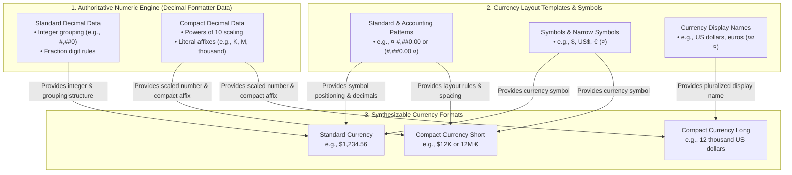
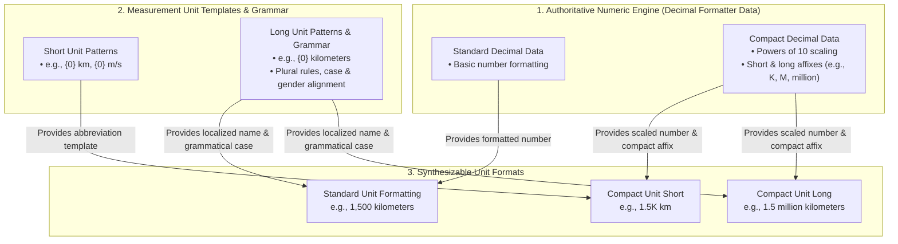
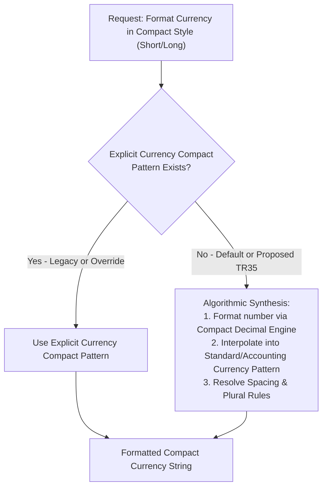

# Unified Numeric Engine Architecture: Powering Currency, Compact Currency, and Units via Decimal Formatting Data

*Related Tickets & Documents: [CLDR-19617](https://unicode-org.atlassian.net/browse/CLDR-19617), [PR #5862](https://github.com/unicode-org/cldr/pull/5862), and [ICU4X Number Formatter Design](file:///usr/local/google/home/younies/i18n/design_docs/number_formatter.md).*

## 1. Executive Summary & Overview

This document presents a foundational architectural shift in how CLDR and downstream internationalization libraries (ICU, ICU4X, JS Intl) handle **standard currency formatting, compact currency formatting, and measurement units**.

Historically, currency formatters and unit formatters have often been modeled as standalone systems with distinct formatting rules and redundant pattern data. We propose a **Unified Engine Architecture** that elevates **Decimal Formatting Data** as the authoritative, universal source for all numerical formatting:

1. **Standard (Non-Compact) Currency Formatting**: Directly inherits integer grouping and digit layout from standard decimal patterns, applying only currency-specific fraction digits, rounding rules, and symbol affixes (`¤`). This eliminates redundant numerical pattern parsing and storage.
2. **Compact Currency & Unit Formatting (Algorithmic Synthesis)**: Replaces fragmented and missing explicit compact patterns with an algorithmic synthesis pipeline. By dynamically interpolating **Compact Decimal Formatting Data** (`decimalFormatLength[@type="short"|"long"]`) into currency and unit layout templates, we achieve 100% short compact coverage and unlock **long compact currency** and **compact units** out of the box with zero new locale data.

### 1.1 Architecture Diagram: Currency Formatting (Standard & Compact)
This diagram illustrates how the authoritative Decimal Formatter engine powers standard currency formatting, short compact currency, and long compact currency without redundant numerical formatting rules.

### 1.2 Architecture Diagram: Measurement Units (Standard & Compact)
This diagram illustrates how the exact same Compact Decimal Engine scales effortlessly to measurement units, unlocking compact unit formatting (short and long) out of the box with zero new locale data.

---

## 2. Currency Architecture, Analysis & Investigation

### 2.1 The 9 Currency Formatting Cases & Matrix
When formatting currencies across different styles and notations, every currency output is formed by combining one of three **Currency Length/Display** options with one of three **Decimal Part Display** options. This creates exactly **9 distinct formatting cases**:

* **Currency Length / Display Options**:
  1. **Symbols** (standard symbol `¤` like `$` / `US$` and narrow symbol like `$`)
  2. **ISO Code** (3-letter currency code like `USD`)
  3. **Full Name** (localized display name `¤¤¤` like `US dollars`)
* **Decimal Part Display Options**:
  1. **Plain Number (Decimal)** (standard grouping/fraction formatting like `1,200.01` or `1,200,000.00`)
  2. **Compact Short** (short powers-of-10 scaling and affix like `1.2M`)
  3. **Compact Long** (long powers-of-10 scaling and affix like `1.2 million`)

#### Summary Matrix (Examples for `1,200,000` / `1,200.01` in `en_US` / `USD`)
*(Note: In `en_US`, ISO code `USD` is always placed as a prefix (`USD 1,200.01`); in many other locales like `fr` or `de`, it is placed as a suffix (`1,200.01 USD` / `1 200,01 USD`).)*

| Decimal Part Display \ Currency Display | 1. Symbols (`$` / `US$`) | 2. ISO Code (`USD`) | 3. Full Name (`US dollars`) |
| :--- | :--- | :--- | :--- |
| **1. Plain Number (Decimal)** | `$1,200.01` `$1,200,000.00` *(Case 1)* | `USD 1,200.01` `USD 1,200,000.00` *(Case 2)* | `1,200.01 US dollars` `1,200,000.00 US dollars` *(Case 3)* |
| **2. Compact Short** | `$1.2M` *(Case 4)* | `USD 1.2M` *(Case 5)* | `1.2M US dollars` *(Case 6)* |
| **3. Compact Long** | `$1.2 million` *(Case 7)* | `USD 1.2 million` *(Case 8)* | `1.2 million US dollars` *(Case 9)* |

#### Individual Discussion of the 9 Cases

##### Case 1: Symbols + Plain Number (Decimal)
* **Example**: `$1,200.01` or `$1,200,000.00`
* **Analysis & Core Behavior**: Standard currency pattern layout (`currencyFormat[@type="standard"|"accounting"]`) applied directly to the plain decimal number, adjusting fraction digits and rounding.
* **Empirical Analysis & Validation Findings (from [PR #5862](https://github.com/unicode-org/cldr/pull/5862) / `currency_validation_report.md`)**:
  Our automated validation suite (`GenerateCurrencyValidationReport.java`) audited the structural relationship across all locales between standard decimal patterns, standard currency patterns, and other currency pattern variations (`accounting`, `alphaNextToNumber`, `noCurrency`). This empirical analysis established two fundamental symmetry laws and identified actionable legacy bugs:
  1. **Integer Part Symmetry (Standard Decimal vs. Standard Currency)**: Across almost every locale in CLDR, the integer portion of the standard currency pattern (grouping separators, primary/secondary grouping sizes like `#,##0` vs `#,##,##0`, and minimum digits) is 100% structurally identical to the standard decimal pattern (`decimalFormatLength/decimalFormat[@type="standard"]/pattern[@type="standard"]`). Currency formatting fundamentally inherits this integer grouping structure and attaches fraction digits (`.00`), rounding rules, and the symbol placeholder (`¤`).
     * *Empirical Anomaly & Action*: A small subset of locales exhibit anomalous divergences where standard currency grouping differs slightly from standard decimal grouping due to legacy data entry errors.
     * *Remediation (Tracked by Jira: [CLDR-19628](https://unicode-org.atlassian.net/browse/CLDR-19628))*: Audit and correct anomalous locales, and introduce CheckCLDR structural validation rules enforcing that `currencyFormat[@type="standard"]` integer grouping exactly matches or inherits from `decimalFormat[@type="standard"]`.
  2. **Number Part Uniformity Across All Currency Patterns (`Standard` vs. `All Other Currency Patterns`)**: Within any given locale, the numerical part (integer grouping + fraction template like `#,##0.00`) of the standard currency pattern is identical across **all other currency pattern variations**—including `accounting` (positive and negative), `alphaNextToNumber` (standard and accounting), `noCurrency` (standard and accounting), etc. Where variations like negative accounting differ (e.g., `(#,##0.00 ¤)` vs `-¤ #,##0.00`), the distinction resides *strictly* in the surrounding negative or symbol affixes (parentheses vs. minus signs), while the underlying core number pattern structure (`#,##0.00`) remains completely identical.
     * *Empirical Anomaly & Action*: The validation report caught rare discrepancies where another currency pattern (`accounting`, `alphaNextToNumber`, or `noCurrency`) diverges in its numerical grouping or fraction digits from the `standard` currency pattern.
     * *Remediation (Tracked by Jira: [CLDR-19629](https://unicode-org.atlassian.net/browse/CLDR-19629))*: Audit and correct all locales where any other currency pattern's numerical part diverges from standard currency, and enforce CheckCLDR integrity rules ensuring numerical part uniformity across all currency pattern styles within a locale.

##### Case 2: ISO Code + Plain Number (Decimal)
* **Example**: `USD 1,200.01` or `EUR 1,200.01` (in `en_US` / `en`)
* **TR35 Specification & Pattern Selection**: According to **[Unicode Technical Standard #35 (LDML Part 3: Numbers, Section 3.4 Currency Formatting)](https://www.unicode.org/reports/tr35/tr35-numbers.html#Currency_Formatting)**, when formatting with a 3-letter ISO 4217 currency code (`¤¤`), pattern selection follows a strict hierarchy:
  1. **Explicit Alpha-Next-To-Number Pattern**: Check if the locale explicitly defines an `alt="alphaNextToNumber"` pattern (`currencyFormatLength/currencyFormat[@type="standard"]/pattern[@alt="alphaNextToNumber"]`). If present, **this pattern is used**.
  2. **Fallback to Standard Currency Pattern**: If no explicit `alt="alphaNextToNumber"` pattern exists, fall back to the standard currency format pattern (`currencyFormat[@type="standard"]/pattern[@type="standard"]`), replacing the symbol token (`¤`) with the double-currency token (`¤¤`).
* **TR35 Spacing & Concrete Examples (`en` Locale)**: In English (`en`), the standard currency pattern is `¤#,##0.00` (no space after `¤`). If an ISO code (`USD`, `EUR`) were naively inserted into this standard pattern, it would produce unreadable collisions like `USD1,200.01` or `EUR1,200.01`. To prevent this:
  * `en.xml` explicitly defines an `alt="alphaNextToNumber"` pattern with a non-breaking space (`\u00A0`): `¤ #,##0.00`.
  * When formatting `1,200.01` with `USD`, the `alphaNextToNumber` pattern is selected, yielding `USD 1,200.01` (`USD\u00A01,200.01`).
  * When formatting `1,200.01` with `EUR`, it yields `EUR 1,200.01` (`EUR\u00A01,200.01`).
  * [TR35 Section 3.4](https://www.unicode.org/reports/tr35/tr35-numbers.html#Currency_Formatting) ensures that even in locales where `alt="alphaNextToNumber"` is not explicitly defined, formatting engines automatically inject appropriate spacing (`\u00A0`) between alphabetic currency codes and adjacent numbers.

##### Case 3: Full Name + Plain Number (Decimal)
* **Example**: `1,200.01 US dollars` or `1,200,000.00 US dollars`
* **Analysis & Behavior**: Combines the plain decimal number with the localized pluralized currency name (`¤¤¤`), adhering to unit/currency spacing rules and grammatical plural selection (`zero`, `one`, `two`, `few`, `many`, `other`).

##### Case 4: Symbols + Compact Short
* **Example**: `$1.2M` or `1.2M €`
* **Analysis & Behavior**: Scales the number via the short compact decimal pattern and glues the short compact affix (e.g., `M`) into the standard currency pattern alongside the symbol (`¤`).

##### Case 5: ISO Code + Compact Short
* **Example**: `USD 1.2M` or `1.2M USD`
* **Analysis & Behavior**: Scales via the short compact decimal engine and interpolates alongside the ISO currency code (`¤¤`), ensuring appropriate non-breaking spacing (`\u00A0`).

##### Case 6: Full Name + Compact Short
* **Example**: `1.2M US dollars`
* **Analysis & Behavior**: Scales via the short compact decimal engine (giving `1.2M`) and appends the pluralized full currency display name (`¤¤¤`) governed by the compact number's plural category (`other`).

##### Case 7: Symbols + Compact Long
* **Example**: `$1.2 million` or `1.2 million €`
* **Analysis & Behavior**: Scales via the long compact decimal engine and interpolates alongside the currency symbol (`¤`). Requires careful spacing resolution so literal words (like `million`) do not collide with adjacent symbols.

##### Case 8: ISO Code + Compact Long
* **Example**: `USD 1.2 million` or `1.2 million USD`
* **Analysis & Behavior**: Scales via the long compact decimal engine and combines with the ISO currency code (`¤¤`) using standardized layout rules.

##### Case 9: Full Name + Compact Long
* **Example**: `1.2 million US dollars`
* **Analysis & Behavior**: Scales via the long compact decimal engine and combines with the localized full currency display name (`¤¤¤`), aligning both the long compact word (`million`) and currency name (`US dollars`) grammatically.

### 2.2 Standard (Normal) Currency Formatting
In standard, non-compact currency formatting (e.g., `$1,234.56`), the core numerical pattern (grouping separators, integer digit rules, and decimal layout) matches standard decimal formatting perfectly. To format a normal currency string, an implementation does not need a distinct number formatting engine; it simply inherits the standard decimal pattern and adjusts:
1. **Fraction Digits & Rounding**: Applying currency-specific minor units (e.g., 2 decimal places for USD/EUR, 0 for JPY, 3 for BHD) and rounding rules (e.g., cash rounding vs. financial rounding).
2. **Magnitude & Affixes**: Applying any currency scaling and attaching the localized symbol or display name (`¤` or `¤¤¤`) according to the layout template.
This establishes that even before compact formatting is considered, currency formatting is fundamentally just a parameterized derivation of decimal formatting.

### 2.3 Compact Currency Data Deficiencies
* **Compact Currency Short**: Existing LDML data for short compact currency (`currencyFormatLength[@type="short"]`) is severely inconsistent. It is partially populated in some locales and completely absent in many others. Where present, it largely duplicates the numerical scaling and affix logic already defined in compact decimal formats.
* **Compact Currency Long**: There is **zero locale data** in CLDR for long compact currency (e.g., `$10 million` or `10 million US dollars`). Downstream formatters currently have no standardized way to produce long compact currency strings.

### 2.4 Non-Compact & Compact Pattern Consistency Analysis
An investigation into standard (**non-compact**) decimal patterns and currency patterns across LDML reveals profound structural identity:
1. **Integer Part Identity (Decimal vs. Currency in Non-Compact Formatting)**: In standard (non-compact) formatting, the integer portion of currency patterns and decimal patterns (e.g., grouping sizes, primary/secondary grouping like `#,##0` or `#,##,##0`) is identical within a locale. The only difference is that currency patterns specify fraction digits (e.g., `.00`), rounding, or affix symbols (`¤`).
2. **Number Part Uniformity Across Currency Patterns**: For any given locale, the numerical part of the pattern is identical across all currency formatting variations (standard vs. accounting, or different currency styles). Where accounting patterns differ (e.g., `#,##0.00 ¤;(#,##0.00 ¤)`), the difference is strictly in the surrounding negative affixes (parentheses), while the underlying number formatting structure remains completely unchanged.
3. **Implications for Core Architecture**: Because the integer and number parts are identical even in non-compact formatting, currency formatting does not need its own separate numerical formatting logic or grouping data. The decimal formatter is already the natural, authoritative engine for all number formatting (both compact and non-compact). The rare discrepancies observed in certain locales appear to be legacy data bugs or accidental inconsistencies rather than intentional typographic distinctions.

### 2.5 Currency Codebase & Tooling Investigation
Our inspection of the CLDR toolchain and test suite confirms the need for this unified currency model:
* **Commented-Out Tooling Capabilities**: In [VerifyCompactNumbers.java](file:///usr/local/google/home/younies/i18n/cldr/google3/third_party/cldr/tools/cldr-code/src/main/java/org/unicode/cldr/test/VerifyCompactNumbers.java), test columns for `Compact-Long+Currency` and `Compact-Long+Currency-Long` are explicitly commented out due to the historical lack of a formal synthesis pipeline and data model.
* **Prototype Alignment**: Recent efforts in PRs like [#5862](https://github.com/unicode-org/cldr/pull/5862) demonstrate that algorithmic gluing of decimal formats with currency patterns successfully resolves existing short compact gaps without introducing new locale data.

---

## 3. Measurement Unit Architecture & Synthesis

### 3.1 Standard vs. Compact Unit Formatting
Measurement unit formatting (e.g., `15 kilometers` or `15 km`) has traditionally relied on combining standard decimal numbers with localized grammatical unit patterns (`unitLength[@type="long"|"short"|"narrow"]` with `unitPattern`). However, modern interfaces increasingly require **compact unit formatting** (e.g., `15M km` or `15 million kilometers`) to display large scientific or technical quantities cleanly in constrained UI spaces.

### 3.2 Absence of Compact Unit Data & Why No Investigation Is Needed
Unlike currency formatting—where an investigation into explicit short compact patterns was necessary to identify legacy inconsistencies and redundancies—**the units domain requires no legacy data reconciliation or investigation**. 

A comprehensive search of CLDR XML data and DTDs confirmed that **there is zero explicit locale data for compact units (short or long) anywhere in CLDR**. Units only define grammatical length templates (`unitPattern`). Because no explicit powers-of-10 compact unit tables exist in locale data:
1. **Zero Legacy Debt**: There are no redundant or conflicting compact unit patterns to deprecate or clean up.
2. **Pure-Play Synthesis**: Algorithmic synthesis is not merely an optimization for units—it is the *only* architectural mechanism capable of supporting compact units without causing an exponential explosion in locale data size.

### 3.3 Unit Synthesis Model
By extending the Unified Numeric Engine to units, compact unit formatting inherits 100% of its numerical scaling and affixes from Compact Decimal Formatting Data (`decimalFormatLength[@type="short"|"long"]`). The synthesis engine simply:
1. Formats the numeric quantity using the underlying Compact Decimal Formatter (yielding a string like `1.5M` or `1.5 million` and a corresponding plural category such as `other`).
2. Interpolates that compacted string into the appropriate `unitPattern` template (e.g., `{0} km` -> `1.5M km`, or `{0} kilometers` -> `1.5 million kilometers`), respecting localized grammatical case and gender rules.
3. In [VerifyCompactNumbers.java](file:///usr/local/google/home/younies/i18n/cldr/google3/third_party/cldr/tools/cldr-code/src/main/java/org/unicode/cldr/test/VerifyCompactNumbers.java), the currently commented-out test column `Compact-Short+Unit` can be activated immediately once this engine pipeline is enabled.

---

## 4. Proposal & Architectural Actions

To solve the existing data deficiencies and establish a future-proof formatting architecture, we propose two distinct, coordinated solutions for Currency and Measurement Units:

### 4.1 Proposal: Currency Formatting Architecture & TR35 Modernization
1. **Integrate Decimal Formatting Data as the Core Engine**:
   * **Mechanism**: Recognize Decimal Formatting Data as the authoritative engine for all number formatting (both non-compact and compact). For compact currencies, use compact decimal formatting data (`decimalFormatLength[@type="short"|"long"]`) as the primary engine and fallback. The compact decimal value (including its literal affixes like "K", "M", "thousand", or "million") is dynamically interpolated into the locale's standard or accounting currency pattern (`currencyFormat[@type="standard"|"accounting"]`), leveraging the fact that their integer and number parts are fundamentally identical.
   * **Outcome**: Eliminates redundant number formatting logic in non-compact currency formatting, automatically achieves 100% coverage for short compact currency across all locales, and introduces **long compact currency** support out-of-the-box with zero new locale data.
2. **Modernize TR35 Fallback Specification**:
   * **Current TR35 Spec**: Unicode Technical Standard #35 (LDML) currently suggests that if explicit compact currency formatting data does not exist for a locale, implementations should fall back to simple (non-compact) standard currency formatting.
   * **Proposed Amendment**: Update TR35 to specify that **algorithmic synthesis from compact decimal patterns** is the official fallback (and recommended primary mechanism) when explicit compact currency patterns are absent.

> [!IMPORTANT]
> By changing the TR35 fallback recommendation from *simple currency formatting* to *algorithmic compact synthesis*, we ensure that users always receive abbreviated, human-readable numbers (e.g., `$10K` instead of `$10,000.00`) even in locales that lack explicit compact currency patterns.

### 4.2 Proposal: Measurement Unit Architecture & Synthesis
1. **Extend Algorithmic Synthesis to Units & Compact Units**:
   * **Mechanism**: Apply the exact same pattern-gluing architecture to measurement units. Because there is zero legacy compact data in CLDR XML/DTDs, the unit synthesis model is pure-play: compact decimal strings from `decimalFormatLength[@type="short"|"long"]` will be dynamically combined with localized `unitPattern` templates, respecting plural categories and grammatical case/gender rules.
   * **Outcome**: Unlocks short and long compact unit formatting (e.g., `3M km`, `3 million kilometers`) across all supported locales without requiring translators to maintain powers-of-10 unit matrices.
2. **Immediate Test Suite Activation**:
   * Enabling this algorithmic pipeline allows immediate activation and verification of the currently commented-out `Compact-Short+Unit` columns in CLDR inspection tools.

---

## 5. Next Steps & Implementation Plan

1. **Formalize Gluing & Spacing Rules**: Document exact string manipulation rules for merging decimal affixes with currency symbols (e.g., avoiding double spaces, inserting non-breaking spaces `\u00A0` where required by locale typography).
2. **Toolchain Enablement**:
   * Update [BuildIcuCompactDecimalFormat.java](file:///usr/local/google/home/younies/i18n/cldr/google3/third_party/cldr/tools/cldr-code/src/main/java/org/unicode/cldr/test/BuildIcuCompactDecimalFormat.java) to synthesize `CURRENCY`, `LONG_CURRENCY`, and `UNIT` styles algorithmically.
   * Enable generation of synthesized examples in [ExampleGenerator.java](file:///usr/local/google/home/younies/i18n/cldr/google3/third_party/cldr/tools/cldr-code/src/main/java/org/unicode/cldr/test/ExampleGenerator.java).
   * Uncomment and activate verification columns in [VerifyCompactNumbers.java](file:///usr/local/google/home/younies/i18n/cldr/google3/third_party/cldr/tools/cldr-code/src/main/java/org/unicode/cldr/util/VerifyCompactNumbers.java).
3. **TR35 Proposal Submission**: Draft the formal text proposal for the CLDR Technical Committee to update Section 3.4.1 of TR35 (Currency Formatting Fallback).
