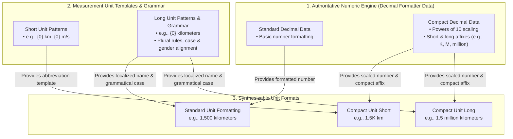
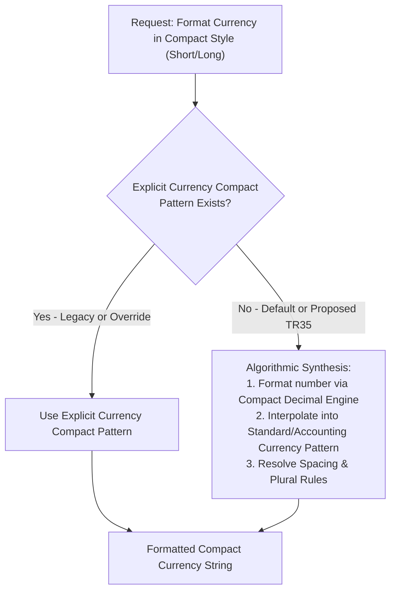

# Unified Numeric Engine Architecture: Powering Currency, Compact Currency, and Units via Decimal Formatting Data

*Related Tickets & Documents: [CLDR-19617](https://unicode-org.atlassian.net/browse/CLDR-19617), [PR #5862](https://github.com/unicode-org/cldr/pull/5862), and [ICU4X Number Formatter Design](file:///usr/local/google/home/younies/i18n/design_docs/number_formatter.md).*

## 1. Executive Summary & Overview

This document presents a foundational architectural shift in how CLDR and downstream internationalization libraries (ICU, ICU4X, JS Intl) handle **standard currency formatting, compact currency formatting, and measurement units**.

Historically, dimension formatters (currency and units) have often been modeled as standalone systems with distinct formatting rules and redundant pattern data. We propose a **Unified Engine Architecture** that elevates **Decimal Formatting Data** as the authoritative, universal source for all numerical formatting:

1. **Standard (Non-Compact) Currency Formatting**: Directly inherits integer grouping and digit layout from standard decimal patterns, applying only currency-specific fraction digits, rounding rules, and symbol affixes (`¤`). This eliminates redundant numerical pattern parsing and storage.
2. **Compact Currency & Unit Formatting (Algorithmic Synthesis)**: Replaces fragmented and missing explicit compact patterns with an algorithmic synthesis pipeline. By dynamically interpolating **Compact Decimal Formatting Data** (`decimalFormatLength[@type="short"|"long"]`) into currency and unit layout templates, we achieve 100% short compact coverage and unlock **long compact currency** and **compact units** out of the box with zero new locale data.

```mermaid
### 1.1 Architecture Diagram: Currency Formatting (Standard & Compact)
This diagram illustrates how the authoritative Decimal Formatter engine powers standard currency formatting, short compact currency, and long compact currency without redundant numerical formatting rules.

```mermaid
flowchart TD
    subgraph NumericEngine ["1. Authoritative Numeric Engine (Decimal Formatter Data)"]
        direction LR
        StdDec["Standard Decimal Data<br/>• Integer grouping (e.g., #,##0)<br/>• Fraction digit rules"]
        CompDec["Compact Decimal Data<br/>• Powers of 10 scaling<br/>• Literal affixes (e.g., K, M, thousand)"]
    end

    subgraph CurrencyTemplates ["2. Currency Layout Templates & Symbols"]
        direction LR
        CP_Std["Standard & Accounting Patterns<br/>• e.g., ¤ #,##0.00 or (#,##0.00 ¤)"]
        CS_Sym["Symbols & Narrow Symbols<br/>• e.g., $, US$, € (¤)"]
        CS_Name["Currency Display Names<br/>• e.g., US dollars, euros (¤¤¤)"]
    end

    subgraph CurrencyOutput ["3. Synthesizable Currency Formats"]
        direction LR
        Out_Std["Standard Currency<br/>e.g., $1,234.56"]
        Out_CompShort["Compact Currency Short<br/>e.g., $12K or 12M €"]
        Out_CompLong["Compact Currency Long<br/>e.g., 12 thousand US dollars"]
    end

    StdDec -->|"Provides integer & grouping structure"| Out_Std
    CP_Std -->|"Provides symbol positioning & decimals"| Out_Std
    CS_Sym -->|"Provides currency symbol"| Out_Std & Out_CompShort

    CompDec -->|"Provides scaled number & compact affix"| Out_CompShort & Out_CompLong
    CP_Std -->|"Provides layout rules & spacing"| Out_CompShort
    CS_Name -->|"Provides pluralized display name"| Out_CompLong
```

### 1.2 Architecture Diagram: Measurement Units (Standard & Compact)
This diagram illustrates how the exact same Compact Decimal Engine scales effortlessly to measurement units, unlocking compact unit formatting (short and long) out of the box with zero new locale data.


```

---

## 2. Current Status & Problem Statement

### 2.1 Compact Currency Data Deficiencies
* **Compact Currency Short**: Existing LDML data for short compact currency (`currencyFormatLength[@type="short"]`) is severely inconsistent. It is partially populated in some locales and completely absent in many others. Where present, it largely duplicates the numerical scaling and affix logic already defined in compact decimal formats.
* **Compact Currency Long**: There is **zero locale data** in CLDR for long compact currency (e.g., `$10 million` or `10 million US dollars`). Downstream formatters currently have no standardized way to produce long compact currency strings.

### 2.2 Non-Compact & Compact Pattern Consistency Analysis
An investigation into standard (**non-compact**) decimal patterns and currency patterns across LDML reveals profound structural identity:
1. **Integer Part Identity (Decimal vs. Currency in Non-Compact Formatting)**: In standard (non-compact) formatting, the integer portion of currency patterns and decimal patterns (e.g., grouping sizes, primary/secondary grouping like `#,##0` or `#,##,##0`) is identical within a locale. The only difference is that currency patterns specify fraction digits (e.g., `.00`), rounding, or affix symbols (`¤`).
2. **Number Part Uniformity Across Currency Patterns**: For any given locale, the numerical part of the pattern is identical across all currency formatting variations (standard vs. accounting, or different currency styles). Where accounting patterns differ (e.g., `#,##0.00 ¤;(#,##0.00 ¤)`), the difference is strictly in the surrounding negative affixes (parentheses), while the underlying number formatting structure remains completely unchanged.
3. **Implications for Core Architecture**: Because the integer and number parts are identical even in non-compact formatting, currency formatting does not need its own separate numerical formatting logic or grouping data. The decimal formatter is already the natural, authoritative engine for all number formatting (both compact and non-compact). The rare discrepancies observed in certain locales appear to be legacy data bugs or accidental inconsistencies rather than intentional typographic distinctions.

---

## 3. Investigation & Codebase Findings

Our investigation across the CLDR repository, DTD definitions, and tooling uncovered several critical data points that validate this architectural direction:

1. **Zero Data for Compact Units**: A comprehensive search of CLDR XML data and DTDs confirmed that **there is zero explicit locale data for compact units (short or long)**. Units only define grammatical length patterns (`unitLength[@type="long"|"short"|"narrow"]` with `unitPattern`). Therefore, algorithmic synthesis is not just an optimization for units—it is the *only* viable path forward without causing an exponential explosion in locale data size.
2. **Pending Tooling Capabilities**: In [VerifyCompactNumbers.java](file:///usr/local/google/home/younies/i18n/cldr/google3/third_party/cldr/tools/cldr-code/src/main/java/org/unicode/cldr/test/VerifyCompactNumbers.java), test columns for `Compact-Short+Unit`, `Compact-Long+Currency`, and `Compact-Long+Currency-Long` are explicitly commented out due to the historical lack of a formal synthesis pipeline.
3. **Alignment with Modern Formatter Architectures**: As documented in [number_formatter.md](file:///usr/local/google/home/younies/i18n/design_docs/number_formatter.md), next-generation formatters (such as ICU4X) are already structured around a layered architecture where the Decimal Formatter acts as the underlying engine powering Currency and Unit formatters.

---

## 4. Proposal & Actions

To solve these deficiencies and establish a future-proof formatting architecture, we propose three concrete actions:

### Action 1: Integrate Decimal Formatting Data as Primary Source & Fallback for Currency
* **Mechanism**: Recognize Decimal Formatting Data as the authoritative engine for all number formatting (both non-compact and compact). For compact currencies, use compact decimal formatting data (`decimalFormatLength[@type="short"|"long"]`) as the primary engine and fallback. The compact decimal value (including its literal affixes like "K", "M", "thousand", or "million") is dynamically interpolated into the locale's standard or accounting currency pattern (`currencyFormat[@type="standard"|"accounting"]`), leveraging the fact that their integer and number parts are fundamentally identical.
* **Outcome**: Eliminates redundant number formatting logic in non-compact currency formatting, automatically achieves 100% coverage for short compact currency across all locales, and introduces **long compact currency** support out-of-the-box with zero new locale data.

### Action 2: Extend Algorithmic Synthesis to Units & Compact Units
* **Mechanism**: Apply the exact same pattern-gluing architecture to measurement units. Compact decimal strings will be combined with `unitPattern` templates, respecting plural categories and grammatical case/gender rules.
* **Outcome**: Unlocks short and long compact unit formatting (e.g., `3M km`, `3 million kilometers`) across all supported locales without requiring translators to maintain powers-of-10 unit matrices.

### Action 3: Modernize TR35 Fallback Specification for Compact Currency
* **Current TR35 Spec**: Unicode Technical Standard #35 (LDML) currently suggests that if explicit compact currency formatting data does not exist for a locale, implementations should fall back to simple (non-compact) standard currency formatting.
* **Proposed Amendment**: Update TR35 to specify that **algorithmic synthesis from compact decimal patterns** is the official fallback (and recommended primary mechanism) when explicit compact currency patterns are absent. 



> [!IMPORTANT]
> By changing the TR35 fallback recommendation from *simple currency formatting* to *algorithmic compact synthesis*, we ensure that users always receive abbreviated, human-readable numbers (e.g., `$10K` instead of `$10,000.00`) even in locales that lack explicit compact currency patterns.

---

## 5. Next Steps & Implementation Plan

1. **Formalize Gluing & Spacing Rules**: Document exact string manipulation rules for merging decimal affixes with currency symbols (e.g., avoiding double spaces, inserting non-breaking spaces `\u00A0` where required by locale typography).
2. **Toolchain Enablement**:
   * Update [BuildIcuCompactDecimalFormat.java](file:///usr/local/google/home/younies/i18n/cldr/google3/third_party/cldr/tools/cldr-code/src/main/java/org/unicode/cldr/test/BuildIcuCompactDecimalFormat.java) to synthesize `CURRENCY`, `LONG_CURRENCY`, and `UNIT` styles algorithmically.
   * Enable generation of synthesized examples in [ExampleGenerator.java](file:///usr/local/google/home/younies/i18n/cldr/google3/third_party/cldr/tools/cldr-code/src/main/java/org/unicode/cldr/test/ExampleGenerator.java).
   * Uncomment and activate verification columns in [VerifyCompactNumbers.java](file:///usr/local/google/home/younies/i18n/cldr/google3/third_party/cldr/tools/cldr-code/src/main/java/org/unicode/cldr/util/VerifyCompactNumbers.java).
3. **TR35 Proposal Submission**: Draft the formal text proposal for the CLDR Technical Committee to update Section 3.4.1 of TR35 (Currency Formatting Fallback).
