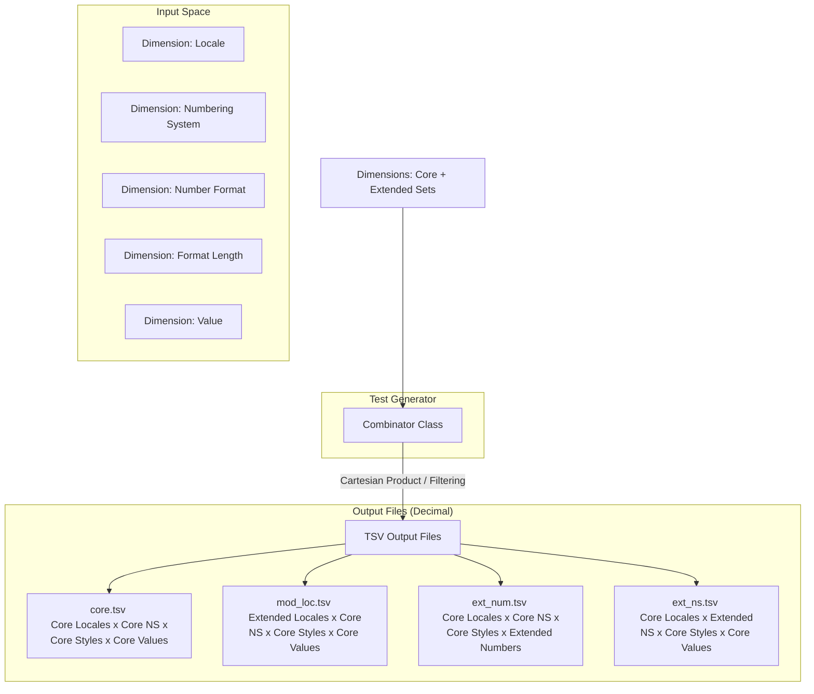

<style>
  .markdown-body {
    max-width: 1200px !important;
  }
</style>

# Design Document: CLDR Conformance Testing for Decimal & Currency Formatting

## 1. Goal & Philosophy

The primary objective of this conformance testing framework is to validate implementations of the Common Locale Data Repository (CLDR) specifications for decimal and currency formatting. 

To achieve this, the design balances two critical needs:
1. **Robust, Structured Test Data:** Providing comprehensive, machine-readable test cases to verify that formatting implementations strictly adhere to CLDR specifications across various locales, edge cases, and formatting options.
2. **Readable & Executable Documentation:** The test generator implementation itself must serve as a clear, readable guide. A developer who reads the CLDR specifications and finds them ambiguous should be able to look at the generator's code (specifically the dimensions and combinations) to understand exactly how the spec is interpreted and applied. 

By tying the specification, the test generation logic, and the output data tightly together, we ensure that:
* It is easy to synchronize the implementation with future CLDR spec updates.
* Ambiguities in the CLDR spec are explicitly resolved in code via readable, well-commented dimensions.

---

## 2. Core Architecture

The test generation framework is built around two primary abstractions: the **Dimension** and the **Combinator**, which output structured **TSV files**.



### 2.1. The `Dimension` Class

A `Dimension` represents a single input variable or configuration option that influences the output of decimal or currency formatting. Examples include the input value, the locale, the numbering system, or the format length.

#### Key Features of `Dimension`:
* **Core vs. Extended Sets:** To prevent combinatorial explosion while maintaining high coverage, each dimension categorizes its values into:
    * **Core Set:** A minimal, highly representative subset of values. This set contains all critical edge cases, common variations, and complex rules. If a dimension is small enough, its Core Set represents the entire dimension.
    * **Extended Set(s):** The remaining possible values (e.g., all 500+ modern locales, rare currencies, or exhaustive numeric scales).
* **Nullability & Defaults:** Each dimension explicitly declares:
    * Whether it can be **empty** (null/omitted).
    * The **default value** applied by the formatting engine when it is empty.
* **TSV Representation:** Each dimension maps directly to a column in the output TSV file. If a dimension value for a test case is empty (i.e., it should test the default behavior), it is serialized as an **empty cell** in the TSV.

### 2.2. The `Combinator` and Output TSV Files

The `Combinator` is responsible for taking all defined dimensions and orchestrating their combination to produce the final test suites, saving them as Tab-Separated Values (TSV) files.

#### Combination & Splitting Strategy:
1. **Core Test Suite (`core.tsv`):** 
   Generates a Cartesian product of the **Core Sets** of all dimensions. This compact suite is designed to cover approximately **90% of all distinct logic paths and edge cases** (e.g., standard styles across high-signal locales, numbering systems, and representative values) with a minimal footprint. Placed under `decimal/core.tsv` and `currency/core.tsv`.
2. **Extended Locales Suite (`mod_loc.tsv` / `*_mod_loc.tsv`):**
   Pairs the **Extended Modern Locales** set with the **Core Sets** of all other dimensions to verify language-specific rules across the long tail.
3. **Extended Numbers Suite (`ext_num.tsv` / `*_ext_num.tsv`):**
   Pairs the **Extended Numbers** set (exhaustive powers of 10, rounding edge cases) with the **Core Locales**, Core Numbering Systems, and Core styles to verify mathematical precision and scale transitions.
4. **Extended Numbering Systems Suite (`ext_ns.tsv` / `*_ext_ns.tsv`):**
   Pairs the **Extended Numbering Systems** set (e.g., Devanagari, Bengali digits) with Core Locales, Core styles, and Core values to verify digit shape rendering across scripts.
5. **Extended Currencies Suite (Currency only - `*_mod_cur.tsv`):**
   Pairs the **Extended Modern Currencies** set with the Core Locales, Core Numbering Systems, and Core styles to verify rare currency symbol rendering, ISO codes, and custom decimal rules.
6. **Deduplication:** Extended sets strictly exclude values already present in the core sets to prevent redundant test cases.
7. **Hybrid Consolidation/Splitting:** Thanks to the Tiny Core Sets optimization, the total test cases are extremely compact. To strictly enforce the **10,000-line maximum file size limit** while keeping directory clutter low, the generator employs a hybrid strategy (producing exactly 10 files total): the Extended Locales suite (`mod_loc.tsv`, ~4.6K lines) and Core suite (`core.tsv`, ~4.5K lines) remain consolidated, while the Extended Currencies suite (~10.6K cases total, excluding redundant `noCurrency`) and Extended Numbers suite (~10K cases total, excluding `noCurrency`) are split by `CurrencyDisplay` into 4 files each (resulting in files of ~2.6K and ~2.5K lines respectively).

### 2.3. Combinatorial Optimization (Tiny Core Sets)

To prevent **combinatorial explosion** while maintaining high coverage across the long tail, the generator employs an optimization strategy using **Tiny Core Sets** (Minimal Core Subsets) when constructing the Extended Suites.

#### The Problem: Combinatorial Explosion
If we pair an **Extended Set** of one dimension (e.g., all 150+ modern currencies) with the **full Core Sets** of all other dimensions (9 locales, 5 values, 2 grouping strategies, 2 format types, 5 displays), we end up with a massive number of redundant test cases:
$$\text{Total Cases} = 150 \times 9 \times 5 \times 2 \times 2 \times 5 = 135,000\text{ cases per file}$$
This results in extremely large test files, high disk usage, and slow test execution times.

#### The Solution: Tiny Core Sets
Instead of pairing the active Extended dimension with the *full* Core Sets of other dimensions, the generator pairs it with a **Tiny Core Set**—a minimal, highly representative subset containing only the most critical variations:

1.  **Tiny Locales (3 locales instead of 10):**
    *   `en` (English: LTR, dot/comma separators, standard symbol placement)
    *   `ar` (Arabic: RTL, Latin digits, right-to-left symbol/minus placement)
    *   `de` (German: LTR, comma/dot separators, space-separated suffix symbol placement)
    *   *Rationale:* Covers LTR, RTL, suffix/prefix placement, and comma/dot separator variations. (Note: Special layouts like Indian grouping in `bn`, Swiss grouping in `de_CH`, and suffix-minus in `fy` are tested thoroughly in the Core Suite against the full Cartesian product).
2.  **Tiny Values (2 values instead of 5):**
    *   `1.2` (Positive decimal, standard formatting and rounding)
    *   `-1230.05` (Negative decimal with grouping, negative signs, grouping, and accounting parentheses)
    *   *Rationale:* Covers positive/negative, grouping/non-grouping, and rounding.
3.  **Tiny Currencies (2 currencies instead of 6 - Currency only):**
    *   `USD` (Standard 2-decimal currency)
    *   `JPY` (0-decimal currency, triggers integer-only formatting and rounding)
    *   *Rationale:* Covers standard fractional vs. integer-only currency rounding and formatting rules.

#### Optimized Consolidated Strategy
When generating an **Extended Suite** for a target dimension, the generator loops over the target's extended values, but restricts all other dimensions to their **Tiny Core Sets**. To strictly respect the **10,000-line maximum file size limit** and remove massive redundancy, the `NO_CURRENCY` display style (which hides the symbol, making ~95% of currencies format identically) is **excluded from all Extended Suites**. Large suites are split by `CurrencyDisplay` (4 active styles) into separate files, while smaller suites remain consolidated:

*   **Extended Currencies Suite (`[display]_mod_cur.tsv`):** Pairs Extended Currencies (148) with `TINY_LOCALES` (3) and `TINY_VALUES` (2) across all 3 valid Style Pairs, **split by `CurrencyDisplay` (4 active styles, excluding redundant `noCurrency`)** to strictly respect the 10,000-line limit.
    *   This produces **4 separate files** (`symbol_mod_cur.tsv`, `narrow_mod_cur.tsv`, `code_mod_cur.tsv`, `name_mod_cur.tsv`).
    *   Each file contains: `148 Currencies * 3 Locales * 2 Values * 3 Styles = 2,664 cases (+1 header line = 2,665 lines)`.
    *   **Status: All 4 files are strictly under the 10,000-line limit (representing a 90.1% overall footprint reduction from 135,000).**
*   **Extended Locales Suite (`mod_loc.tsv`):** Pairs Extended Locales (96) with `TINY_CURRENCIES` (2) and `TINY_VALUES` (2) across all 12 valid Styles (excluding `NO_CURRENCY`). Since it is already well under 10,000 lines, it remains consolidated as a single file.
    $$\text{Consolidated Cases} = 96\text{ Locales} \times 2\text{ Currencies} \times 2\text{ Values} \times 12\text{ Styles} = 4,608\text{ cases (+1 header line = 4,609 lines)}$$
    *   **Status: Strictly under the 10,000-line limit.**
*   **Extended Numbers Suite (`[display]_ext_num.tsv`):** Pairs Extended Numbers (140) with `TINY_LOCALES` (3) and `TINY_CURRENCIES` (2) across all 3 valid Style Pairs, **split by `CurrencyDisplay` (4 active styles, excluding `noCurrency`)** to strictly respect the 10,000-line limit.
    *   This produces **4 separate files** (`symbol_ext_num.tsv`, `narrow_ext_num.tsv`, `code_ext_num.tsv`, `name_ext_num.tsv`).
    *   Each file contains: `140 Numbers * 3 Locales * 2 Currencies * 3 Styles = 2,520 cases (+1 header line = 2,521 lines)`.
    *   **Status: All 4 files are strictly under the 10,000-line limit.**

This optimization dramatically reduces the test suite footprint and execution time while ensuring that every extended value is still rigorously verified across all formatting styles and in key representative environments.

---

## 3. Decimal Formatting Dimensions

This section details the dimensions implemented in the decimal formatting test generator, indicating which values constitute the Core and Extended sets, and specifying default behaviors.

| Dimension Column | Explanation | Core Set | Extended Set | Default Value / Behavior if Empty |
| :--- | :--- | :--- | :--- | :--- |
| `locale` <br> **Java Name:** `Locale` | The locale identifier determines the linguistic and regional formatting rules (e.g., decimal separator, grouping separator, digit symbols). | `ar` (Arabic RTL, Latin digits)<br>`ar_EG` (Arabic Egypt, Eastern Arabic digits)<br>`bn` (Bengali LTR, Bengali digits, Indian grouping)<br>`de` (German, comma/dot separators)<br>`de_CH` (German Swiss, apostrophe separator)<br>`en` (English LTR, dot/comma separators)<br>`ja` (Japanese, 4-digit grouping)<br>`pt_PT` (Portuguese, space separator)<br>`ru` (Russian, Cyrillic script, complex plurals) | All other modern CLDR locales | `en` |
| `number_system` <br> **Java Name:** `NumberSystem` | Defines the digit set and numeric rules (e.g. Latin digits, Arabic-Indic digits, or Devanagari digits). | `empty` (Uses locale default digits) <br>`latn` (Latin digits: 0-9)<br>`arab` (Eastern Arabic-Indic digits: ٠-٩) | `deva` (Devanagari digits)<br>`beng` (Bengali digits) | `empty` (Resolves to locale's default numbering system) |
| `number_format` <br> **Java Name:** `NumberFormat` | Specifies the core format pattern type to apply: standard decimal, percent representation, or scientific notation. | `decimal` (Standard decimal)<br>`percent` (Percentage, scaled $\times 100$)<br>`scientific` (Scientific/exponential notation) | *None* (Dimension is fully covered) | `decimal` |
| `decimal_format_length` <br> **Java Name:** `DecimalFormatLength` | Specifies the format length style, allowing compact representations of numbers (e.g. 1.2K or 1.2 million). | `empty` (Standard formatting, represented as `""`) <br>`short` (Compact short, e.g. 1.2K)<br>`long` (Compact long, e.g. 1.2 thousand) | *None* (Dimension is fully covered) | `empty` (Standard decimal formatting) |
| `value` <br> **Java Name:** `Value` | The input numeric value (represented as a standard double) to be formatted. | `0.0`, `1.2`, `0.00831765`<br>`1234565.0`, `-1230.05` | Comprehensive mathematical scale:<br>- Powers of 10 ($10^{-6}$ to $10^{12}$)<br>- Multiples ($1.5 \times 10^i$, $5 \times 10^i$)<br>- Edge cases: `12.0`, `123.0`, `1234.56`, `1234567.0`, `0.000123`, `-0.0`, `0.5`, `1.5`, `2.5`, `3.5`, `0.125`, `0.135`, `999.9`, `999999.9`<br>- Negatives of all the above. | *Mandatory* (No default) |
| `grouping_strategy` <br> **Java Name:** `GroupingStrategy` | Controls the application of digit grouping separators. | `auto` (Uses locale default grouping)<br>`off` (Disables grouping entirely) | `min2` (Groups only if 2+ digits in first group)<br>`thousand` (Forces 3-digit grouping) | `auto` |
| `rounding_mode` <br> **Java Name:** `RoundingMode` | Controls the mathematical rounding algorithm when rounding fractional digits. | `half-even` (Bankers rounding, rounds to nearest even) | `half-up` (Commercial rounding)<br>`up` (Away from zero)<br>`down` (Toward zero)<br>`ceiling` (Toward +infinity)<br>`floor` (Toward -infinity) | `half-even` |
| `precision` <br> **Java Name:** `Precision` | Overrides the default fractional or significant digit precision. | `default` (Uses pattern defaults)<br>`min2` (Minimum 2 fraction digits, pads with zeros)<br>`max2` (Maximum 2 fraction digits, rounds value) | `min0` (Forces integer representation)<br>`sig3` (Limits to 3 significant digits) | `default` |
| `sign_display` <br> **Java Name:** `SignDisplay` | Controls when the positive or negative sign is displayed. | `auto` (Shows sign for negatives only)<br>`always` (Always shows sign) | `never` (Hides sign entirely)<br>`except_zero` (Shows sign for non-zero values) | `auto` |
| `min_integer_digits` <br> **Java Name:** `MinIntegerDigits` | Controls the minimum number of digits displayed to the left of the decimal separator, padding with leading zeros if necessary. | `1` (Default, no padding) | `3` (Pads to 3 digits, e.g., `005`) | `1` |
| `decimal_separator_display` <br> **Java Name:** `DecimalSeparatorDisplay` | Controls whether the decimal separator is shown when the fractional part is empty. | `auto` (Hides separator if no fraction)<br>`always` (Always shows decimal separator) | `always` | `auto` |

### 3.1. Detailed Dimension References

This section provides the official Unicode Technical Standard #35 (TR35) specifications, exact quotes, and corresponding CLDR XML data examples for each decimal formatting dimension.

#### 3.1.1. `locale` (Locale)
*   **Why it's a dimension:** Number formatting is highly locale-dependent.
*   **TR35 Specification:** [UTS #35 Locale & Numbers](https://www.unicode.org/reports/tr35/tr35-numbers.html#Number_Symbols)
*   **Spec Quote:** *“Number symbols define the localized symbols that are commonly used when formatting numbers in a given locale.”* (Section 2)
*   **CLDR XML Example (`common/main/en.xml` - Locale Identity):**
    ```xml
    <ldml>
      <identity>
        <version number="$Revision$"/>
        <language type="en"/>
      </identity>
    </ldml>
    ```
*   **Core Set:** `ar`, `ar_EG`, `bn`, `de`, `de_CH`, `en`, `ja`, `pt_PT`, `ru`
*   **Extended Set:** All other modern CLDR locales
*   **Default Value / Behavior if Empty:** `en`

#### 3.1.2. `number_system` (NumberSystem)
*   **Why it's a dimension:** Determines the digit set used to represent the number.
*   **TR35 Specification:** [TR35 Numbering Systems](https://www.unicode.org/reports/tr35/tr35-numbers.html#Numbering_Systems)
*   **Spec Quote:** *“Numbering systems information is used to define different representations for numeric values to an end user. ... Numeric systems are simply a decimal based system that uses a predefined set of digits to represent numbers.”* (Section 1)
*   **CLDR XML Example (`common/main/ar.xml`):**
    ```xml
    <numbers>
      <defaultNumberingSystem>arab</defaultNumberingSystem>
    </numbers>
    ```
*   **Core Set:** `empty` (uses locale default), `latn`, `arab`
*   **Extended Set:** `deva`, `beng`
*   **Default Value / Behavior if Empty:** `empty` (resolves to the locale's default numbering system)

#### 3.1.3. `number_format` (NumberFormat)
*   **Why it's a dimension:** Controls the core mathematical representation (decimal, percentage, or scientific).
*   **TR35 Specification:** [TR35 Number Formats](https://www.unicode.org/reports/tr35/tr35-numbers.html#Number_Formats)
*   **Spec Quote:** *“Number formats are used to define the rules for formatting numeric quantities... Different formats are provided for different contexts, as follows: decimalFormats... percentFormats... scientificFormats...”* (Section 2)
*   **CLDR XML Examples (`common/main/en.xml`):**
    *   **Decimal Format (`decimal`):**
        ```xml
        <decimalFormats numberSystem="latn">
          <decimalFormatLength>
            <decimalFormat>
              <pattern>#,##0.###</pattern>
            </decimalFormat>
          </decimalFormatLength>
        </decimalFormats>
        ```
    *   **Percent Format (`percent`):**
        ```xml
        <percentFormats numberSystem="latn">
          <percentFormatLength>
            <percentFormat>
              <pattern>#,##0%</pattern>
            </percentFormat>
          </percentFormatLength>
        </percentFormats>
        ```
    *   **Scientific Format (`scientific`):**
        ```xml
        <scientificFormats numberSystem="latn">
          <scientificFormatLength>
            <scientificFormat>
              <pattern>#E0</pattern>
            </scientificFormat>
          </scientificFormatLength>
        </scientificFormats>
        ```
*   **Core Set:** `decimal`, `percent`, `scientific`
*   **Extended Set:** *None* (dimension is fully covered in Core)
*   **Default Value / Behavior if Empty:** `decimal`

#### 3.1.4. `decimal_format_length` (DecimalFormatLength)
*   **Why it's a dimension:** Controls compact scaling (short vs. long) for space-constrained UIs.
*   **TR35 Specification:** [TR35 Compact Formats](https://www.unicode.org/reports/tr35/tr35-numbers.html#Compact_Number_Formats)
*   **Spec Quote:** *“A pattern type attribute is used for compact number formats... The short non-currency format is designed for UI environments where space is at a premium...”* (Section 2)
*   **CLDR XML Example (`common/main/en.xml`):**
    ```xml
    <decimalFormats numberSystem="latn">
      <decimalFormatLength type="short">
        <decimalFormat>
          <pattern type="1000" count="one">0K</pattern>
          <pattern type="1000" count="other">0K</pattern>
        </decimalFormat>
      </decimalFormatLength>
    </decimalFormats>
    ```
*   **Core Set:** `empty` (standard formatting), `short` (compact short), `long` (compact long)
*   **Extended Set:** *None* (dimension is fully covered in Core)
*   **Default Value / Behavior if Empty:** `empty` (standard decimal formatting)

#### 3.1.5. `value` (Value)
*   **Why it's a dimension:** Value magnitude determines the compact pattern and plural rules applied.
*   **TR35 Specification:** [TR35 Number Format Patterns & Compact Formats](https://www.unicode.org/reports/tr35/tr35-numbers.html#Number_Format_Patterns)
*   **Spec Quote:** *“To format a... unit type for a particular numeric value, determine the count value according to the plural rules for the language, then select the appropriate display form...”* (Section 5)
*   **CLDR XML Example (`common/main/en.xml`):**
    ```xml
    <decimalFormatLength type="short">
      <decimalFormat>
        <pattern type="1000" count="one">0K</pattern>
        <pattern type="1000" count="other">0K</pattern>
        <pattern type="10000" count="one">00K</pattern>
      </decimalFormat>
    </decimalFormatLength>
    ```
*   **Core Set:** `0.0`, `1.2`, `0.00831765`, `1234565.0`, `-1230.05`
*   **Extended Set:** Comprehensive mathematical scale: powers of 10 ($10^{-6}$ to $10^{12}$), multiples ($1.5 \times 10^i$, $5 \times 10^i$), edge cases (e.g. `12.0`, `123.0`, `0.125`, `999.9`), and negatives of all values.
*   **Default Value / Behavior if Empty:** *Mandatory* (no default; an input value must be explicitly provided)

#### 3.1.6. `grouping_strategy` (GroupingStrategy)
*   **Why it's a dimension:** Controls grouping separator application.
*   **TR35 Specification:** [TR35 Grouping](https://www.unicode.org/reports/tr35/tr35-numbers.html#Number_Format_Patterns)
*   **Spec Quote:** *“The grouping separator is a character that separates clusters of integer digits... The grouping size is the number of digits between the grouping separators...”* (Section 3)
*   **CLDR XML Example (`common/main/en.xml`):**
    ```xml
    <numbers>
      <symbols numberSystem="latn">
        <group>,</group>
      </symbols>
      <decimalFormats numberSystem="latn">
        <decimalFormatLength>
          <decimalFormat>
            <pattern>#,##0.###</pattern> <!-- Defines grouping size 3 -->
          </decimalFormat>
        </decimalFormatLength>
      </decimalFormats>
    </numbers>
    ```
*   **Core Set:** `auto` (uses locale default grouping), `off` (disables grouping entirely)
*   **Extended Set:** `min2` (groups only if 2+ digits in the first group), `thousand` (forces 3-digit grouping regardless of locale default)
*   **Default Value / Behavior if Empty:** `auto`

#### 3.1.7. `rounding_mode` (RoundingMode)
*   **Why it's a dimension:** Determines how halfway cases are resolved.
*   **TR35 Specification:** [TR35 Rounding](https://www.unicode.org/reports/tr35/tr35-numbers.html#Number_Format_Patterns)
*   **Spec Quote:** *“An implementation may allow the specification of a rounding mode to determine how values are rounded. In the absence of such choices, the default is to round 'half-even'...”* (Section 3)
*   **CLDR XML Example (Rounding Increment in Pattern):**
    ```xml
    <decimalFormat>
      <pattern>#,##0.05</pattern> <!-- Rounds to nearest 0.05; mode is API-driven -->
    </decimalFormat>
    ```
*   **Core Set:** `half-even` (bankers' rounding, rounds to nearest even)
*   **Extended Set:** `half-up` (commercial rounding), `up` (away from zero), `down` (toward zero), `ceiling` (toward +infinity), `floor` (toward -infinity)
*   **Default Value / Behavior if Empty:** `half-even`

#### 3.1.8. `precision` (Precision)
*   **Why it's a dimension:** Tests custom overrides for fraction and significant digits.
*   **TR35 Specification:** [TR35 Digit Precision](https://www.unicode.org/reports/tr35/tr35-numbers.html#Number_Format_Patterns)
*   **Spec Quote:** *“There are two ways of controlling how many digits are shown: (a) significant digits counts, or (b) integer and fraction digit counts. ... In order to enable significant digits formatting, use a pattern containing the '@' character.”* (Section 3)
*   **CLDR XML Example (`common/main/en.xml` - Fraction Precision):**
    ```xml
    <decimalFormat>
      <pattern>#,##0.00</pattern> <!-- Forces exactly 2 fraction digits (Standard CLDR pattern) -->
    </decimalFormat>
    ```
    *Note: While the UTS #35 specification defines the `@` character to specify significant digits in patterns (e.g., `@@@` for exactly 3 significant digits), standard CLDR XML locale files in the repository do not utilize `@` patterns. Significant digits are supported by the TR35 spec and ICU, and are typically applied programmatically via APIs (e.g., ICU `Precision.significantDigits(3)`).*
*   **Core Set:** `default` (uses pattern defaults), `min2` (minimum 2 fraction digits), `max2` (maximum 2 fraction digits)
*   **Extended Set:** `min0` (forces integer representation), `sig3` (forces exactly 3 significant digits)
*   **Default Value / Behavior if Empty:** `default`

#### 3.1.9. `sign_display` (SignDisplay)
*   **Why it's a dimension:** Tests rendering of positive and negative signs.
*   **TR35 Specification:** [TR35 Sign Display](https://www.unicode.org/reports/tr35/tr35-numbers.html#Number_Format_Patterns)
*   **Spec Quote:** *“either the positive and negative prefixes or the suffixes must be distinct for any parser using this data to be able to distinguish positive from negative values.”* (Section 3)
*   **CLDR XML Example (`common/main/en.xml` - Sign Symbols):**
    ```xml
    <numbers>
      <symbols numberSystem="latn">
        <plusSign>+</plusSign>
        <minusSign>-</minusSign>
      </symbols>
    </numbers>
    ```
    *Note: While the UTS #35 specification allows defining explicit positive and negative subpatterns within a pattern string (e.g., `+#,##0.00;-#,##0.00` to force a plus sign), standard CLDR XML locale files in the repository do not utilize explicit positive sign patterns. Instead, they define the localized sign characters in the `<symbols>` block. The high-level `sign_display` options (`auto`, `always`, `never`, `except_zero`) are API-level configurations derived from the ICU specifications and ECMA-402 (JavaScript Intl) standards, rather than direct CLDR XML elements. The formatting API (ICU) dynamically applies these options by prepending the `<plusSign>` or hiding the `<minusSign>` as required.*
*   **Core Set:** `auto` (shows sign for negative values only), `always` (always shows sign)
*   **Extended Set:** `never` (hides sign entirely), `except_zero` (shows sign for non-zero values)
*   **Default Value / Behavior if Empty:** `auto`

#### 3.1.10. `min_integer_digits` (MinIntegerDigits)
*   **Why it's a dimension:** Tests padding of numbers with leading zeros.
*   **TR35 Specification:** [TR35 Integer Padding](https://www.unicode.org/reports/tr35/tr35-numbers.html#Number_Format_Patterns)
*   **Spec Quote:** *“A '0' indicates zero-padding: if the number is too short, a zero (in the locale's numeric set) will go there. A '#' indicates no padding...”* (Section 3)
*   **CLDR XML Example (`common/main/en.xml`):**
    ```xml
    <decimalFormat>
      <pattern>000.##</pattern> <!-- Pads to minimum 3 integer digits, e.g. "5" -> "005" -->
    </decimalFormat>
    ```
*   **Core Set:** `1` (default, no padding beyond a single zero for decimals)
*   **Extended Set:** `3` (pads integer part to at least 3 digits, e.g. `005`)
*   **Default Value / Behavior if Empty:** `1`

#### 3.1.11. `decimal_separator_display` (DecimalSeparatorDisplay)
*   **Why it's a dimension:** Tests forcing of the decimal separator.
*   **TR35 Specification:** [TR35 Decimal Separator](https://www.unicode.org/reports/tr35/tr35-numbers.html#Number_Format_Patterns)
*   **Spec Quote:** *“The '.' shows where the decimal point should go. ... Notice how the pattern characters ',' and '.' are replaced by the characters appropriate for the locale.”* (Section 3)
*   **CLDR XML Example (`common/main/en.xml`):**
    ```xml
    <decimalFormat>
      <pattern>#,##0.</pattern> <!-- Separator always shown, even with empty fraction -->
    </decimalFormat>
    ```
*   **Core Set:** `auto` (hides separator if no fraction), `always` (always displays the separator)
*   **Extended Set:** *None* (dimension is fully covered in Core)
*   **Default Value / Behavior if Empty:** `auto`

### 3.2. Java API Representation

To keep the specification and implementation in perfect alignment, the following Java code snippet reflects the exact `Dimensions` structure and datasets implemented in `GenerateDecimalFormatTestData.java`:

```java
package org.unicode.cldr.tool;

import com.google.common.collect.ImmutableSet;
import java.util.EnumSet;
import java.util.Set;
import java.util.TreeSet;
import org.unicode.cldr.util.CLDRConfig;
import org.unicode.cldr.util.Factory;
import org.unicode.cldr.util.Level;
import org.unicode.cldr.util.Organization;
import org.unicode.cldr.util.StandardCodes;

public final class GenerateDecimalFormatTestData {

    public static final class Dimensions {
        private static final CLDRConfig CLDR_CONFIG = CLDRConfig.getInstance();
        private static final Factory CLDR_FACTORY = CLDR_CONFIG.getCldrFactory();

        // Core subset of locales for quick, high-signal testing
        private static final ImmutableSet<String> CORE_LOCALES =
                ImmutableSet.of("ar", "ar_EG", "bn", "de", "de_CH", "en", "ja", "pt_PT", "ru");

        // Core subset of test values
        public static final ImmutableSet<Double> CORE_VALUES =
                ImmutableSet.of(0.0, 1.2, 0.00831765, 1234565.0, -1230.05);

        // Core subset of grouping strategies
        private static final ImmutableSet<GroupingStrategy> CORE_GROUPING_STRATEGIES =
                ImmutableSet.of(GroupingStrategy.AUTO, GroupingStrategy.OFF);

        // Core subset of rounding modes
        private static final ImmutableSet<RoundingMode> CORE_ROUNDING_MODES =
                ImmutableSet.of(RoundingMode.HALF_EVEN);

        // Core subset of precisions
        private static final ImmutableSet<Precision> CORE_PRECISIONS =
                ImmutableSet.of(Precision.DEFAULT, Precision.MIN2, Precision.MAX2);

        // Core subset of sign displays
        private static final ImmutableSet<SignDisplay> CORE_SIGN_DISPLAYS =
                ImmutableSet.of(SignDisplay.AUTO, SignDisplay.ALWAYS);

        // Core subset of minimum integer digits
        private static final ImmutableSet<Integer> CORE_MIN_INTEGER_DIGITS =
                ImmutableSet.of(1);

        // Core subset of decimal separator displays
        private static final ImmutableSet<DecimalSeparatorDisplay> CORE_DECIMAL_SEPARATOR_DISPLAYS =
                ImmutableSet.of(DecimalSeparatorDisplay.AUTO);

        // Numbering System dimension
        public enum NumberSystem {
            EMPTY(""),
            LATN("latn"),
            ARAB("arab"),
            DEVA("deva"),
            BENG("beng");

            private final String label;
            NumberSystem(String label) { this.label = label; }
            public String getLabel() { return label; }
        }

        public static final ImmutableSet<NumberSystem> CORE_NUMBER_SYSTEMS =
                ImmutableSet.of(NumberSystem.EMPTY, NumberSystem.LATN, NumberSystem.ARAB);

        public static Set<NumberSystem> getExtendedNumberSystems() {
            Set<NumberSystem> extended = new TreeSet<>();
            extended.add(NumberSystem.DEVA);
            extended.add(NumberSystem.BENG);
            return extended;
        }

        // Core number format type dimension
        public enum NumberFormat {
            DECIMAL("decimal"),
            PERCENT("percent"),
            SCIENTIFIC("scientific");

            private final String label;
            NumberFormat(String label) { this.label = label; }
            public String getLabel() { return label; }
        }

        // Format length dimension (empty, short, long)
        public enum DecimalFormatLength {
            EMPTY(""),
            SHORT("short"),
            LONG("long");

            private final String label;
            DecimalFormatLength(String label) { this.label = label; }
            public String getLabel() { return label; }
        }

        // Grouping strategy dimension
        public enum GroupingStrategy {
            AUTO("auto"),
            OFF("off"),
            MIN2("min2"),
            THOUSAND("thousand");

            private final String label;
            GroupingStrategy(String label) { this.label = label; }
            public String getLabel() { return label; }
        }

        // Rounding mode dimension
        public enum RoundingMode {
            HALF_EVEN("half-even"),
            HALF_UP("half-up"),
            UP("up"),
            DOWN("down"),
            CEILING("ceiling"),
            FLOOR("floor");

            private final String label;
            RoundingMode(String label) { this.label = label; }
            public String getLabel() { return label; }
        }

        // Precision override dimension
        public enum Precision {
            DEFAULT("default"),
            MIN2("min2"),
            MAX2("max2"),
            MIN0("min0"),
            SIG3("sig3");

            private final String label;
            Precision(String label) { this.label = label; }
            public String getLabel() { return label; }
        }

        // Sign display dimension
        public enum SignDisplay {
            AUTO("auto"),
            ALWAYS("always"),
            NEVER("never"),
            EXCEPT_ZERO("except-zero");

            private final String label;
            SignDisplay(String label) { this.label = label; }
            public String getLabel() { return label; }
        }

        // Decimal separator display dimension
        public enum DecimalSeparatorDisplay {
            AUTO("auto"),
            ALWAYS("always");

            private final String label;
            DecimalSeparatorDisplay(String label) { this.label = label; }
            public String getLabel() { return label; }
        }

        public static ImmutableSet<String> getCoreLocales() { return CORE_LOCALES; }
        public static Set<String> getAllLocales() { return CLDR_FACTORY.getAvailableLanguages(); }
        public static ImmutableSet<GroupingStrategy> getCoreGroupingStrategies() { return CORE_GROUPING_STRATEGIES; }
        public static ImmutableSet<RoundingMode> getCoreRoundingModes() { return CORE_ROUNDING_MODES; }
        public static ImmutableSet<Precision> getCorePrecisions() { return CORE_PRECISIONS; }
        public static ImmutableSet<SignDisplay> getCoreSignDisplays() { return CORE_SIGN_DISPLAYS; }
        public static ImmutableSet<Integer> getCoreMinIntegerDigits() { return CORE_MIN_INTEGER_DIGITS; }
        public static ImmutableSet<DecimalSeparatorDisplay> getCoreDecimalSeparatorDisplays() { return CORE_DECIMAL_SEPARATOR_DISPLAYS; }

        public static Set<GroupingStrategy> getExtendedGroupingStrategies() {
            Set<GroupingStrategy> extended = new TreeSet<>();
            extended.add(GroupingStrategy.MIN2);
            extended.add(GroupingStrategy.THOUSAND);
            return extended;
        }

        public static Set<RoundingMode> getExtendedRoundingModes() {
            Set<RoundingMode> extended = new TreeSet<>();
            extended.add(RoundingMode.HALF_UP);
            extended.add(RoundingMode.UP);
            extended.add(RoundingMode.DOWN);
            extended.add(RoundingMode.CEILING);
            extended.add(RoundingMode.FLOOR);
            return extended;
        }

        public static Set<Precision> getExtendedPrecisions() {
            Set<Precision> extended = new TreeSet<>();
            extended.add(Precision.MIN0);
            extended.add(Precision.SIG3);
            return extended;
        }

        public static Set<SignDisplay> getExtendedSignDisplays() {
            Set<SignDisplay> extended = new TreeSet<>();
            extended.add(SignDisplay.NEVER);
            extended.add(SignDisplay.EXCEPT_ZERO);
            return extended;
        }

        public static Set<Integer> getExtendedMinIntegerDigits() {
            return ImmutableSet.of(3);
        }

        public static Set<DecimalSeparatorDisplay> getExtendedDecimalSeparatorDisplays() {
            return ImmutableSet.of(DecimalSeparatorDisplay.ALWAYS);
        }

        public static Set<String> getExtendedModernLocales() {
            Set<String> modernLocales =
                    StandardCodes.make()
                            .getLocaleCoverageLocales(Organization.cldr, EnumSet.of(Level.MODERN));
            Set<String> extendedModernLocales = new TreeSet<>(modernLocales);
            extendedModernLocales.removeAll(getCoreLocales());
            return extendedModernLocales;
        }

        public static Set<Double> getExtendedValues() {
            Set<Double> results = new TreeSet<>();
            for (int i = -6; i <= 12; i++) {
                results.add(Math.pow(10, i));
                results.add(Math.pow(10, i) * 1.5);
                results.add(Math.pow(10, i) * 5);
            }
            results.addAll(CORE_VALUES);
            results.add(12.0);
            results.add(123.0);
            results.add(1234.56);
            results.add(1234567.0);
            results.add(0.000123);
            results.add(-0.0);
            results.add(0.5);
            results.add(1.5);
            results.add(2.5);
            results.add(3.5);
            results.add(0.125);
            results.add(0.135);
            results.add(999.9);
            results.add(999999.9);

            Set<Double> negatives = new TreeSet<>();
            for (Double d : results) {
                if (d > 0) { negatives.add(-d); }
            }
            results.addAll(negatives);
            return results;
        }

        private Dimensions() {}
    }
}
```

---

## 4. Currency Formatting Dimensions

Currency formatting inherits several dimensions from Decimal formatting, but introduces currency-specific dimensions that alter layout, symbols, and formatting behavior (accounting parenthesis, long names, narrow symbols). The shared dimensions are redefined here in full to represent their behavior in currency contexts.

| Dimension Column | Explanation | Core Set | Extended Set | Default Value / Behavior if Empty |
| :--- | :--- | :--- | :--- | :--- |
| `locale` <br> **Java Name:** `Locale` | The locale identifier determines the linguistic and regional formatting rules (e.g., currency symbol placement, decimal separator, grouping separator, digit symbols, spacing between currency symbol and number). | `ar` (Arabic RTL, Latin digits)<br>`ar_EG` (Arabic Egypt, Eastern Arabic digits)<br>`bn` (Bengali LTR, Bengali digits, Indian grouping)<br>`de` (German, comma/dot separators)<br>`de_CH` (German Swiss, apostrophe separator)<br>`en` (English LTR, dot/comma separators)<br>`ja` (Japanese, CJK myriad grouping)<br>`pt_PT` (Portuguese, space separator)<br>`ru` (Russian, Cyrillic script, complex plurals) | All other modern CLDR locales | `en` |
| `currency` <br> **Java Name:** `Currency` | The ISO 4217 three-letter code of the currency to format. If empty, formats as a standard decimal/accounting number without a currency unit. | `USD` (Standard 2-decimal)<br>`EUR` (Standard 2-decimal, European spacing)<br>`JPY` (0-decimal currency)<br>`RUB` (Cyrillic Ruble, complex plurals)<br>`EGP` (Egyptian Pound, RTL Arabic context)<br>`empty` (Omitted, represented as `""`) | All other active legal-tender ISO 4217 currency codes | `empty` (Omitted) |
| `currency_format_length` <br> **Java Name:** `CurrencyFormatLength` | Controls the overall formatting length style (standard or compact short). <br> *Note: Compact long is not supported for currency in CLDR.* | `standard` (Standard currency formatting)<br>`short` (Compact short currency style: e.g. $1.2K) | *None* (Dimension is fully covered) | `standard` |
| `currency_format_type` <br> **Java Name:** `CurrencyFormatType` | Controls the formatting style type (standard or accounting with parentheses for negatives). | `standard` (Standard currency formatting)<br>`accounting` (Accounting style: uses parenthesis for negatives) | *None* (Dimension is fully covered) | `standard` |
| `currency_display` <br> **Java Name:** `CurrencyDisplay` | Controls how the currency unit itself is represented within the formatted string (symbol, narrow symbol, ISO code, full plural name, or hidden/no currency). | `symbol` (e.g. $1.00)<br>`narrowSymbol` (e.g. narrow variant)<br>`code` (ISO code, e.g. USD 1.00)<br>`name` (Plural name, e.g. 1.00 US dollar)<br>`noCurrency` (Hides symbol, e.g. 1.00) | *None* (Dimension is fully covered) | `symbol` |
| `input` <br> **Java Name:** `Number` | The input numeric currency amount (represented as a standard double) to be formatted. | `0.0`, `1.2`, `0.00831765`<br>`1234565.0`, `-1230.05` | Comprehensive mathematical scale:<br>- Powers of 10 ($10^{-6}$ to $10^{12}$)<br>- Multiples ($1.5 \times 10^i$, $5 \times 10^i$)<br>- Edge cases: `12.0`, `123.0`, `1234.56`, `1234567.0`, `0.000123`, `-0.0`, `0.5`, `1.5`, `2.5`, `3.5`, `0.125`, `0.135`, `999.9`, `999999.9`<br>- Negatives of all the above. | *Mandatory* (No default) |
| `currency_usage` <br> **Java Name:** `CurrencyUsage` | Specifies the transaction usage context, determining if standard electronic rounding or cash rounding rules apply. | `standard` (Standard electronic rounding)<br>`cash` (Cash rounding based on circulating coins) | *None* (Dimension is fully covered) | `standard` |
| `grouping_strategy` <br> **Java Name:** `GroupingStrategy` | Controls the application of digit grouping separators. | `auto` (Uses locale default grouping)<br>`off` (Disables grouping entirely) | `min2` (Groups only if 2+ digits in first group)<br>`thousand` (Forces 3-digit grouping) | `auto` |
| `rounding_mode` <br> **Java Name:** `RoundingMode` | Controls the mathematical rounding algorithm when rounding fractional digits. | `half-even` (Bankers rounding, rounds to nearest even) | `half-up` (Commercial rounding)<br>`up` (Away from zero)<br>`down` (Toward zero)<br>`ceiling` (Toward +infinity)<br>`floor` (Toward -infinity) | `half-even` |

### 4.1. Detailed Dimension References

This section provides the official Unicode Technical Standard #35 (TR35) specifications, exact quotes, and corresponding CLDR XML data examples for each currency formatting dimension.

#### 4.1.1. `locale` (Locale)
*   **Why it's a dimension:** Currency formatting is highly locale-dependent (symbol placement, spacing, separators).
*   **TR35 Specification:** [UTS #35 Locale & Numbers](https://www.unicode.org/reports/tr35/tr35-numbers.html#Number_Symbols)
*   **Spec Quote:** *“Number symbols define the localized symbols that are commonly used when formatting numbers in a given locale.”* (Section 2)
*   **CLDR XML Example (`common/main/en.xml` - Locale Identity & Number System Context):**
    ```xml
    <ldml>
      <identity>
        <version number="$Revision$"/>
        <language type="en"/>
      </identity>
      <numbers>
        <currencyFormats numberSystem="latn">
          <!-- Currency patterns are defined here -->
        </currencyFormats>
      </numbers>
    </ldml>
    ```
*   **Core Set:** `ar`, `ar_EG`, `bn`, `de`, `de_CH`, `en`, `ja`, `pt_PT`, `ru`
*   **Extended Set:** All other modern CLDR locales
*   **Default Value / Behavior if Empty:** `en`

#### 4.1.2. `currency` (Currency)
*   **Why it's a dimension:** Currency-specific digits and rounding override locale defaults.
*   **TR35 Specification:** [TR35 Currencies](https://www.unicode.org/reports/tr35/tr35-numbers.html#Currencies)
*   **Spec Quote:** *“The formatting of a currency value can depend on the currency itself. ... In the supplemental currency data... [rounding and digits] override whatever is given in the currency numberFormat.”* (Section 5)
*   **CLDR XML Example (`common/supplemental/supplementalData.xml`):**
    ```xml
    <currencyData>
      <fractions>
        <info iso4217="USD" digits="2" rounding="0"/>
        <info iso4217="JPY" digits="0" rounding="0"/>
        <info iso4217="DEFAULT" digits="2" rounding="0"/>
      </fractions>
    </currencyData>
    ```
*   **Core Set:** `USD` (standard 2-decimal), `EUR` (standard 2-decimal, European spacing), `JPY` (0-decimal), `RUB` (Cyrillic Ruble, complex plurals), `EGP` (Egyptian Pound, RTL Arabic), `empty` (omitted/no currency)
*   **Extended Set:** All other active legal-tender ISO 4217 currency codes
*   **Default Value / Behavior if Empty:** `empty` (omitted; formats as a standard decimal/accounting number without a currency unit)

#### 4.1.3. `currency_format_length` (CurrencyFormatLength)
*   **Why it's a dimension:** Controls standard vs. compact currency formatting.
*   **TR35 Specification:** [TR35 Compact Currency Formats](https://www.unicode.org/reports/tr35/tr35-numbers.html#Compact_Currency_Formats)
*   **Spec Quote:** *“The short currency format will include currency symbols, and should ideally be no more than 8 em in width... [For compact currency formats] the compact decimal format... should be used if no alt='noCurrency' pattern is present...”* (Section 2)
*   **CLDR XML Example (`common/main/en.xml`):**
    ```xml
    <currencyFormats numberSystem="latn">
      <currencyFormatLength type="short">
        <currencyFormat type="standard">
          <pattern type="1000" count="one">¤0K</pattern>
          <pattern type="1000" count="other">¤0K</pattern>
        </currencyFormat>
      </currencyFormatLength>
    </currencyFormats>
    ```
*   **Core Set:** `standard` (standard currency formatting), `short` (compact short currency formatting)
*   **Extended Set:** *None* (dimension is fully covered in Core; compact long is not supported for currencies in CLDR)
*   **Default Value / Behavior if Empty:** `standard`

#### 4.1.4. `currency_format_type` (CurrencyFormatType)
*   **Why it's a dimension:** Controls standard vs. accounting negative representations.
*   **TR35 Specification:** [TR35 Currency Patterns](https://www.unicode.org/reports/tr35/tr35-numbers.html#Currency_Patterns)
*   **Spec Quote:** *“In addition to a standard currency format... locales may provide an 'accounting' form, in which... the same example would appear as '($3.27)'. The locale keyword 'cf' can be used to select the standard or accounting form...”* (Section 2)
*   **CLDR XML Example (`common/main/en.xml`):**
    ```xml
    <currencyFormatLength>
      <currencyFormat type="standard">
        <pattern>¤#,##0.00</pattern>
      </currencyFormat>
      <currencyFormat type="accounting">
        <pattern>¤#,##0.00;(¤#,##0.00)</pattern>
      </currencyFormat>
    </currencyFormatLength>
    ```
*   **Core Set:** `standard`, `accounting`
*   **Extended Set:** *None* (dimension is fully covered in Core)
*   **Default Value / Behavior if Empty:** `standard`

#### 4.1.5. `currency_display` (CurrencyDisplay)
*   **Why it's a dimension:** Controls currency unit representation (symbol, narrow symbol, ISO code, full name, or none).
*   **TR35 Specification:** [TR35 Currencies & Symbols](https://www.unicode.org/reports/tr35/tr35-numbers.html#Currencies)
*   **Spec Quote:** *“Any sequence [of ¤] is replaced by the localized currency symbol... ¤: Standard currency symbol... ¤¤: ISO currency symbol... ¤¤¤: Appropriate currency display name... ¤¤¤¤¤: Narrow currency symbol...”* (Section 3.2) <br><br> *“The alt="noCurrency" pattern can be used when a currency-style format is desired but without the currency symbol.”* (Section 2.1)
*   **CLDR XML Example (`common/main/en.xml`):**
    ```xml
    <numbers>
      <currencies>
        <currency type="USD">
          <symbol>$</symbol>
          <displayName>US Dollar</displayName>
        </currency>
      </currencies>
      <currencyFormats numberSystem="latn">
        <currencyFormatLength>
          <currencyFormat type="standard">
            <pattern>¤#,##0.00</pattern> <!-- ¤ resolves to symbol ($) -->
            <pattern alt="noCurrency">#,##0.00</pattern> <!-- Omit symbol, keep rounding/decimals -->
          </currencyFormat>
        </currencyFormatLength>
      </currencyFormats>
    </numbers>
    ```
*   **Core Set:** `symbol` (standard localized symbol, e.g. `$`), `narrowSymbol` (narrow variant), `code` (ISO 4217 code, e.g. `USD`), `name` (plural name, e.g. `US dollar`), `noCurrency` (hides the symbol but keeps currency formatting)
*   **Extended Set:** *None* (dimension is fully covered in Core)
*   **Default Value / Behavior if Empty:** `symbol`

#### 4.1.6. `input` (Number/Value)
*   **Why it's a dimension:** Value magnitude determines plural rules and compact thresholds.
*   **TR35 Specification:** [TR35 Currency Patterns & Compact Formats](https://www.unicode.org/reports/tr35/tr35-numbers.html#Currency_Patterns)
*   **Spec Quote:** *“To format a... unit type for a particular numeric value, determine the count value according to the plural rules for the language, then select the appropriate display form...”* (Section 5)
*   **CLDR XML Example (`common/main/en.xml`):**
    ```xml
    <currencyFormatLength type="short">
      <currencyFormat type="standard">
        <pattern type="1000" count="one">¤0K</pattern>
        <pattern type="1000" count="other">¤0K</pattern>
      </currencyFormat>
    </currencyFormatLength>
    ```
*   **Core Set:** `0.0`, `1.2`, `0.00831765`, `1234565.0`, `-1230.05`
*   **Extended Set:** Comprehensive mathematical scale: powers of 10 ($10^{-6}$ to $10^{12}$), multiples ($1.5 \times 10^i$, $5 \times 10^i$), edge cases, and negatives. (Identical to Decimal `value` set).
*   **Default Value / Behavior if Empty:** *Mandatory* (no default; an input amount must be explicitly provided)

#### 4.1.7. `currency_usage` (CurrencyUsage)
*   **Why it's a dimension:** Accounts for cash rounding rules (e.g., CHF rounding to 0.05).
*   **TR35 Specification:** [TR35 Currencies (Cash Rounding)](https://www.unicode.org/reports/tr35/tr35-numbers.html#Currencies)
*   **Spec Quote:** *“cashRounding: the cash rounding increment... to be used when formatting quantities used in cash transactions (as opposed to a quantity that would appear in a more formal setting, such as on a bank statement).”* (Section 5)
*   **CLDR XML Example (`common/supplemental/supplementalData.xml`):**
    ```xml
    <currencyData>
      <fractions>
        <info iso4217="CHF" digits="2" rounding="0" cashRounding="5"/> <!-- Cash rounds to 0.05 -->
        <info iso4217="CAD" digits="2" rounding="0" cashRounding="5"/>
      </fractions>
    </currencyData>
    ```
*   **Core Set:** `standard` (standard electronic rounding), `cash` (cash rounding based on circulating coins)
*   **Extended Set:** *None* (dimension is fully covered in Core)
*   **Default Value / Behavior if Empty:** `standard`

#### 4.1.8. `grouping_strategy` (GroupingStrategy)
*   **Why it's a dimension:** Controls grouping separator application.
*   **TR35 Specification:** [TR35 Grouping](https://www.unicode.org/reports/tr35/tr35-numbers.html#Number_Format_Patterns)
*   **Spec Quote:** *“The grouping separator is a character that separates clusters of integer digits... The grouping size is the number of digits between the grouping separators...”* (Section 3)
*   **CLDR XML Example (`common/main/en.xml`):**
    ```xml
    <currencyFormat type="standard">
      <pattern>¤#,##0.00</pattern> <!-- Grouping size 3 -->
    </currencyFormat>
    ```
*   **Core Set:** `auto` (uses locale default grouping), `off` (disables grouping entirely)
*   **Extended Set:** `min2` (groups only if 2+ digits), `thousand` (forces 3-digit grouping)
*   **Default Value / Behavior if Empty:** `auto`

#### 4.1.9. `rounding_mode` (RoundingMode)
*   **Why it's a dimension:** Determines how halfway cases are resolved.
*   **TR35 Specification:** [TR35 Rounding](https://www.unicode.org/reports/tr35/tr35-numbers.html#Number_Format_Patterns)
*   **Spec Quote:** *“An implementation may allow the specification of a rounding mode to determine how values are rounded. In the absence of such choices, the default is to round 'half-even'...”* (Section 3)
*   **CLDR XML Example:** *Note: Rounding mode is API-driven and not defined in CLDR XML.*
*   **Core Set:** `half-even`
*   **Extended Set:** `half-up`, `up`, `down`, `ceiling`, `floor`
*   **Default Value / Behavior if Empty:** `half-even`

### 4.2. Java API Representation

The following Java code snippet reflects the exact `Dimensions` structure and datasets implemented in `GenerateCurrencyFormatTestData.java` (reusing core sets where applicable):

```java
package org.unicode.cldr.tool;

import com.google.common.collect.ImmutableSet;
import java.util.Date;
import java.util.EnumSet;
import java.util.Set;
import java.util.TreeSet;
import org.unicode.cldr.util.CLDRConfig;
import org.unicode.cldr.util.Factory;
import org.unicode.cldr.util.Level;
import org.unicode.cldr.util.Organization;
import org.unicode.cldr.util.StandardCodes;
import org.unicode.cldr.util.SupplementalDataInfo;
import org.unicode.cldr.util.SupplementalDataInfo.CurrencyDateInfo;

public final class GenerateCurrencyFormatTestData {

    public static final class Dimensions {
        private static final CLDRConfig CLDR_CONFIG = CLDRConfig.getInstance();
        private static final Factory CLDR_FACTORY = CLDR_CONFIG.getCldrFactory();

        // Core subset of locales (tailored for currency)
        private static final ImmutableSet<String> CORE_LOCALES =
                ImmutableSet.of("ar", "ar_EG", "bn", "de", "de_CH", "en", "ja", "pt_PT", "ru");

        // Core subset of major currencies matching core locales
        private static final ImmutableSet<String> CORE_CURRENCIES =
                ImmutableSet.of("USD", "EUR", "JPY", "RUB", "EGP", "");

        // Core subset of currency usages
        private static final ImmutableSet<CurrencyUsage> CORE_CURRENCY_USAGES =
                ImmutableSet.copyOf(CurrencyUsage.values());

        // Core subset of grouping strategies
        private static final ImmutableSet<GroupingStrategy> CORE_GROUPING_STRATEGIES =
                ImmutableSet.of(GroupingStrategy.AUTO, GroupingStrategy.OFF);

        // Core subset of rounding modes
        private static final ImmutableSet<RoundingMode> CORE_ROUNDING_MODES =
                ImmutableSet.of(RoundingMode.HALF_EVEN);

        public static ImmutableSet<String> getCoreLocales() { return CORE_LOCALES; }
        public static ImmutableSet<String> getCoreCurrencies() { return CORE_CURRENCIES; }
        public static ImmutableSet<CurrencyUsage> getCoreCurrencyUsages() { return CORE_CURRENCY_USAGES; }
        public static ImmutableSet<GroupingStrategy> getCoreGroupingStrategies() { return CORE_GROUPING_STRATEGIES; }
        public static ImmutableSet<RoundingMode> getCoreRoundingModes() { return CORE_ROUNDING_MODES; }

        public static Set<String> getExtendedModernLocales() {
            Set<String> modernLocales =
                    StandardCodes.make()
                            .getLocaleCoverageLocales(Organization.cldr, EnumSet.of(Level.MODERN));
            Set<String> extendedModernLocales = new TreeSet<>(modernLocales);
            extendedModernLocales.removeAll(getCoreLocales());
            return extendedModernLocales;
        }

        public static Set<String> getModernCurrencies() {
            SupplementalDataInfo sdi = CLDR_CONFIG.getSupplementalDataInfo();
            Set<String> modernCurrencies = new TreeSet<>();
            Date now = new Date();
            for (String territory : sdi.getCurrencyTerritories()) {
                for (CurrencyDateInfo cdi : sdi.getCurrencyDateInfo(territory)) {
                    if (cdi.getStart().before(now)
                            && cdi.getEnd().after(now)
                            && cdi.isLegalTender()) {
                        modernCurrencies.add(cdi.getCurrency());
                    }
                }
            }
            return modernCurrencies;
        }

        public static Set<String> getExtendedModernCurrencies() {
            Set<String> allModern = getModernCurrencies();
            allModern.removeAll(getCoreCurrencies());
            return allModern;
        }

        // Currency format length (standard, compact short)
        public enum CurrencyFormatLength {
            STANDARD("standard"),
            SHORT("short");

            private final String label;
            CurrencyFormatLength(String label) { this.label = label; }
            public String getLabel() { return label; }
        }

        // Currency format type (standard, accounting)
        public enum CurrencyFormatType {
            STANDARD("standard"),
            ACCOUNTING("accounting");

            private final String label;
            CurrencyFormatType(String label) { this.label = label; }
            public String getLabel() { return label; }
        }

        // Currency unit representation
        public enum CurrencyDisplay {
            SYMBOL("symbol"),
            NARROW_SYMBOL("narrowSymbol"),
            ISO_CODE("code"),
            NAME("name"),
            NO_CURRENCY("noCurrency");

            private final String label;
            CurrencyDisplay(String label) { this.label = label; }
            public String getLabel() { return label; }
        }

        public static final ImmutableSet<Double> CORE_NUMBERS =
                ImmutableSet.of(0.0, 1.2, 0.00831765, 1234565.0, -1230.05);

        public static Set<Double> getExtendedNumbers() {
            Set<Double> results = new TreeSet<>();
            for (int i = -6; i <= 12; i++) {
                results.add(Math.pow(10, i));
                results.add(Math.pow(10, i) * 1.5);
                results.add(Math.pow(10, i) * 5);
            }
            results.addAll(CORE_NUMBERS);
            results.add(12.0);
            results.add(123.0);
            results.add(1234.56);
            results.add(1234567.0);
            results.add(0.000123);
            results.add(-0.0);
            results.add(0.5);
            results.add(1.5);
            results.add(2.5);
            results.add(3.5);
            results.add(0.125);
            results.add(0.135);
            results.add(999.9);
            results.add(999999.9);

            Set<Double> negatives = new TreeSet<>();
            for (Double d : results) {
                if (d > 0) { negatives.add(-d); }
            }
            results.addAll(negatives);
            return results;
        }

        private Dimensions() {}
    }
}
```

---

## 5. Summary of Generated Test Suites

To demonstrate how the files are structured and split systematically to maintain readability, version control, and keep size below the 10,000-line threshold:

### 5.1. Decimal Test Suites
The decimal generator outputs four main files under the `decimal/` directory. To maintain file readability and keep sizes manageable, if any extended suite file exceeds the 10,000-line threshold, it can be split systematically by style (similar to the currency suites).

1. **`core.tsv` (Core Suite)**
   * **Combinations:** Core Locales ($9$) $\times$ Core NS ($3$) $\times$ All Styles ($5$) $\times$ Core Values ($5$) $\times$ Core Grouping ($2$) $\times$ Core Rounding ($1$) $\times$ Core Precision ($3$) $\times$ Core Sign Display ($2$) $\times$ Core Min Integer Digits ($1$) $\times$ Core Decimal Separator Display ($1$) = **$8,100$ test cases**.
   * **Purpose:** Highly concentrated, fast-running smoke test covering 90% of code paths.
2. **`mod_loc.tsv` (Extended Locales Suite)**
   * **Combinations:** Extended Locales (~$140$) $\times$ Core NS ($3$) $\times$ All Styles ($5$) $\times$ Core Values ($5$) $\times$ Core Grouping ($2$) $\times$ Core Rounding ($1$) $\times$ Core Precision ($3$) $\times$ Core Sign Display ($2$) = **~$126,000$ test cases** (can be split by style if needed).
   * **Purpose:** Thorough coverage of locale-specific formatting rules.
3. **`ext_num.tsv` (Extended Numbers Suite)**
   * **Combinations:** Core Locales ($9$) $\times$ Core NS ($3$) $\times$ All Styles ($5$) $\times$ Extended Values (~$120$) $\times$ Core Grouping ($2$) $\times$ Core Rounding ($1$) $\times$ Core Precision ($3$) $\times$ Core Sign Display ($2$) = **~$194,400$ test cases** (can be split by style if needed).
   * **Purpose:** Full validation of mathematical scale and rounding behaviors.
4. **`ext_ns.tsv` (Extended Numbering Systems Suite)**
   * **Combinations:** Core Locales ($9$) $\times$ Extended NS ($2$) $\times$ All Styles ($5$) $\times$ Core Values ($5$) $\times$ Core Grouping ($2$) $\times$ Core Rounding ($1$) $\times$ Core Precision ($3$) $\times$ Core Sign Display ($2$) = **$5,400$ test cases**.
   * **Purpose:** Direct testing of digit representation in less common numbering systems.

### 5.2. Currency Test Suites
The currency generator outputs a structured set of files under the `currency/` directory. Due to the extra dimensions (Currencies and Usage), the extended suites are split systematically by style (combinations of `CurrencyDisplay`, `CurrencyFormatLength`, and `CurrencyFormatType`) to maintain file readability.

There are **12 distinct styles** (4 display types $\times$ 3 valid length/type pairs). The files for extended suites are split by style, using a prefix format: `{display}[_{type}][_{length}]` (where default `standard` values are omitted, e.g., `symbol`, `symbol_acc`, or `symbol_short`).

1. **`core.tsv` (Core Suite)**
   * **Combinations:** Core Locales ($9$) $\times$ Core Currencies ($6$) $\times$ Core Usages ($2$) $\times$ All Styles ($12$) $\times$ Core Numbers ($5$) $\times$ Core Grouping ($2$) $\times$ Core Rounding ($1$) = **$12,960$ test cases**.
   * **Purpose:** Core validation of major currency formats.
2. **Extended Modern Currencies (`{style_prefix}_mod_cur.tsv`)**
   * **Combinations:** Core Locales ($9$) $\times$ Core Usages ($2$) $\times$ Extended Currencies (~$150$) $\times$ Single Style ($1$) $\times$ Core Numbers ($5$) = **~$13,500$ test cases per file**.
   * **Split:** A file is written for each of the $12$ styles (e.g., `symbol_acc_mod_cur.tsv`).
3. **Extended Modern Locales (`{style_prefix}_mod_loc.tsv`)**
   * **Combinations:** Extended Locales (~$140$) $\times$ Core Usages ($2$) $\times$ Core Currencies ($6$) $\times$ Single Style ($1$) $\times$ Core Numbers ($5$) = **~$8,400$ test cases per file**.
   * **Split:** A file is written for each of the $12$ styles.
4. **Extended Numbers (`{style_prefix}_ext_num.tsv`)**
   * **Combinations:** Core Locales ($9$) $\times$ Core Usages ($2$) $\times$ Core Currencies ($6$) $\times$ Single Style ($1$) $\times$ Extended Numbers (~$120$) = **~$12,960$ test cases per file**.
   * **Split:** A file is written for each of the $12$ styles.
