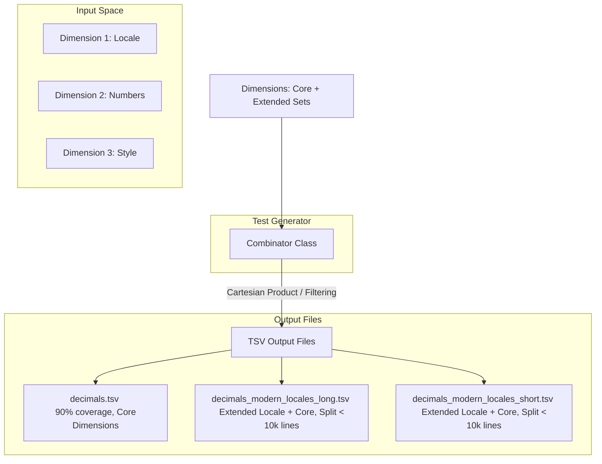

# Design Document: CLDR Conformance Testing for Decimal & Currency Formatting

## 1. Goal & Philosophy

The primary objective of this conformance testing framework is to validate implementations of the Common Locale Data Repository (CLDR) specifications for decimal and currency formatting. 

To achieve this, the design balances two critical needs:
1. **Robust, Structured Test Data:** Providing comprehensive, machine-readable test cases to verify that formatting implementations strictly adhere to CLDR specifications across various locales, edge cases, and formatting options.
2. **Readable & Executable Documentation:** The test generator implementation itself must serve as a clear, readable guide. A developer who reads the CLDR specifications and finds them ambiguous should be able to look at the generator's code (specifically the dimensions and combinations) to understand exactly how the spec is interpreted and applied. 

By tying the specification, the test generation logic, and the output data tightly together, we ensure that:
* It is easy to synchronize the implementation with future CLDR spec updates.
* Ambiguities in the CLDR spec are explicitly resolved in code via readable, well-commented dimensions.

---

## 2. Core Architecture

The test generation framework is built around two primary abstractions: the **Dimension** and the **Combinator**, which output structured **TSV files**.

### 2.1. The `Dimension` Class

A `Dimension` represents a single input variable or configuration option that influences the output of decimal or currency formatting. Examples include the input number, the locale, the sign display rule, or the compact width.

#### Key Features of `Dimension`:
* **Core vs. Extended Sets:** To prevent combinatorial explosion while maintaining high coverage, each dimension categorizes its values into:
    * **Core Set:** A minimal, highly representative subset of values. This set contains all critical edge cases, common variations, and complex rules. If a dimension is small enough, its Core Set represents the entire dimension.
    * **Extended Set(s):** The remaining possible values (e.g., all 500+ modern locales, rare currencies, or exhaustive rounding combinations).
* **Nullability & Defaults:** Each dimension explicitly declares:
    * Whether it can be **empty** (null/omitted).
    * The **default value** applied by the formatting engine when it is empty.
* **TSV Representation:** Each dimension maps directly to a column in the output TSV file. If a dimension value for a test case is empty (i.e., it should test the default behavior), it is serialized as an **empty cell** in the TSV.

### 2.2. The `Combinator` Class

The `Combinator` is responsible for taking all defined dimensions and orchestrating their combination to produce a final set of test cases.

#### Combination Strategy:
1. **Core Test Suite:** 
   The Combinator generates a Cartesian product of the **Core Sets** of all dimensions. This compact suite is designed to cover approximately **90% of all distinct logic paths and edge cases** with a relatively small number of test cases.
2. **Extended Test Suites:**
   To test the remaining long tail of values without multiplying the entire space, the Combinator pairs **one extended dimension set at a time** with the **core sets of all other dimensions**.
   * *Example:* To test all modern locales, it combines the *Extended Locales* set with the *Core Numbers*, *Core Styles*, and *Core Rounding* options.
   * *De-duplication:* The extended sets must strictly exclude values already present in the core sets to prevent redundant test cases.

### 2.3. Output TSV Files & Splitting Strategy

The output of the generator consists of Tab-Separated Values (TSV) files. 

* **Columns:** The columns represent the dimensions in a fixed, documented order, followed by the expected formatted output (and potentially auxiliary validation fields).
* **Empty Cells:** A blank cell explicitly denotes that the dimension was omitted, signaling the implementation under test to fall back to its default behavior.
* **File Splitting Rules:**
    1. **Core File:** Saved as `decimals.tsv` or `currencies.tsv`. This contains the core-to-core combinations.
    2. **Extended Files:** Named systematically (e.g., `decimals_modern_locale.tsv`).
    3. **Line Limit (Max 10k lines):** To keep files manageable for version control, code review, and memory consumption in test runners, no single TSV file should exceed **10,000 lines**.
    4. **Splitting Dimension:** If an extended test suite exceeds 10,000 lines, the Combinator splits it across another logical dimension. For example, modern locales might be split by compact format length:
        * `decimals_modern_locale_short.tsv`
        * `decimals_modern_locale_long.tsv`

---

## 3. Decimal Formatting Dimensions

This section details the proposed dimensions for decimal formatting, indicating which values constitute the Core and Extended sets, and specifying default behaviors.

| Dimension Column | Core Set | Extended Set | Default Value / Behavior if Empty |
| :--- | :--- | :--- | :--- |
| `locale` | `en` (Standard Latin, default plurals) `fr` (French, spaces as grouping separators) `ar` (Arabic, Eastern Arabic digits, right-to-left) `hi` (Hindi, non-standard grouping sizes like 3,2,2) `ru` (Russian, complex plural rules) `da` (Danish, different decimal/grouping separators) | All other modern CLDR locales (e.g., `zh`, `ja`, `de`, `es`, `fi`, etc.) | `en` |
| `value` | `0`, `-0` `1`, `-1` `1.23`, `-1.23` `1000`, `100000` `1000000000` `NaN`, `Infinity`, `-Infinity` Edge cases: `0.0001`, `999.999` (forcing rounding transitions) | Comprehensive scale of numbers: exponents, very long decimals, specific values triggering all plural categories (zero, one, two, few, many, other) per locale. | *Mandatory* (No default) |
| `numbering_system` | `latn` (Latin digits) `arab` (Arabic-Indic digits) `deva` (Devanagari digits) | All other CLDR numbering systems (e.g., `hans`, `beng`, `thai`) | Determined by `locale` |
| `compact_style` | `none` (Standard decimal) `short` (e.g., 1.2M) `long` (e.g., 1.2 million) | *None* (Dimension is small) | `none` |
| `sign_display` | `auto` (Minus sign for negative only) `always` (Always show sign except NaN) `never` (Never show sign) `exceptZero` (Show sign for positive and negative, not zero) | *None* (Dimension is small) | `auto` |
| `grouping_strategy` | `auto` (Standard CLDR grouping) `always` (Force grouping even for small numbers) `never` (No grouping separators) `min2` (Group only if there are at least 2 digits before the separator) | *None* (Dimension is small) | `auto` |
| `rounding_mode` | `halfEven` (IEEE 754 Round half to even) `halfUp` (Round half away from zero) `down` (Round towards zero) | Other rounding modes: `up`, `ceiling`, `floor`, `halfDown` | `halfEven` |
| `precision` | Standard fraction limits (e.g., Min: 0, Max: 3) Significant digits limits (e.g., Min: 1, Max: 5) | Exhaustive combinations of Min/Max fraction and significant digits. | Min fraction: 0, Max fraction: 3, Significant digits: undefined. |

---

## 4. Currency Formatting Dimensions

Currency formatting inherits many dimensions from Decimal formatting (such as `locale`, `value`, `numbering_system`, `sign_display`, and `rounding_mode`), but introduces currency-specific dimensions that alter layout, symbols, and rounding rules.

| Dimension Column | Core Set | Extended Set | Default Value / Behavior if Empty |
| :--- | :--- | :--- | :--- |
| `currency_code` | `USD` (Standard 2-decimal) `EUR` (Standard 2-decimal, space/suffix in some locales) `JPY` (0-decimal currency) `IQD` (3-decimal currency) `CHF` (Cash rounding to nearest 0.05) `CVE` (Escudo, symbol acts as decimal separator: 100$00) | All other ISO 4217 currency codes | *Mandatory* (No default) |
| `currency_style` | `standard` (e.g., $1,000.00) `accounting` (e.g., ($1,000.00) for negative) `name` (e.g., 1,000.00 US dollars) | *None* (Dimension is small) | `standard` |
| `currency_width`| `symbol` (Standard symbol: $) `narrow` (Narrow symbol if exists: $) `code` (ISO code: USD) | *None* (Dimension is small) | `symbol` |
| `cash_rounding` | `false` (Standard mathematical rounding) `true` (Apply currency-specific cash rounding, e.g., Swiss 5-cent rounding) | *None* | `false` |
| `plural_context` | `other` (default context) `one` (singular context, e.g., "1.00 US dollar") `many` (e.g., "1.00 US dollars" - locale dependent) | *None* (Controlled primarily by the input `value` and `locale` combination) | `other` |

---

## 5. Summary of Splitting Plan (Example)

To demonstrate how the files will be structured and split to maintain readability and the 10k line limit:

1. **`decimals.tsv` (Core)**
   * Dimensions: Core Locale $\times$ Core Value $\times$ Core Sign $\times$ Core Rounding $\times$ Core Compact.
   * Size: ~5,000 cases. Highly concentrated.
2. **`decimals_modern_locales_standard_[a-m].tsv` & `[n-z].tsv`**
   * Dimensions: Extended Locales $\times$ Core Value $\times$ Standard Style (No compact).
   * Split alphabetically by locale code to stay under 10k lines per file.
3. **`decimals_modern_locales_compact.tsv`**
   * Dimensions: Extended Locales $\times$ Core Value $\times$ Compact Style (Short & Long).
4. **`currencies.tsv` (Core)**
   * Dimensions: Core Locale $\times$ Core Value $\times$ Core Currencies (USD, JPY, CHF, etc.) $\times$ Core Styles.
   * Size: ~4,000 cases.
5. **`currencies_extended_codes.tsv`**
   * Dimensions: Core Locale $\times$ Core Value $\times$ Extended Currency Codes (all ISO currencies).
   * Verifies that rare currency symbols and decimal requirements are loaded correctly.
