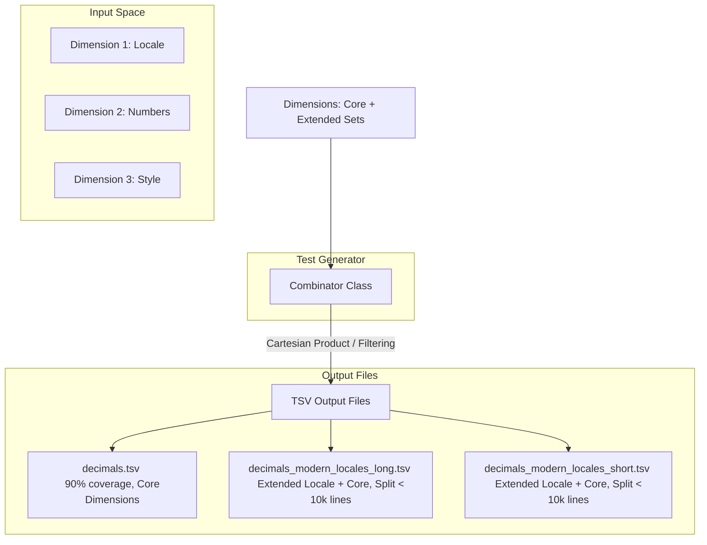

<style>
  .markdown-body {
    max-width: 1200px !important;
  }
</style>

# Design Document: CLDR Conformance Testing for Decimal & Currency Formatting

## 1. Goal & Philosophy

The primary objective of this conformance testing framework is to validate implementations of the Common Locale Data Repository (CLDR) specifications for decimal and currency formatting. 

To achieve this, the design balances two critical needs:
1. **Robust, Structured Test Data:** Providing comprehensive, machine-readable test cases to verify that formatting implementations strictly adhere to CLDR specifications across various locales, edge cases, and formatting options.
2. **Readable & Executable Documentation:** The test generator implementation itself must serve as a clear, readable guide. A developer who reads the CLDR specifications and finds them ambiguous should be able to look at the generator's code (specifically the dimensions and combinations) to understand exactly how the spec is interpreted and applied. 

By tying the specification, the test generation logic, and the output data tightly together, we ensure that:
* It is easy to synchronize the implementation with future CLDR spec updates.
* Ambiguities in the CLDR spec are explicitly resolved in code via readable, well-commented dimensions.

---

## 2. Core Architecture

The test generation framework is built around two primary abstractions: the **Dimension** and the **Combinator**, which output structured **TSV files**.



### 2.1. The `Dimension` Class

A `Dimension` represents a single input variable or configuration option that influences the output of decimal or currency formatting. Examples include the input number, the locale, the sign display rule, or the compact width.

#### Key Features of `Dimension`:
* **Core vs. Extended Sets:** To prevent combinatorial explosion while maintaining high coverage, each dimension categorizes its values into:
    * **Core Set:** A minimal, highly representative subset of values. This set contains all critical edge cases, common variations, and complex rules. If a dimension is small enough, its Core Set represents the entire dimension.
    * **Extended Set(s):** The remaining possible values (e.g., all 500+ modern locales, rare currencies, or exhaustive rounding combinations).
* **Nullability & Defaults:** Each dimension explicitly declares:
    * Whether it can be **empty** (null/omitted).
    * The **default value** applied by the formatting engine when it is empty.
* **TSV Representation:** Each dimension maps directly to a column in the output TSV file. If a dimension value for a test case is empty (i.e., it should test the default behavior), it is serialized as an **empty cell** in the TSV.

### 2.2. The `Combinator` Class

The `Combinator` is responsible for taking all defined dimensions and orchestrating their combination to produce a final set of test cases.

#### Combination Strategy:
1. **Core Test Suite:** 
   The Combinator generates a Cartesian product of the **Core Sets** of all dimensions. This compact suite is designed to cover approximately **90% of all distinct logic paths and edge cases** with a relatively small number of test cases.
2. **Extended Test Suites:**
   To test the remaining long tail of values without multiplying the entire space, the Combinator pairs **one extended dimension set at a time** with the **core sets of all other dimensions**.
   * *Example:* To test all modern locales, it combines the *Extended Locales* set with the *Core Numbers*, *Core Styles*, and *Core Rounding* options.
   * *De-duplication:* The extended sets must strictly exclude values already present in the core sets to prevent redundant test cases.

### 2.3. Output TSV Files & Splitting Strategy

The output of the generator consists of Tab-Separated Values (TSV) files. 

* **Columns:** The columns represent the dimensions in a fixed, documented order, followed by the expected formatted output (and potentially auxiliary validation fields).
* **Empty Cells:** A blank cell explicitly denotes that the dimension was omitted, signaling the implementation under test to fall back to its default behavior.
* **File Splitting Rules:**
    1. **Core File:** Saved as `decimals.tsv` or `currencies.tsv`. This contains the core-to-core combinations.
    2. **Extended Files:** Named systematically (e.g., `decimals_modern_locale.tsv`).
    3. **Line Limit (Max 10k lines):** To keep files manageable for version control, code review, and memory consumption in test runners, no single TSV file should exceed **10,000 lines**.
    4. **Splitting Dimension:** If an extended test suite exceeds 10,000 lines, the Combinator splits it across another logical dimension. For example, modern locales might be split by compact format length:
        * `decimals_modern_locale_short.tsv`
        * `decimals_modern_locale_long.tsv`

---

## 3. Decimal Formatting Dimensions

This section details the proposed dimensions for decimal formatting, indicating which values constitute the Core and Extended sets, and specifying default behaviors.

| Dimension Column | Explanation | TR35 Spec Reference (Link & Snippet) | Core Set | Extended Set | Default Value / Behavior if Empty |
| :--- | :--- | :--- | :--- | :--- | :--- |
| `locale` <br> **Java Name:** `Locale` | The locale identifier determines the linguistic and regional formatting rules (e.g., decimal separator, grouping separator, digit symbols). | [UTS #35 Locale](https://www.unicode.org/reports/tr35/#Locale) <br> *"A locale identifier is a structured string that identifies a particular set of language, script, region, and variant preferences."* | `en` (Standard Latin, default plurals)<br>`fr` (French, spaces as grouping separators)<br>`ar` (Arabic, Eastern Arabic digits, right-to-left)<br>`hi` (Hindi, non-standard grouping sizes like 3,2,2)<br>`ru` (Russian, complex plural rules)<br>`da` (Danish, different decimal/grouping separators) | All other modern CLDR locales (e.g., `zh`, `ja`, `de`, `es`, `fi`, etc.) | `en` |
| `value` <br> **Java Name:** `Value` | The input numeric value (a finite number, negative zero, NaN, or Infinity) to be formatted. | [TR35 Number Formats](https://www.unicode.org/reports/tr35/tr35-numbers.html#Number_Format_Patterns) <br> *"The pattern defines the layout of the formatted number, including grouping, decimals, and sign."* | `empty` (Omitted/null value)<br>`0`, `-0`<br>`1`, `-1`<br>`1.23`, `-1.23`<br>`1000`, `100000`<br>`1000000000`<br>`NaN`, `Infinity`, `-Infinity`<br>Edge cases: `0.0001`, `999.999` (forcing rounding transitions) | Comprehensive scale of numbers: exponents, very long decimals, specific values triggering all plural categories (zero, one, two, few, many, other) per locale. | `empty` (Omitted value defaults to empty/blank output) |
| `numbering_system` <br> **Java Name:** `NumberingSystem` | Specifies the set of digit characters and rules used to render the numbers (e.g., standard Latin vs. Eastern Arabic-Indic digits). | [TR35 Numbering Systems](https://www.unicode.org/reports/tr35/tr35-numbers.html#Numbering_Systems) <br> *"Numbering systems define the set of digits used to represent numbers, such as 'latn' (0-9) or 'arab' (Eastern Arabic digits)."* | `latn` (Latin digits)<br>`arab` (Arabic-Indic digits)<br>`deva` (Devanagari digits) | All other CLDR numbering systems (e.g., `hans`, `beng`, `thai`) | Determined by `locale` |
| `decimal_format_length` <br> **Java Name:** `DecimalFormatLength` | Specifies the format length style, allowing compact representations of numbers. | [TR35 Compact Formats](https://www.unicode.org/reports/tr35/tr35-numbers.html#Compact_Number_Formats) <br> *"Compact number formats are designed for short, user-friendly representations of large numbers, e.g., '10K' or '10 thousand'."* | `compact_short` (e.g., 1.2K)<br>`compact_long` (e.g., 1.2 thousand) | *None* (Dimension is small) | `empty` (Falls back to standard decimal formatting) |
| `sign_display` <br> **Java Name:** `SignDisplay` | Controls when and how the positive or negative signs are displayed (e.g., always show sign, or only for negative numbers). | [TR35 Number Patterns](https://www.unicode.org/reports/tr35/tr35-numbers.html#Number_Format_Patterns) <br> *"A pattern can contain a positive and a negative subpattern, e.g., '#,##0.00;(#,##0.00)'. Sign display options override how these subpatterns are applied."* | `auto` (Minus sign for negative only)<br>`always` (Always show sign except NaN)<br>`never` (Never show sign)<br>`exceptZero` (Show sign for positive and negative, not zero) | *None* (Dimension is small) | `auto` |
| `rounding_mode` <br> **Java Name:** `RoundingMode` | Determines the mathematical algorithm used when rounding numbers to fit the precision limits (e.g., round half-to-even, round towards zero). | [TR35 Rounding](https://www.unicode.org/reports/tr35/tr35-numbers.html#Round_Rounding_Increment) <br> *"Rounding increment and mode define how numbers are rounded to the nearest increment, e.g., rounding half to even."* | `halfEven` (IEEE 754 Round half to even)<br>`halfUp` (Round half away from zero)<br>`down` (Round towards zero) | Other rounding modes: `up`, `ceiling`, `floor`, `halfDown` | `halfEven` |
| `precision` <br> **Java Name:** `Precision` | Controls the constraints on the number of fraction digits or significant digits to be displayed (minimum and maximum limits). | [TR35 Significant Digits](https://www.unicode.org/reports/tr35/tr35-numbers.html#Significant_Digits) <br> *"Controls the number of fraction digits or significant digits displayed, checking minimum and maximum bounds."* | Standard fraction limits (e.g., Min: 0, Max: 3)<br>Significant digits limits (e.g., Min: 1, Max: 5) | Exhaustive combinations of Min/Max fraction and significant digits. | Min fraction: 0, Max fraction: 3, Significant digits: undefined. |

### 3.1. Java API Representation

To make the dimensions concrete and easily reviewable by engineering leads, the following Java code skeleton outlines how the `Dimension` classes, enums, and their core/extended configurations are defined:

```java
package com.google.i18n.conformance.decimal;

import java.math.BigDecimal;
import java.util.List;
import java.util.Optional;

/**
 * Java definition of dimensions for decimal formatting conformance testing.
 * This representation makes it easy to review the input space and defaults
 * with engineering leads.
 */
public final class DecimalDimensions {

  // Prevent instantiation
  private DecimalDimensions() {}

  // ==========================================================================
  // CORE SETS (Copy-pasteable datasets for the test runner)
  // ==========================================================================

  public static final List<String> CORE_LOCALES = List.of(
      "en", // Standard Latin, default plurals
      "fr", // French, spaces as grouping separators
      "ar", // Arabic, Eastern Arabic digits, right-to-left
      "hi", // Hindi, non-standard grouping sizes like 3,2,2
      "ru", // Russian, complex plural rules
      "da"  // Danish, different decimal/grouping separators
  );

  public static final List<BigDecimal> CORE_VALUES = java.util.Arrays.asList(
      null, // Omitted/empty value (tests default behavior)
      BigDecimal.ZERO,
      new BigDecimal("-0"), // Negative zero handling
      BigDecimal.ONE,
      new BigDecimal("-1"),
      new BigDecimal("1.23"),
      new BigDecimal("-1.23"),
      new BigDecimal("1000"),
      new BigDecimal("100000"),
      new BigDecimal("1000000000"),
      new BigDecimal("0.0001"), // Edge case forcing rounding transitions
      new BigDecimal("999.999")  // Edge case forcing rounding transitions
  );

  public static final List<String> CORE_NUMBERING_SYSTEMS = List.of(
      "latn", // Latin digits
      "arab", // Arabic-Indic digits
      "deva"  // Devanagari digits
  );

  public static final List<DecimalFormatLength> CORE_DECIMAL_FORMAT_LENGTHS = List.of(
      DecimalFormatLength.values()
  );

  public static final List<SignDisplay> CORE_SIGN_DISPLAYS = List.of(
      SignDisplay.values()
  );

  public static final List<RoundingMode> CORE_ROUNDING_MODES = List.of(
      RoundingMode.HALF_EVEN, // IEEE 754 Round half to even (default)
      RoundingMode.HALF_UP,   // Round half away from zero
      RoundingMode.DOWN       // Round towards zero (truncation)
  );

  public static final List<PrecisionConfig> CORE_PRECISIONS = List.of(
      PrecisionConfig.create(0, 3),            // Standard default (0-3 fraction digits)
      PrecisionConfig.create(0, 0),            // Integer only
      PrecisionConfig.create(2, 2),            // Fixed 2 decimal places
      PrecisionConfig.createSignificant(1, 5)  // Significant digits range (1-5)
  );

  // ==========================================================================
  // ENUMS & CONFIG CLASSES
  // ==========================================================================

  public enum DecimalFormatLength { COMPACT_SHORT, COMPACT_LONG }
  
  public enum SignDisplay { AUTO, ALWAYS, NEVER, EXCEPT_ZERO }
  
  public enum RoundingMode { HALF_EVEN, HALF_UP, DOWN, UP, CEILING, FLOOR, HALF_DOWN }

  public static class PrecisionConfig {
    public static PrecisionConfig create(int minFraction, int maxFraction) { ... }
    public static PrecisionConfig createSignificant(int minSig, int maxSig) { ... }
  }

  // ==========================================================================
  // DIMENSION DEFINITIONS (Using the constants above)
  // ==========================================================================

  /** 1. Locale Dimension */
  public static final Dimension<String> LOCALE = Dimension.<String>builder("locale")
      .withDefault("en")
      .withCoreSet(CORE_LOCALES)
      .withExtendedSetProvider(() -> LocaleRegistry.getModernLocalesExcept(CORE_LOCALES))
      .build();

  /** 2. Value Dimension */
  public static final Dimension<BigDecimal> VALUE = Dimension.<BigDecimal>builder("value")
      .withDefault(null) // Null represents omitted/empty value (results in empty string output)
      .withCoreSet(CORE_VALUES)
      .withExtendedSetProvider(ValueGenerator::getExhaustivePluralTriggerValues)
      .build();

  /** 3. Numbering System Dimension */
  public static final Dimension<String> NUMBERING_SYSTEM = Dimension.<String>builder("numbering_system")
      .withDynamicDefault(context -> context.get(LOCALE)
          .flatMap(LocaleRegistry::getDefaultNumberingSystem)
          .orElse("latn"))
      .withCoreSet(CORE_NUMBERING_SYSTEMS)
      .withExtendedSetProvider(() -> LocaleRegistry.getAllNumberingSystemsExcept(CORE_NUMBERING_SYSTEMS))
      .build();

  /** 4. Decimal Format Length Dimension */
  public static final Dimension<DecimalFormatLength> DECIMAL_FORMAT_LENGTH = Dimension.<DecimalFormatLength>builder("decimal_format_length")
      .withDefault(null) // Null/empty represents standard decimal formatting
      .withCoreSet(CORE_DECIMAL_FORMAT_LENGTHS)
      .build();

  /** 5. Sign Display Dimension */
  public static final Dimension<SignDisplay> SIGN_DISPLAY = Dimension.<SignDisplay>builder("sign_display")
      .withDefault(SignDisplay.AUTO)
      .withCoreSet(CORE_SIGN_DISPLAYS)
      .build();

  /** 6. Rounding Mode Dimension */
  public static final Dimension<RoundingMode> ROUNDING_MODE = Dimension.<RoundingMode>builder("rounding_mode")
      .withDefault(RoundingMode.HALF_EVEN)
      .withCoreSet(CORE_ROUNDING_MODES)
      .withExtendedSet(List.of(RoundingMode.UP, RoundingMode.CEILING, RoundingMode.FLOOR, RoundingMode.HALF_DOWN))
      .build();

  /** 7. Precision Dimension */
  public static final Dimension<PrecisionConfig> PRECISION = Dimension.<PrecisionConfig>builder("precision")
      .withDefault(PrecisionConfig.create(0, 3))
      .withCoreSet(CORE_PRECISIONS)
      .withExtendedSetProvider(PrecisionConfig::generateExhaustiveCombinations)
      .build();
}
```

---


## 4. Currency Formatting Dimensions

Currency formatting inherits many dimensions from Decimal formatting (such as `locale`, `value`, `numbering_system`, `sign_display`, and `rounding_mode`), but introduces currency-specific dimensions that alter layout, symbols, and rounding rules.

| Dimension Column | Explanation | TR35 Spec Reference (Link & Snippet) | Core Set | Extended Set | Default Value / Behavior if Empty |
| :--- | :--- | :--- | :--- | :--- | :--- |
| `currency_code` <br> **Java Name:** `CurrencyCode` | The ISO 4217 three-letter code of the currency, which determines the currency symbol, default decimal places, and rounding rules. | [TR35 Currencies](https://www.unicode.org/reports/tr35/tr35-numbers.html#Currencies) <br> *"Currencies are defined by ISO 4217 codes. Localized data provides the symbols, names, and decimal/rounding overrides for each code."* | `USD` (Standard 2-decimal)<br>`EUR` (Standard 2-decimal, space/suffix in some locales)<br>`JPY` (0-decimal currency)<br>`IQD` (3-decimal currency)<br>`CHF` (Cash rounding to nearest 0.05)<br>`CVE` (Escudo, symbol acts as decimal separator: 100$00) | All other ISO 4217 currency codes | *Mandatory* (No default) |
| `currency_style` <br> **Java Name:** `CurrencyStyle` | Selects between standard formatting (e.g., '$1.00') or accounting formatting (which often uses parentheses for negative values: '($1.00)'). | [TR35 Currency Formats](https://www.unicode.org/reports/tr35/tr35-numbers.html#Currency_Formats) <br> *"Specifies standard versus accounting styles (e.g., using parentheses for negative values in accounting: ($1.00))."* | `standard` (e.g., $1,000.00)<br>`accounting` (e.g., ($1,000.00) for negative)<br>`name` (e.g., 1,000.00 US dollars) | *None* (Dimension is small) | `standard` |
| `currency_width` <br> **Java Name:** `CurrencyWidth` | Determines the display width of the currency identifier (e.g., standard symbol '$', narrow symbol '$', or ISO code 'USD'). | [TR35 Currencies](https://www.unicode.org/reports/tr35/tr35-numbers.html#Currencies) <br> *"Determines if the display uses the standard symbol ($), the narrow symbol (if available), or the ISO code (USD)."* | `symbol` (Standard symbol: $)<br>`narrow` (Narrow symbol if exists: $)<br>`code` (ISO code: USD) | *None* (Dimension is small) | `symbol` |
| `decimal_format_length` <br> **Java Name:** `DecimalFormatLength` | Specifies the format length style for compact currency representation. <br> *Note: `compact_long` is not added/supported yet.* | [TR35 Compact Currency Formats](https://www.unicode.org/reports/tr35/tr35-numbers.html#Compact_Number_Formats) <br> *"Compact number formats can also be applied to currencies, e.g., '$1.2M'. Only the short style is currently supported."* | `compact_short` (e.g., $1.2M) | *None* (Dimension is small) | `empty` (Falls back to standard currency formatting) |
| `cash_rounding` <br> **Java Name:** `CashRounding` | Specifies whether to apply currency-specific cash rounding rules, which are typically used for physical cash transactions in specific countries. | [TR35 Cash Rounding](https://www.unicode.org/reports/tr35/tr35-numbers.html#Cash_Rounding) <br> *"In some countries, cash transactions are rounded to a specific increment (e.g., 5 cents in Canada/Switzerland) while electronic transactions are not."* | `false` (Standard mathematical rounding)<br>`true` (Apply currency-specific cash rounding, e.g., Swiss 5-cent rounding) | *None* | `false` |
| `plural_context` <br> **Java Name:** `PluralContext` | Determines the plural category context to ensure correct grammatical agreement when formatting with the long currency name (e.g., '1.00 US dollar' vs. '2.00 US dollars'). | [TR35 Language Plural Rules](https://www.unicode.org/reports/tr35/tr35-numbers.html#Language_Plural_Rules) <br> *"When formatting with currency names, the name must agree in plural form with the formatted number according to the locale's plural rules (e.g., '1 US dollar' vs '2 US dollars')."* | `other` (default context)<br>`one` (singular context, e.g., "1.00 US dollar")<br>`many` (e.g., "1.00 US dollars" - locale dependent) | *None* (Controlled primarily by the input `value` and `locale` combination) | `other` |

### 4.1. Java API Representation

To keep the implementation aligned, the following Java code skeleton defines the `CurrencyDimensions` class, including the core sets as copy-pasteable constants:

```java
package com.google.i18n.conformance.currency;

import java.math.BigDecimal;
import java.util.List;

/**
 * Java definition of dimensions for currency formatting conformance testing.
 * This representation makes it easy to review the input space and defaults
 * with engineering leads.
 */
public final class CurrencyDimensions {

  // Prevent instantiation
  private CurrencyDimensions() {}

  // ==========================================================================
  // CORE SETS (Copy-pasteable datasets for the test runner)
  // ==========================================================================

  public static final List<String> CORE_CURRENCY_CODES = List.of(
      "USD", // Standard 2-decimal currency
      "EUR", // Standard 2-decimal, space/suffix differences in some locales
      "JPY", // 0-decimal currency
      "IQD", // 3-decimal currency
      "CHF", // Cash rounding to nearest 0.05
      "CVE"  // Escudo (symbol acts as decimal separator: 100$00)
  );

  public static final List<CurrencyStyle> CORE_CURRENCY_STYLES = List.of(
      CurrencyStyle.values()
  );

  public static final List<CurrencyWidth> CORE_CURRENCY_WIDTHS = List.of(
      CurrencyWidth.values()
  );

  public static final List<DecimalFormatLength> CORE_DECIMAL_FORMAT_LENGTHS = List.of(
      DecimalFormatLength.values()
  );

  public static final List<Boolean> CORE_CASH_ROUNDING_OPTIONS = List.of(
      Boolean.TRUE,
      Boolean.FALSE
  );

  public static final List<PluralContext> CORE_PLURAL_CONTEXTS = List.of(
      PluralContext.values()
  );

  // ==========================================================================
  // ENUMS
  // ==========================================================================

  public enum CurrencyStyle { STANDARD, ACCOUNTING, NAME }

  public enum CurrencyWidth { SYMBOL, NARROW, CODE }

  public enum DecimalFormatLength { 
    COMPACT_SHORT // Note: compact_long is not added/supported yet for currencies
  }

  public enum PluralContext { OTHER, ONE, MANY }

  // ==========================================================================
  // DIMENSION DEFINITIONS (Using the constants above)
  // ==========================================================================

  /** 1. Currency Code Dimension */
  public static final Dimension<String> CURRENCY_CODE = Dimension.<String>builder("currency_code")
      .mandatory() // Each currency test case must specify a currency code
      .withCoreSet(CORE_CURRENCY_CODES)
      .withExtendedSetProvider(CurrencyRegistry::getAllIsoCurrenciesExceptCore)
      .build();

  /** 2. Currency Style Dimension */
  public static final Dimension<CurrencyStyle> CURRENCY_STYLE = Dimension.<CurrencyStyle>builder("currency_style")
      .withDefault(CurrencyStyle.STANDARD)
      .withCoreSet(CORE_CURRENCY_STYLES)
      .build();

  /** 3. Currency Width Dimension */
  public static final Dimension<CurrencyWidth> CURRENCY_WIDTH = Dimension.<CurrencyWidth>builder("currency_width")
      .withDefault(CurrencyWidth.SYMBOL)
      .withCoreSet(CORE_CURRENCY_WIDTHS)
      .build();

  /** 4. Decimal Format Length Dimension */
  public static final Dimension<DecimalFormatLength> DECIMAL_FORMAT_LENGTH = Dimension.<DecimalFormatLength>builder("decimal_format_length")
      .withDefault(null) // Null/empty represents standard currency formatting
      .withCoreSet(CORE_DECIMAL_FORMAT_LENGTHS)
      .build();

  /** 5. Cash Rounding Dimension */
  public static final Dimension<Boolean> CASH_ROUNDING = Dimension.<Boolean>builder("cash_rounding")
      .withDefault(false)
      .withCoreSet(CORE_CASH_ROUNDING_OPTIONS)
      .build();

  /** 6. Plural Context Dimension */
  public static final Dimension<PluralContext> PLURAL_CONTEXT = Dimension.<PluralContext>builder("plural_context")
      .withDefault(PluralContext.OTHER)
      .withCoreSet(CORE_PLURAL_CONTEXTS)
      .build();
}
```

---

## 5. Summary of Splitting Plan (Example)

To demonstrate how the files will be structured and split to maintain readability and the 10k line limit:

1. **`decimals.tsv` (Core)**
   * Dimensions: Core Locale $\times$ Core Value $\times$ Core Sign $\times$ Core Rounding $\times$ Core Compact.
   * Size: ~5,000 cases. Highly concentrated.
2. **`decimals_modern_locales_standard_[a-m].tsv` & `[n-z].tsv`**
   * Dimensions: Extended Locales $\times$ Core Value $\times$ Standard Style (No compact).
   * Split alphabetically by locale code to stay under 10k lines per file.
3. **`decimals_modern_locales_compact.tsv`**
   * Dimensions: Extended Locales $\times$ Core Value $\times$ Compact Style (Short & Long).
4. **`currencies.tsv` (Core)**
   * Dimensions: Core Locale $\times$ Core Value $\times$ Core Currencies (USD, JPY, CHF, etc.) $\times$ Core Styles.
   * Size: ~4,000 cases.
5. **`currencies_extended_codes.tsv`**
   * Dimensions: Core Locale $\times$ Core Value $\times$ Extended Currency Codes (all ISO currencies).
   * Verifies that rare currency symbols and decimal requirements are loaded correctly.
