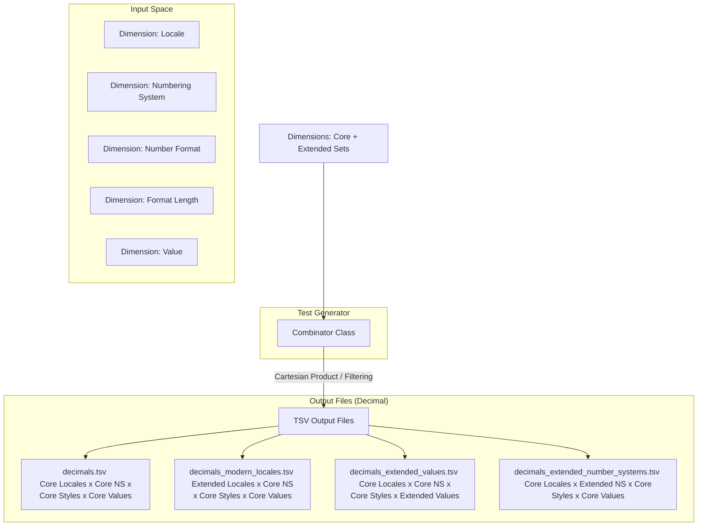

<style>
  .markdown-body {
    max-width: 1200px !important;
  }
</style>

# Design Document: CLDR Conformance Testing for Decimal & Currency Formatting

## 1. Goal & Philosophy

The primary objective of this conformance testing framework is to validate implementations of the Common Locale Data Repository (CLDR) specifications for decimal and currency formatting. 

To achieve this, the design balances two critical needs:
1. **Robust, Structured Test Data:** Providing comprehensive, machine-readable test cases to verify that formatting implementations strictly adhere to CLDR specifications across various locales, edge cases, and formatting options.
2. **Readable & Executable Documentation:** The test generator implementation itself must serve as a clear, readable guide. A developer who reads the CLDR specifications and finds them ambiguous should be able to look at the generator's code (specifically the dimensions and combinations) to understand exactly how the spec is interpreted and applied. 

By tying the specification, the test generation logic, and the output data tightly together, we ensure that:
* It is easy to synchronize the implementation with future CLDR spec updates.
* Ambiguities in the CLDR spec are explicitly resolved in code via readable, well-commented dimensions.

---

## 2. Core Architecture

The test generation framework is built around two primary abstractions: the **Dimension** and the **Combinator**, which output structured **TSV files**.



### 2.1. The `Dimension` Class

A `Dimension` represents a single input variable or configuration option that influences the output of decimal or currency formatting. Examples include the input value, the locale, the numbering system, or the format length.

#### Key Features of `Dimension`:
* **Core vs. Extended Sets:** To prevent combinatorial explosion while maintaining high coverage, each dimension categorizes its values into:
    * **Core Set:** A minimal, highly representative subset of values. This set contains all critical edge cases, common variations, and complex rules. If a dimension is small enough, its Core Set represents the entire dimension.
    * **Extended Set(s):** The remaining possible values (e.g., all 500+ modern locales, rare currencies, or exhaustive numeric scales).
* **Nullability & Defaults:** Each dimension explicitly declares:
    * Whether it can be **empty** (null/omitted).
    * The **default value** applied by the formatting engine when it is empty.
* **TSV Representation:** Each dimension maps directly to a column in the output TSV file. If a dimension value for a test case is empty (i.e., it should test the default behavior), it is serialized as an **empty cell** in the TSV.

### 2.2. The `Combinator` and Output TSV Files

The `Combinator` is responsible for taking all defined dimensions and orchestrating their combination to produce the final test suites, saving them as Tab-Separated Values (TSV) files.

#### Combination & Splitting Strategy:
1. **Core Test Suite (`decimals.tsv` / `currencies.tsv`):** 
   Generates a Cartesian product of the **Core Sets** of all dimensions. This compact suite is designed to cover approximately **90% of all distinct logic paths and edge cases** (e.g., standard styles across high-signal locales, numbering systems, and representative values) with a minimal footprint.
2. **Extended Locales Suite (`decimals_modern_locales.tsv` / `currencies_*_modern_locales.tsv`):**
   Pairs the **Extended Modern Locales** set with the **Core Sets** of all other dimensions to verify language-specific rules across the long tail.
3. **Extended Values Suite (`decimals_extended_values.tsv` / `currencies_*_extended_values.tsv`):**
   Pairs the **Extended Values** set (exhaustive powers of 10, rounding edge cases) with the **Core Locales**, Core Numbering Systems, and Core styles to verify mathematical precision and scale transitions.
4. **Extended Numbering Systems Suite (`decimals_extended_number_systems.tsv` / `currencies_*_extended_number_systems.tsv`):**
   Pairs the **Extended Numbering Systems** set (e.g., Devanagari, Bengali digits) with Core Locales, Core styles, and Core values to verify digit shape rendering across scripts.
5. **Extended Currencies Suite (Currency only - `currencies_*_modern_currencies.tsv`):**
   Pairs the **Extended Modern Currencies** set with the Core Locales, Core Numbering Systems, and Core styles to verify rare currency symbol rendering, ISO codes, and custom decimal rules.
6. **Deduplication:** Extended sets strictly exclude values already present in the core sets to prevent redundant test cases.
7. **File Size Management:** To keep files manageable for version control and test runners, the currency extended suites are split by formatting style and representation (e.g., splitting into `currencies_symbol_accounting_modern_currencies.tsv`, etc.) ensuring no single file exceeds comfortable reading limits (max 10,000 lines).

---

## 3. Decimal Formatting Dimensions

This section details the dimensions implemented in the decimal formatting test generator, indicating which values constitute the Core and Extended sets, and specifying default behaviors.

| Dimension Column | Explanation | TR35 Spec Reference (Link & Snippet) | Core Set | Extended Set | Default Value / Behavior if Empty |
| :--- | :--- | :--- | :--- | :--- | :--- |
| `locale` <br> **Java Name:** `Locale` | The locale identifier determines the linguistic and regional formatting rules (e.g., decimal separator, grouping separator, digit symbols). | [UTS #35 Locale](https://www.unicode.org/reports/tr35/#Locale) <br> *"A locale identifier is a structured string that identifies a particular set of language, script, region, and variant preferences."* | `ar` (Arabic RTL, Latin digits)<br>`ar_EG` (Arabic Egypt, Eastern Arabic digits)<br>`bn` (Bengali LTR, Bengali digits, Indian grouping)<br>`de` (German, comma/dot separators)<br>`de_CH` (German Swiss, apostrophe separator)<br>`en` (English LTR, dot/comma separators)<br>`ja` (Japanese, 4-digit grouping)<br>`pt_PT` (Portuguese, space separator)<br>`ru` (Russian, Cyrillic script, complex plurals) | All other modern CLDR locales | `en` |
| `number_system` <br> **Java Name:** `NumberSystem` | Defines the digit set and numeric rules (e.g. Latin digits, Arabic-Indic digits, or Devanagari digits). | [TR35 Numbering Systems](https://www.unicode.org/reports/tr35/tr35-numbers.html#Numbering_Systems) <br> *"Specifies the set of digits or symbols used to represent numbers, e.g., 'latn' for 0-9, 'arab' for Eastern Arabic digits."* | `empty` (Uses locale default digits) <br>`latn` (Latin digits: 0-9)<br>`arab` (Eastern Arabic-Indic digits: ٠-٩) | `deva` (Devanagari digits)<br>`beng` (Bengali digits) | `empty` (Resolves to locale's default numbering system) |
| `number_format` <br> **Java Name:** `NumberFormat` | Specifies the core format pattern type to apply: standard decimal, percent representation, or scientific notation. | [TR35 Number Formats](https://www.unicode.org/reports/tr35/tr35-numbers.html#Number_Formats) <br> *"Number formats include standard decimal patterns, percent patterns, and scientific notation patterns."* | `decimal` (Standard decimal)<br>`percent` (Percentage, scaled $\times 100$)<br>`scientific` (Scientific/exponential notation) | *None* (Dimension is fully covered) | `decimal` |
| `decimal_format_length` <br> **Java Name:** `DecimalFormatLength` | Specifies the format length style, allowing compact representations of numbers (e.g. 1.2K or 1.2 million). | [TR35 Compact Formats](https://www.unicode.org/reports/tr35/tr35-numbers.html#Compact_Number_Formats) <br> *"Compact number formats are designed for short, user-friendly representations of large numbers, e.g., '10K' or '10 thousand'."* | `empty` (Standard formatting, represented as `""`) <br>`short` (Compact short, e.g. 1.2K)<br>`long` (Compact long, e.g. 1.2 thousand) | *None* (Dimension is fully covered) | `empty` (Standard decimal formatting) |
| `value` <br> **Java Name:** `Value` | The input numeric value (represented as a standard double) to be formatted. | [TR35 Number Formats](https://www.unicode.org/reports/tr35/tr35-numbers.html#Number_Format_Patterns) <br> *"The pattern defines the layout of the formatted number, including grouping, decimals, and sign."* | `0.0`, `1.2`, `0.00831765`<br>`1234565.0`, `-1230.05` | Comprehensive mathematical scale:<br>- Powers of 10 ($10^{-6}$ to $10^{12}$)<br>- Multiples ($1.5 \times 10^i$, $5 \times 10^i$)<br>- Edge cases: `12.0`, `123.0`, `1234.56`, `1234567.0`, `0.000123`, `-0.0`, `0.5`, `1.5`, `2.5`, `3.5`, `0.125`, `0.135`, `999.9`, `999999.9`<br>- Negatives of all the above. | *Mandatory* (No default) |

### 3.1. Java API Representation

To keep the specification and implementation in perfect alignment, the following Java code snippet reflects the exact `Dimensions` structure and datasets implemented in `GenerateDecimalFormatTestData.java`:

```java
package org.unicode.cldr.tool;

import com.google.common.collect.ImmutableSet;
import java.util.EnumSet;
import java.util.Set;
import java.util.TreeSet;
import org.unicode.cldr.util.CLDRConfig;
import org.unicode.cldr.util.Factory;
import org.unicode.cldr.util.Level;
import org.unicode.cldr.util.Organization;
import org.unicode.cldr.util.StandardCodes;

public final class GenerateDecimalFormatTestData {

    public static final class Dimensions {
        private static final CLDRConfig CLDR_CONFIG = CLDRConfig.getInstance();
        private static final Factory CLDR_FACTORY = CLDR_CONFIG.getCldrFactory();

        // Core subset of locales for quick, high-signal testing
        private static final ImmutableSet<String> CORE_LOCALES =
                ImmutableSet.of("ar", "ar_EG", "bn", "de", "de_CH", "en", "ja", "pt_PT", "ru");

        // Core subset of test values
        public static final ImmutableSet<Double> CORE_VALUES =
                ImmutableSet.of(0.0, 1.2, 0.00831765, 1234565.0, -1230.05);

        // Numbering System dimension
        public enum NumberSystem {
            EMPTY(""),
            LATN("latn"),
            ARAB("arab"),
            DEVA("deva"),
            BENG("beng");

            private final String label;
            NumberSystem(String label) { this.label = label; }
            public String getLabel() { return label; }
        }

        public static final ImmutableSet<NumberSystem> CORE_NUMBER_SYSTEMS =
                ImmutableSet.of(NumberSystem.EMPTY, NumberSystem.LATN, NumberSystem.ARAB);

        public static Set<NumberSystem> getExtendedNumberSystems() {
            Set<NumberSystem> extended = new TreeSet<>();
            extended.add(NumberSystem.DEVA);
            extended.add(NumberSystem.BENG);
            return extended;
        }

        // Core number format type dimension
        public enum NumberFormat {
            DECIMAL("decimal"),
            PERCENT("percent"),
            SCIENTIFIC("scientific");

            private final String label;
            NumberFormat(String label) { this.label = label; }
            public String getLabel() { return label; }
        }

        // Format length dimension (empty, short, long)
        public enum DecimalFormatLength {
            EMPTY(""),
            SHORT("short"),
            LONG("long");

            private final String label;
            DecimalFormatLength(String label) { this.label = label; }
            public String getLabel() { return label; }
        }

        public static ImmutableSet<String> getCoreLocales() { return CORE_LOCALES; }
        public static Set<String> getAllLocales() { return CLDR_FACTORY.getAvailableLanguages(); }

        public static Set<String> getExtendedModernLocales() {
            Set<String> modernLocales =
                    StandardCodes.make()
                            .getLocaleCoverageLocales(Organization.cldr, EnumSet.of(Level.MODERN));
            Set<String> extendedModernLocales = new TreeSet<>(modernLocales);
            extendedModernLocales.removeAll(getCoreLocales());
            return extendedModernLocales;
        }

        public static Set<Double> getExtendedValues() {
            Set<Double> results = new TreeSet<>();
            // Add powers of 10 and their multiples
            for (int i = -6; i <= 12; i++) {
                results.add(Math.pow(10, i));
                results.add(Math.pow(10, i) * 1.5);
                results.add(Math.pow(10, i) * 5);
            }
            // Add standard edge cases
            results.addAll(CORE_VALUES);
            results.add(12.0);
            results.add(123.0);
            results.add(1234.56);
            results.add(1234567.0);
            results.add(0.000123);
            results.add(-0.0);
            results.add(0.5);
            results.add(1.5);
            results.add(2.5);
            results.add(3.5);
            results.add(0.125);
            results.add(0.135);
            results.add(999.9);
            results.add(999999.9);

            // Add negative counterparts
            Set<Double> negatives = new TreeSet<>();
            for (Double d : results) {
                if (d > 0) { negatives.add(-d); }
            }
            results.addAll(negatives);
            return results;
        }

        private Dimensions() {}
    }
}
```

---

## 4. Currency Formatting Dimensions

Currency formatting inherits several dimensions from Decimal formatting (such as `locale`, `number_system` and `value`), but introduces currency-specific dimensions that alter layout, symbols, and formatting behavior (accounting parenthesis, long names, narrow symbols).

| Dimension Column | Explanation | TR35 Spec Reference (Link & Snippet) | Core Set | Extended Set | Default Value / Behavior if Empty |
| :--- | :--- | :--- | :--- | :--- | :--- |
| `locale` <br> **Java Name:** `Locale` | Same as Decimal. | Same as Decimal. | Same as Decimal. | Same as Decimal. | `en` |
| `number_system` <br> **Java Name:** `NumberSystem` | Same as Decimal. | Same as Decimal. | Same as Decimal. | Same as Decimal. | `empty` |
| `currency` <br> **Java Name:** `Currency` | The ISO 4217 three-letter code of the currency to format. If empty, formats as a standard decimal/accounting number without a currency unit. | [TR35 Currencies](https://www.unicode.org/reports/tr35/tr35-numbers.html#Currencies) <br> *"Currencies are defined by ISO 4217 codes. Localized data provides the symbols, names, and decimal/rounding overrides for each code."* | `USD` (Standard 2-decimal)<br>`EUR` (Standard 2-decimal, European spacing)<br>`JPY` (0-decimal currency)<br>`RUB` (Cyrillic Ruble, complex plurals)<br>`EGP` (Egyptian Pound, RTL Arabic context)<br>`empty` (Omitted, represented as `""`) | All other active legal-tender ISO 4217 currency codes | `empty` (Omitted) |
| `currency_format_length` <br> **Java Name:** `CurrencyFormatLength` | Controls the overall formatting style and length (standard, accounting parentheses, or compact short). <br> *Note: Compact long is not supported for currency in CLDR.* | [TR35 Currency Formats](https://www.unicode.org/reports/tr35/tr35-numbers.html#Currency_Formats) <br> *"Specifies standard versus accounting styles (e.g., ($1.00)) or compact short styles (e.g., $1.2K)."* | `standard` (Standard currency formatting)<br>`accounting` (Accounting style: uses parenthesis for negatives)<br>`short` (Compact short currency style: e.g. $1.2K) | *None* (Dimension is fully covered) | `standard` |
| `currency_display` <br> **Java Name:** `CurrencyDisplay` | Controls how the currency unit itself is represented within the formatted string (symbol, narrow symbol, ISO code, or full plural name). | [TR35 Currencies](https://www.unicode.org/reports/tr35/tr35-numbers.html#Currencies) <br> *"Determines if the display uses the standard symbol ($), narrow symbol ($), ISO code (USD), or full name (US dollars)."* | `symbol` (e.g. $1.00)<br>`narrowSymbol` (e.g. narrow variant)<br>`code` (ISO code, e.g. USD 1.00)<br>`name` (Plural name, e.g. 1.00 US dollar) | *None* (Dimension is fully covered) | `symbol` |
| `value` <br> **Java Name:** `Value` | Same as Decimal. | Same as Decimal. | Same as Decimal. | Same as Decimal. | *Mandatory* |

### 4.1. Java API Representation

The following Java code snippet reflects the exact `Dimensions` structure and datasets implemented in `GenerateCurrencyFormatTestData.java` (reusing core sets where applicable):

```java
package org.unicode.cldr.tool;

import com.google.common.collect.ImmutableSet;
import java.util.Date;
import java.util.EnumSet;
import java.util.Set;
import java.util.TreeSet;
import org.unicode.cldr.util.CLDRConfig;
import org.unicode.cldr.util.Factory;
import org.unicode.cldr.util.Level;
import org.unicode.cldr.util.Organization;
import org.unicode.cldr.util.StandardCodes;
import org.unicode.cldr.util.SupplementalDataInfo;
import org.unicode.cldr.util.SupplementalDataInfo.CurrencyDateInfo;

public final class GenerateCurrencyFormatTestData {

    public static final class Dimensions {
        private static final CLDRConfig CLDR_CONFIG = CLDRConfig.getInstance();
        private static final Factory CLDR_FACTORY = CLDR_CONFIG.getCldrFactory();

        // Core subset of locales (deduplicated/shared with decimal)
        private static final ImmutableSet<String> CORE_LOCALES =
                ImmutableSet.of("ar", "ar_EG", "bn", "de", "de_CH", "en", "ja", "pt_PT", "ru");

        // Core subset of major currencies matching core locales
        private static final ImmutableSet<String> CORE_CURRENCIES =
                ImmutableSet.of("USD", "EUR", "JPY", "RUB", "EGP", "");

        // Core values (deduplicated/shared with decimal)
        public static final ImmutableSet<Double> CORE_VALUES =
                ImmutableSet.of(0.0, 1.2, 0.00831765, 1234565.0, -1230.05);

        // Numbering System dimension
        public enum NumberSystem {
            EMPTY(""),
            LATN("latn"),
            ARAB("arab"),
            DEVA("deva"),
            BENG("beng");

            private final String label;
            NumberSystem(String label) { this.label = label; }
            public String getLabel() { return label; }
        }

        public static final ImmutableSet<NumberSystem> CORE_NUMBER_SYSTEMS =
                ImmutableSet.of(NumberSystem.EMPTY, NumberSystem.LATN, NumberSystem.ARAB);

        public static Set<NumberSystem> getExtendedNumberSystems() {
            Set<NumberSystem> extended = new TreeSet<>();
            extended.add(NumberSystem.DEVA);
            extended.add(NumberSystem.BENG);
            return extended;
        }

        // Currency format length (standard, accounting, compact short)
        public enum CurrencyFormatLength {
            STANDARD("standard"),
            ACCOUNTING("accounting"),
            SHORT("short");

            private final String label;
            CurrencyFormatLength(String label) { this.label = label; }
            public String getLabel() { return label; }
        }

        // Currency unit representation
        public enum CurrencyDisplay {
            SYMBOL("symbol"),
            NARROW_SYMBOL("narrowSymbol"),
            ISO_CODE("code"),
            NAME("name");

            private final String label;
            CurrencyDisplay(String label) { this.label = label; }
            public String getLabel() { return label; }
        }

        public static ImmutableSet<String> getCoreLocales() { return CORE_LOCALES; }
        public static ImmutableSet<String> getCoreCurrencies() { return CORE_CURRENCIES; }

        public static Set<String> getExtendedModernLocales() {
            Set<String> modernLocales =
                    StandardCodes.make()
                            .getLocaleCoverageLocales(Organization.cldr, EnumSet.of(Level.MODERN));
            Set<String> extendedModernLocales = new TreeSet<>(modernLocales);
            extendedModernLocales.removeAll(getCoreLocales());
            return extendedModernLocales;
        }

        public static Set<String> getModernCurrencies() {
            SupplementalDataInfo sdi = CLDR_CONFIG.getSupplementalDataInfo();
            Set<String> modernCurrencies = new TreeSet<>();
            Date now = new Date();
            for (String territory : sdi.getCurrencyTerritories()) {
                for (CurrencyDateInfo cdi : sdi.getCurrencyDateInfo(territory)) {
                    if (cdi.getStart().before(now)
                            && cdi.getEnd().after(now)
                            && cdi.isLegalTender()) {
                        modernCurrencies.add(cdi.getCurrency());
                    }
                }
            }
            return modernCurrencies;
        }

        public static Set<String> getExtendedModernCurrencies() {
            Set<String> allModern = getModernCurrencies();
            allModern.removeAll(getCoreCurrencies());
            return allModern;
        }

        public static Set<Double> getExtendedValues() {
            // Formulaic generation exactly matching decimal
            Set<Double> results = new TreeSet<>();
            for (int i = -6; i <= 12; i++) {
                results.add(Math.pow(10, i));
                results.add(Math.pow(10, i) * 1.5);
                results.add(Math.pow(10, i) * 5);
            }
            results.addAll(CORE_VALUES);
            results.add(12.0);
            results.add(123.0);
            results.add(1234.56);
            results.add(1234567.0);
            results.add(0.000123);
            results.add(-0.0);
            results.add(0.5);
            results.add(1.5);
            results.add(2.5);
            results.add(3.5);
            results.add(0.125);
            results.add(0.135);
            results.add(999.9);
            results.add(999999.9);

            Set<Double> negatives = new TreeSet<>();
            for (Double d : results) {
                if (d > 0) { negatives.add(-d); }
            }
            results.addAll(negatives);
            return results;
        }

        private Dimensions() {}
    }
}
```

---

## 5. Summary of Generated Test Suites

To demonstrate how the files are structured and split systematically to maintain readability, version control, and keep size below the 10,000-line threshold:

### 5.1. Decimal Test Suites
The decimal generator outputs four main files under the `decimal/` directory:

1. **`decimals.tsv` (Core Suite)**
   * **Combinations:** Core Locales ($9$) $\times$ Core NS ($3$) $\times$ All Styles ($5$) $\times$ Core Values ($5$) = **$675$ test cases**.
   * **Purpose:** Highly concentrated, fast-running smoke test covering 90% of code paths.
2. **`decimals_modern_locales.tsv` (Extended Locales Suite)**
   * **Combinations:** Extended Locales (~$140$) $\times$ Core NS ($3$) $\times$ All Styles ($5$) $\times$ Core Values ($5$) = **~$10,500$ test cases**.
   * **Purpose:** Thorough coverage of locale-specific formatting rules.
3. **`decimals_extended_values.tsv` (Extended Values Suite)**
   * **Combinations:** Core Locales ($9$) $\times$ Core NS ($3$) $\times$ All Styles ($5$) $\times$ Extended Values (~$120$) = **~$16,200$ test cases**.
   * **Purpose:** Full validation of mathematical scale and rounding behaviors.
4. **`decimals_extended_number_systems.tsv` (Extended Numbering Systems Suite)**
   * **Combinations:** Core Locales ($9$) $\times$ Extended NS ($2$) $\times$ All Styles ($5$) $\times$ Core Values ($5$) = **$450$ test cases**.
   * **Purpose:** Direct testing of digit representation in less common numbering systems.

### 5.2. Currency Test Suites
The currency generator outputs a structured set of files under the `currency/` directory. Due to the extra dimensions (Currencies and Numbering Systems), the extended suites are split systematically by style (`CurrencyDisplay` and `CurrencyFormatLength`) to maintain file readability:

1. **`currencies.tsv` (Core Suite)**
   * **Combinations:** Core Locales ($9$) $\times$ Core NS ($3$) $\times$ Core Currencies ($6$) $\times$ All Styles ($12$) $\times$ Core Values ($5$) = **$9,720$ test cases**.
   * **Purpose:** Core validation of major currency formats.
2. **Extended Modern Currencies (`currencies_{display}_{length}_modern_currencies.tsv`)**
   * **Combinations:** Core Locales ($9$) $\times$ Core NS ($3$) $\times$ Extended Currencies (~$150$) $\times$ Single Style ($1$) $\times$ Core Values ($5$) = **~$20,250$ test cases per file**.
   * **Split:** A file is written for each of the $12$ styles (e.g., `currencies_symbol_accounting_modern_currencies.tsv`).
3. **Extended Modern Locales (`currencies_{display}_{length}_modern_locales.tsv`)**
   * **Combinations:** Extended Locales (~$140$) $\times$ Core NS ($3$) $\times$ Core Currencies ($6$) $\times$ Single Style ($1$) $\times$ Core Values ($5$) = **~$12,600$ test cases per file**.
   * **Split:** A file is written for each of the $12$ styles.
4. **Extended Values (`currencies_{display}_{length}_extended_values.tsv`)**
   * **Combinations:** Core Locales ($9$) $\times$ Core NS ($3$) $\times$ Core Currencies ($6$) $\times$ Single Style ($1$) $\times$ Extended Values (~$120$) = **~$38,880$ test cases per file**.
   * **Split:** A file is written for each of the $12$ styles.
5. **Extended Numbering Systems (`currencies_{display}_{length}_extended_number_systems.tsv`)**
   * **Combinations:** Core Locales ($9$) $\times$ Extended NS ($2$) $\times$ Core Currencies ($6$) $\times$ Single Style ($1$) $\times$ Core Values ($5$) = **$540$ test cases per file**.
   * **Split:** A file is written for each of the $12$ styles.
