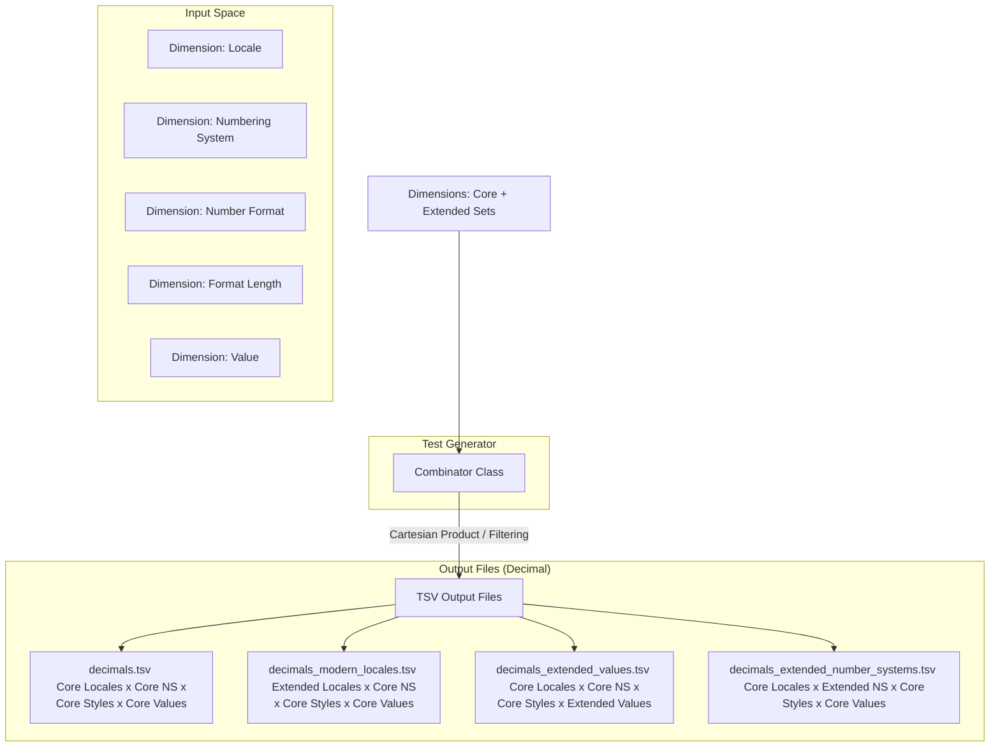

<style>
  .markdown-body {
    max-width: 1200px !important;
  }
</style>

# Design Document: CLDR Conformance Testing for Decimal & Currency Formatting

## 1. Goal & Philosophy

The primary objective of this conformance testing framework is to validate implementations of the Common Locale Data Repository (CLDR) specifications for decimal and currency formatting. 

To achieve this, the design balances two critical needs:
1. **Robust, Structured Test Data:** Providing comprehensive, machine-readable test cases to verify that formatting implementations strictly adhere to CLDR specifications across various locales, edge cases, and formatting options.
2. **Readable & Executable Documentation:** The test generator implementation itself must serve as a clear, readable guide. A developer who reads the CLDR specifications and finds them ambiguous should be able to look at the generator's code (specifically the dimensions and combinations) to understand exactly how the spec is interpreted and applied. 

By tying the specification, the test generation logic, and the output data tightly together, we ensure that:
* It is easy to synchronize the implementation with future CLDR spec updates.
* Ambiguities in the CLDR spec are explicitly resolved in code via readable, well-commented dimensions.

---

## 2. Core Architecture

The test generation framework is built around two primary abstractions: the **Dimension** and the **Combinator**, which output structured **TSV files**.



### 2.1. The `Dimension` Class

A `Dimension` represents a single input variable or configuration option that influences the output of decimal or currency formatting. Examples include the input value, the locale, the numbering system, or the format length.

#### Key Features of `Dimension`:
* **Core vs. Extended Sets:** To prevent combinatorial explosion while maintaining high coverage, each dimension categorizes its values into:
    * **Core Set:** A minimal, highly representative subset of values. This set contains all critical edge cases, common variations, and complex rules. If a dimension is small enough, its Core Set represents the entire dimension.
    * **Extended Set(s):** The remaining possible values (e.g., all 500+ modern locales, rare currencies, or exhaustive numeric scales).
* **Nullability & Defaults:** Each dimension explicitly declares:
    * Whether it can be **empty** (null/omitted).
    * The **default value** applied by the formatting engine when it is empty.
* **TSV Representation:** Each dimension maps directly to a column in the output TSV file. If a dimension value for a test case is empty (i.e., it should test the default behavior), it is serialized as an **empty cell** in the TSV.

### 2.2. The `Combinator` and Output TSV Files

The `Combinator` is responsible for taking all defined dimensions and orchestrating their combination to produce the final test suites, saving them as Tab-Separated Values (TSV) files.

#### Combination & Splitting Strategy:
1. **Core Test Suite (`decimals.tsv` / `currencies.tsv`):** 
   Generates a Cartesian product of the **Core Sets** of all dimensions. This compact suite is designed to cover approximately **90% of all distinct logic paths and edge cases** (e.g., standard styles across high-signal locales, numbering systems, and representative values) with a minimal footprint.
2. **Extended Locales Suite (`decimals_modern_locales.tsv` / `currencies_*_modern_locales.tsv`):**
   Pairs the **Extended Modern Locales** set with the **Core Sets** of all other dimensions to verify language-specific rules across the long tail.
3. **Extended Values Suite (`decimals_extended_values.tsv` / `currencies_*_extended_values.tsv`):**
   Pairs the **Extended Values** set (exhaustive powers of 10, rounding edge cases) with the **Core Locales**, Core Numbering Systems, and Core styles to verify mathematical precision and scale transitions.
4. **Extended Numbering Systems Suite (`decimals_extended_number_systems.tsv` / `currencies_*_extended_number_systems.tsv`):**
   Pairs the **Extended Numbering Systems** set (e.g., Devanagari, Bengali digits) with Core Locales, Core styles, and Core values to verify digit shape rendering across scripts.
5. **Extended Currencies Suite (Currency only - `currencies_*_modern_currencies.tsv`):**
   Pairs the **Extended Modern Currencies** set with the Core Locales, Core Numbering Systems, and Core styles to verify rare currency symbol rendering, ISO codes, and custom decimal rules.
6. **Deduplication:** Extended sets strictly exclude values already present in the core sets to prevent redundant test cases.
7. **File Size Management:** To keep files manageable for version control and test runners, the currency extended suites are split by formatting style and representation (e.g., splitting into `currencies_symbol_accounting_modern_currencies.tsv`, etc.) ensuring no single file exceeds comfortable reading limits (max 10,000 lines).

---

## 3. Decimal Formatting Dimensions

This section details the dimensions implemented in the decimal formatting test generator, indicating which values constitute the Core and Extended sets, and specifying default behaviors.

| Dimension Column | Explanation | TR35 Spec Reference (Link & Snippet) | Core Set | Extended Set | Default Value / Behavior if Empty |
| :--- | :--- | :--- | :--- | :--- | :--- |
| `locale` <br> **Java Name:** `Locale` | The locale identifier determines the linguistic and regional formatting rules (e.g., decimal separator, grouping separator, digit symbols). | [UTS #35 Locale & Numbers](https://www.unicode.org/reports/tr35/tr35-numbers.html#Number_Symbols) <br><br> **Why it's a dimension:** Number formatting is highly locale-dependent. Different locales use different grouping/decimal separators and patterns. <br><br> *“Localized numbers are formatted using patterns and symbols that are specific to a locale.”* (Section 1) | `ar` (Arabic RTL, Latin digits)<br>`ar_EG` (Arabic Egypt, Eastern Arabic digits)<br>`bn` (Bengali LTR, Bengali digits, Indian grouping)<br>`de` (German, comma/dot separators)<br>`de_CH` (German Swiss, apostrophe separator)<br>`en` (English LTR, dot/comma separators)<br>`ja` (Japanese, 4-digit grouping)<br>`pt_PT` (Portuguese, space separator)<br>`ru` (Russian, Cyrillic script, complex plurals) | All other modern CLDR locales | `en` |
| `number_system` <br> **Java Name:** `NumberSystem` | Defines the digit set and numeric rules (e.g. Latin digits, Arabic-Indic digits, or Devanagari digits). | [TR35 Numbering Systems](https://www.unicode.org/reports/tr35/tr35-numbers.html#Numbering_Systems) <br><br> **Why it's a dimension:** Determines the digit set used to represent the number (e.g., Latin `0-9` vs. Eastern Arabic-Indic `٠-٩`). <br><br> *“Specifies the set of digits or symbols used to represent numbers, e.g., 'latn' for 0-9, 'arab' for Eastern Arabic digits.”* (Section 2) | `empty` (Uses locale default digits) <br>`latn` (Latin digits: 0-9)<br>`arab` (Eastern Arabic-Indic digits: ٠-٩) | `deva` (Devanagari digits)<br>`beng` (Bengali digits) | `empty` (Resolves to locale's default numbering system) |
| `number_format` <br> **Java Name:** `NumberFormat` | Specifies the core format pattern type to apply: standard decimal, percent representation, or scientific notation. | [TR35 Number Formats](https://www.unicode.org/reports/tr35/tr35-numbers.html#Number_Formats) <br><br> **Why it's a dimension:** Controls the core mathematical representation (standard decimal, percentage scaling, or exponential scientific notation). <br><br> *“Number formats include standard decimal patterns, percent patterns, and scientific notation patterns.”* (Section 3) | `decimal` (Standard decimal)<br>`percent` (Percentage, scaled $\times 100$)<br>`scientific` (Scientific/exponential notation) | *None* (Dimension is fully covered) | `decimal` |
| `decimal_format_length` <br> **Java Name:** `DecimalFormatLength` | Specifies the format length style, allowing compact representations of numbers (e.g. 1.2K or 1.2 million). | [TR35 Compact Formats](https://www.unicode.org/reports/tr35/tr35-numbers.html#Compact_Number_Formats) <br><br> **Why it's a dimension:** Controls compact scaling (short like "10K" or long like "10 thousand") for space-constrained UIs. <br><br> *“Compact number formats are designed for short, user-friendly representations of large numbers, e.g., '10K' or '10 thousand'.”* (Section 4) | `empty` (Standard formatting, represented as `""`) <br>`short` (Compact short, e.g. 1.2K)<br>`long` (Compact long, e.g. 1.2 thousand) | *None* (Dimension is fully covered) | `empty` (Standard decimal formatting) |
| `value` <br> **Java Name:** `Value` | The input numeric value (represented as a standard double) to be formatted. | [TR35 Number Format Patterns & Compact Formats](https://www.unicode.org/reports/tr35/tr35-numbers.html#Number_Format_Patterns) <br><br> **Why it's a dimension:** The value's magnitude determines the compact format pattern selected and the plural rules applied to compact long names. <br><br> *“The compact pattern selected depends on the magnitude of the value.”* (Section 4) <br> *“Plural rules apply to the compact long formats based on the formatted value.”* (Section 4) | `0.0`, `1.2`, `0.00831765`<br>`1234565.0`, `-1230.05` | Comprehensive mathematical scale:<br>- Powers of 10 ($10^{-6}$ to $10^{12}$)<br>- Multiples ($1.5 \times 10^i$, $5 \times 10^i$)<br>- Edge cases: `12.0`, `123.0`, `1234.56`, `1234567.0`, `0.000123`, `-0.0`, `0.5`, `1.5`, `2.5`, `3.5`, `0.125`, `0.135`, `999.9`, `999999.9`<br>- Negatives of all the above. | *Mandatory* (No default) |
| `grouping_strategy` <br> **Java Name:** `GroupingStrategy` | Controls the application of digit grouping separators. | [TR35 Grouping](https://www.unicode.org/reports/tr35/tr35-numbers.html#Number_Format_Patterns) <br><br> **Why it's a dimension:** Controls whether grouping is enabled, disabled, or uses specific strategies like min2 (highly locale-dependent). <br><br> *“The grouping size... is the number of digits between grouping separators. ... The grouping separator is placed according to the grouping size.”* (Section 3) | `auto` (Uses locale default grouping)<br>`off` (Disables grouping entirely) | `min2` (Groups only if 2+ digits in first group)<br>`thousand` (Forces 3-digit grouping) | `auto` |
| `rounding_mode` <br> **Java Name:** `RoundingMode` | Controls the mathematical rounding algorithm when rounding fractional digits. | [TR35 Rounding](https://www.unicode.org/reports/tr35/tr35-numbers.html#Number_Format_Patterns) <br><br> **Why it's a dimension:** Determines how halfway cases are resolved (e.g., banker's rounding vs. standard round-half-up). <br><br> *“Rounding increments and rounding modes are used to round values to a specific precision.”* (Section 3) | `half-even` (Bankers rounding, rounds to nearest even) | `half-up` (Commercial rounding)<br>`up` (Away from zero)<br>`down` (Toward zero)<br>`ceiling` (Toward +infinity)<br>`floor` (Toward -infinity) | `half-even` |
| `precision` <br> **Java Name:** `Precision` | Overrides the default fractional or significant digit precision. | [TR35 Digit Precision](https://www.unicode.org/reports/tr35/tr35-numbers.html#Number_Format_Patterns) <br><br> **Why it's a dimension:** Tests custom overrides for minimum/maximum fraction digits and significant digits. <br><br> *“Rounding increments and rounding modes are used to round values to a specific precision... `@` represents a significant digit.”* (Section 3) | `default` (Uses pattern defaults)<br>`min2` (Minimum 2 fraction digits, pads with zeros)<br>`max2` (Maximum 2 fraction digits, rounds value) | `min0` (Forces integer representation)<br>`sig3` (Limits to 3 significant digits) | `default` |
| `sign_display` <br> **Java Name:** `SignDisplay` | Controls when the positive or negative sign is displayed. | [TR35 Sign Display](https://www.unicode.org/reports/tr35/tr35-numbers.html#Number_Format_Patterns) <br><br> **Why it's a dimension:** Tests rendering of positive signs (`+1.23`) and hiding of signs entirely (`never`). <br><br> *“The pattern defines the layout of the formatted number, including grouping, decimals, and sign.”* (Section 3) | `auto` (Shows sign for negatives only)<br>`always` (Always shows sign) | `never` (Hides sign entirely)<br>`except_zero` (Shows sign for non-zero values) | `auto` |
| `min_integer_digits` <br> **Java Name:** `MinIntegerDigits` | Controls the minimum number of digits displayed to the left of the decimal separator, padding with leading zeros if necessary. | [TR35 Integer Padding](https://www.unicode.org/reports/tr35/tr35-numbers.html#Number_Format_Patterns) <br><br> **Why it's a dimension:** Tests padding of numbers with leading zeros (e.g., `005`). <br><br> *“0: A digit. Zero shows as 0 if there is no digit in that position.”* (Section 3) | `1` (Default, no padding) | `3` (Pads to 3 digits, e.g., `005`) | `1` |
| `decimal_separator_display` <br> **Java Name:** `DecimalSeparatorDisplay` | Controls whether the decimal separator is shown when the fractional part is empty. | [TR35 Decimal Separator](https://www.unicode.org/reports/tr35/tr35-numbers.html#Number_Format_Patterns) <br><br> **Why it's a dimension:** Tests forcing of the decimal separator (e.g., `123.`). <br><br> *“.: Local decimal separator... Shows always if the pattern contains a dot.”* (Section 3) | `auto` (Hides separator if no fraction)<br>`always` (Always shows decimal separator) | `always` | `auto` |

### 3.1. Java API Representation

To keep the specification and implementation in perfect alignment, the following Java code snippet reflects the exact `Dimensions` structure and datasets implemented in `GenerateDecimalFormatTestData.java`:

```java
package org.unicode.cldr.tool;

import com.google.common.collect.ImmutableSet;
import java.util.EnumSet;
import java.util.Set;
import java.util.TreeSet;
import org.unicode.cldr.util.CLDRConfig;
import org.unicode.cldr.util.Factory;
import org.unicode.cldr.util.Level;
import org.unicode.cldr.util.Organization;
import org.unicode.cldr.util.StandardCodes;

public final class GenerateDecimalFormatTestData {

    public static final class Dimensions {
        private static final CLDRConfig CLDR_CONFIG = CLDRConfig.getInstance();
        private static final Factory CLDR_FACTORY = CLDR_CONFIG.getCldrFactory();

        // Core subset of locales for quick, high-signal testing
        private static final ImmutableSet<String> CORE_LOCALES =
                ImmutableSet.of("ar", "ar_EG", "bn", "de", "de_CH", "en", "ja", "pt_PT", "ru");

        // Core subset of test values
        public static final ImmutableSet<Double> CORE_VALUES =
                ImmutableSet.of(0.0, 1.2, 0.00831765, 1234565.0, -1230.05);

        // Core subset of grouping strategies
        private static final ImmutableSet<GroupingStrategy> CORE_GROUPING_STRATEGIES =
                ImmutableSet.of(GroupingStrategy.AUTO, GroupingStrategy.OFF);

        // Core subset of rounding modes
        private static final ImmutableSet<RoundingMode> CORE_ROUNDING_MODES =
                ImmutableSet.of(RoundingMode.HALF_EVEN);

        // Core subset of precisions
        private static final ImmutableSet<Precision> CORE_PRECISIONS =
                ImmutableSet.of(Precision.DEFAULT, Precision.MIN2, Precision.MAX2);

        // Core subset of sign displays
        private static final ImmutableSet<SignDisplay> CORE_SIGN_DISPLAYS =
                ImmutableSet.of(SignDisplay.AUTO, SignDisplay.ALWAYS);

        // Core subset of minimum integer digits
        private static final ImmutableSet<Integer> CORE_MIN_INTEGER_DIGITS =
                ImmutableSet.of(1);

        // Core subset of decimal separator displays
        private static final ImmutableSet<DecimalSeparatorDisplay> CORE_DECIMAL_SEPARATOR_DISPLAYS =
                ImmutableSet.of(DecimalSeparatorDisplay.AUTO);

        // Numbering System dimension
        public enum NumberSystem {
            EMPTY(""),
            LATN("latn"),
            ARAB("arab"),
            DEVA("deva"),
            BENG("beng");

            private final String label;
            NumberSystem(String label) { this.label = label; }
            public String getLabel() { return label; }
        }

        public static final ImmutableSet<NumberSystem> CORE_NUMBER_SYSTEMS =
                ImmutableSet.of(NumberSystem.EMPTY, NumberSystem.LATN, NumberSystem.ARAB);

        public static Set<NumberSystem> getExtendedNumberSystems() {
            Set<NumberSystem> extended = new TreeSet<>();
            extended.add(NumberSystem.DEVA);
            extended.add(NumberSystem.BENG);
            return extended;
        }

        // Core number format type dimension
        public enum NumberFormat {
            DECIMAL("decimal"),
            PERCENT("percent"),
            SCIENTIFIC("scientific");

            private final String label;
            NumberFormat(String label) { this.label = label; }
            public String getLabel() { return label; }
        }

        // Format length dimension (empty, short, long)
        public enum DecimalFormatLength {
            EMPTY(""),
            SHORT("short"),
            LONG("long");

            private final String label;
            DecimalFormatLength(String label) { this.label = label; }
            public String getLabel() { return label; }
        }

        // Grouping strategy dimension
        public enum GroupingStrategy {
            AUTO("auto"),
            OFF("off"),
            MIN2("min2"),
            THOUSAND("thousand");

            private final String label;
            GroupingStrategy(String label) { this.label = label; }
            public String getLabel() { return label; }
        }

        // Rounding mode dimension
        public enum RoundingMode {
            HALF_EVEN("half-even"),
            HALF_UP("half-up"),
            UP("up"),
            DOWN("down"),
            CEILING("ceiling"),
            FLOOR("floor");

            private final String label;
            RoundingMode(String label) { this.label = label; }
            public String getLabel() { return label; }
        }

        // Precision override dimension
        public enum Precision {
            DEFAULT("default"),
            MIN2("min2"),
            MAX2("max2"),
            MIN0("min0"),
            SIG3("sig3");

            private final String label;
            Precision(String label) { this.label = label; }
            public String getLabel() { return label; }
        }

        // Sign display dimension
        public enum SignDisplay {
            AUTO("auto"),
            ALWAYS("always"),
            NEVER("never"),
            EXCEPT_ZERO("except-zero");

            private final String label;
            SignDisplay(String label) { this.label = label; }
            public String getLabel() { return label; }
        }

        // Decimal separator display dimension
        public enum DecimalSeparatorDisplay {
            AUTO("auto"),
            ALWAYS("always");

            private final String label;
            DecimalSeparatorDisplay(String label) { this.label = label; }
            public String getLabel() { return label; }
        }

        public static ImmutableSet<String> getCoreLocales() { return CORE_LOCALES; }
        public static Set<String> getAllLocales() { return CLDR_FACTORY.getAvailableLanguages(); }
        public static ImmutableSet<GroupingStrategy> getCoreGroupingStrategies() { return CORE_GROUPING_STRATEGIES; }
        public static ImmutableSet<RoundingMode> getCoreRoundingModes() { return CORE_ROUNDING_MODES; }
        public static ImmutableSet<Precision> getCorePrecisions() { return CORE_PRECISIONS; }
        public static ImmutableSet<SignDisplay> getCoreSignDisplays() { return CORE_SIGN_DISPLAYS; }
        public static ImmutableSet<Integer> getCoreMinIntegerDigits() { return CORE_MIN_INTEGER_DIGITS; }
        public static ImmutableSet<DecimalSeparatorDisplay> getCoreDecimalSeparatorDisplays() { return CORE_DECIMAL_SEPARATOR_DISPLAYS; }

        public static Set<GroupingStrategy> getExtendedGroupingStrategies() {
            Set<GroupingStrategy> extended = new TreeSet<>();
            extended.add(GroupingStrategy.MIN2);
            extended.add(GroupingStrategy.THOUSAND);
            return extended;
        }

        public static Set<RoundingMode> getExtendedRoundingModes() {
            Set<RoundingMode> extended = new TreeSet<>();
            extended.add(RoundingMode.HALF_UP);
            extended.add(RoundingMode.UP);
            extended.add(RoundingMode.DOWN);
            extended.add(RoundingMode.CEILING);
            extended.add(RoundingMode.FLOOR);
            return extended;
        }

        public static Set<Precision> getExtendedPrecisions() {
            Set<Precision> extended = new TreeSet<>();
            extended.add(Precision.MIN0);
            extended.add(Precision.SIG3);
            return extended;
        }

        public static Set<SignDisplay> getExtendedSignDisplays() {
            Set<SignDisplay> extended = new TreeSet<>();
            extended.add(SignDisplay.NEVER);
            extended.add(SignDisplay.EXCEPT_ZERO);
            return extended;
        }

        public static Set<Integer> getExtendedMinIntegerDigits() {
            return ImmutableSet.of(3);
        }

        public static Set<DecimalSeparatorDisplay> getExtendedDecimalSeparatorDisplays() {
            return ImmutableSet.of(DecimalSeparatorDisplay.ALWAYS);
        }

        public static Set<String> getExtendedModernLocales() {
            Set<String> modernLocales =
                    StandardCodes.make()
                            .getLocaleCoverageLocales(Organization.cldr, EnumSet.of(Level.MODERN));
            Set<String> extendedModernLocales = new TreeSet<>(modernLocales);
            extendedModernLocales.removeAll(getCoreLocales());
            return extendedModernLocales;
        }

        public static Set<Double> getExtendedValues() {
            Set<Double> results = new TreeSet<>();
            for (int i = -6; i <= 12; i++) {
                results.add(Math.pow(10, i));
                results.add(Math.pow(10, i) * 1.5);
                results.add(Math.pow(10, i) * 5);
            }
            results.addAll(CORE_VALUES);
            results.add(12.0);
            results.add(123.0);
            results.add(1234.56);
            results.add(1234567.0);
            results.add(0.000123);
            results.add(-0.0);
            results.add(0.5);
            results.add(1.5);
            results.add(2.5);
            results.add(3.5);
            results.add(0.125);
            results.add(0.135);
            results.add(999.9);
            results.add(999999.9);

            Set<Double> negatives = new TreeSet<>();
            for (Double d : results) {
                if (d > 0) { negatives.add(-d); }
            }
            results.addAll(negatives);
            return results;
        }

        private Dimensions() {}
    }
}
```

---

## 4. Currency Formatting Dimensions

Currency formatting inherits several dimensions from Decimal formatting, but introduces currency-specific dimensions that alter layout, symbols, and formatting behavior (accounting parenthesis, long names, narrow symbols). The shared dimensions are redefined here in full to represent their behavior in currency contexts.

| Dimension Column | Explanation | TR35 Spec Reference (Link & Snippet) | Core Set | Extended Set | Default Value / Behavior if Empty |
| :--- | :--- | :--- | :--- | :--- | :--- |
| `locale` <br> **Java Name:** `Locale` | The locale identifier determines the linguistic and regional formatting rules (e.g., currency symbol placement, decimal separator, grouping separator, digit symbols, spacing between currency symbol and number). | [UTS #35 Locale & Numbers](https://www.unicode.org/reports/tr35/tr35-numbers.html#Number_Symbols) <br><br> **Why it's a dimension:** Number formatting is highly locale-dependent. Different locales use different grouping/decimal separators and patterns. <br><br> *“Localized numbers are formatted using patterns and symbols that are specific to a locale.”* (Section 1) | `ar` (Arabic RTL, Latin digits)<br>`ar_EG` (Arabic Egypt, Eastern Arabic digits)<br>`bn` (Bengali LTR, Bengali digits, Indian grouping)<br>`de` (German, comma/dot separators)<br>`de_CH` (German Swiss, apostrophe separator)<br>`en` (English LTR, dot/comma separators)<br>`ja` (Japanese, CJK myriad grouping)<br>`pt_PT` (Portuguese, space separator)<br>`ru` (Russian, Cyrillic script, complex plurals) | All other modern CLDR locales | `en` |
| `currency` <br> **Java Name:** `Currency` | The ISO 4217 three-letter code of the currency to format. If empty, formats as a standard decimal/accounting number without a currency unit. | [TR35 Currencies](https://www.unicode.org/reports/tr35/tr35-numbers.html#Currencies) <br><br> **Why it's a dimension:** Formatting depends on the currency itself. Currencies define their own decimal places (e.g., JPY has 0, USD has 2) and rounding increments, which override locale defaults. <br><br> *“The formatting of a currency value can depend on the currency itself. In particular, the supplemental data defines the number of decimal digits and the rounding increment to be used for each currency.”* (Section 5) | `USD` (Standard 2-decimal)<br>`EUR` (Standard 2-decimal, European spacing)<br>`JPY` (0-decimal currency)<br>`RUB` (Cyrillic Ruble, complex plurals)<br>`EGP` (Egyptian Pound, RTL Arabic context)<br>`empty` (Omitted, represented as `""`) | All other active legal-tender ISO 4217 currency codes | `empty` (Omitted) |
| `currency_format_length` <br> **Java Name:** `CurrencyFormatLength` | Controls the overall formatting length style (standard or compact short). <br> *Note: Compact long is not supported for currency in CLDR.* | [TR35 Compact Currency Formats](https://www.unicode.org/reports/tr35/tr35-numbers.html#Compact_Currency_Formats) <br><br> **Why it's a dimension:** Determines whether standard or compact formatting (scaling numbers and using terms like "K" or "M") is used. This is locale- and currency-dependent. <br><br> *“Compact currency formats... are designed for use in user interfaces where space is limited... They are locale-specific and depend on the currency.”* (Section 5.3) | `standard` (Standard currency formatting)<br>`short` (Compact short currency style: e.g. $1.2K) | *None* (Dimension is fully covered) | `standard` |
| `currency_format_type` <br> **Java Name:** `CurrencyFormatType` | Controls the formatting style type (standard or accounting with parentheses for negatives). | [TR35 Currency Patterns](https://www.unicode.org/reports/tr35/tr35-numbers.html#Currency_Patterns) <br><br> **Why it's a dimension:** Determines the negative representation style, which is critical for financial reporting. <br><br> *“There are two standard currency patterns: standard and accounting. The accounting pattern is typically used in financial statements to represent negative values with parentheses.”* (Section 5.1) | `standard` (Standard currency formatting)<br>`accounting` (Accounting style: uses parenthesis for negatives) | *None* (Dimension is fully covered) | `standard` |
| `currency_display` <br> **Java Name:** `CurrencyDisplay` | Controls how the currency unit itself is represented within the formatted string (symbol, narrow symbol, ISO code, or full plural name). | [TR35 Currencies & Symbols](https://www.unicode.org/reports/tr35/tr35-numbers.html#Currencies) <br><br> **Why it's a dimension:** Dictates the visual representation of the currency unit (e.g., standard symbol "$", narrow symbol "$", ISO code "USD", or full name "US dollars"). <br><br> *“The currency display name or symbol to use is determined by the choice of currency display... standard symbol, narrow symbol, ISO code, or full plural name.”* (Section 5) | `symbol` (e.g. $1.00)<br>`narrowSymbol` (e.g. narrow variant)<br>`code` (ISO code, e.g. USD 1.00)<br>`name` (Plural name, e.g. 1.00 US dollar) | *None* (Dimension is fully covered) | `symbol` |
| `input` <br> **Java Name:** `Number` | The input numeric currency amount (represented as a standard double) to be formatted. | [TR35 Currency Patterns & Compact Formats](https://www.unicode.org/reports/tr35/tr35-numbers.html#Currency_Patterns) <br><br> **Why it's a dimension:** The value's magnitude determines plural rules for currency names and thresholds for compact formatting scale transitions. <br><br> *“When the currency display name is used, the plural form of the name is determined by the numeric value...”* (Section 5.1) <br> *“The compact pattern selected depends on the magnitude of the value.”* (Section 5.3) | `0.0`, `1.2`, `0.00831765`<br>`1234565.0`, `-1230.05` | Comprehensive mathematical scale:<br>- Powers of 10 ($10^{-6}$ to $10^{12}$)<br>- Multiples ($1.5 \times 10^i$, $5 \times 10^i$)<br>- Edge cases: `12.0`, `123.0`, `1234.56`, `1234567.0`, `0.000123`, `-0.0`, `0.5`, `1.5`, `2.5`, `3.5`, `0.125`, `0.135`, `999.9`, `999999.9`<br>- Negatives of all the above. | *Mandatory* (No default) |
| `currency_usage` <br> **Java Name:** `CurrencyUsage` | Specifies the transaction usage context, determining if standard electronic rounding or cash rounding rules apply. | [TR35 Currencies (Cash Rounding)](https://www.unicode.org/reports/tr35/tr35-numbers.html#Currencies) <br><br> **Why it's a dimension:** Accounts for cash rounding rules (e.g., CHF or CAD rounding to the nearest 0.05) which often differ from electronic/standard rounding due to the absence of physical 1-cent coins. <br><br> *“There are also separate values for cash transactions, where the rounding rules may be different from the standard rules. In the supplemental currency data, these have the choice of usage="cash".”* (Section 5) | `standard` (Standard electronic rounding)<br>`cash` (Cash rounding based on circulating coins) | *None* (Dimension is fully covered) | `standard` |
| `grouping_strategy` <br> **Java Name:** `GroupingStrategy` | Controls the application of digit grouping separators. | [TR35 Grouping](https://www.unicode.org/reports/tr35/tr35-numbers.html#Number_Format_Patterns) <br><br> **Why it's a dimension:** Controls whether grouping is enabled, disabled, or uses specific strategies like min2 (highly locale-dependent). <br><br> *“The grouping size... is the number of digits between grouping separators. ... The grouping separator is placed according to the grouping size.”* (Section 3) | `auto` (Uses locale default grouping)<br>`off` (Disables grouping entirely) | `min2` (Groups only if 2+ digits in first group)<br>`thousand` (Forces 3-digit grouping) | `auto` |
| `rounding_mode` <br> **Java Name:** `RoundingMode` | Controls the mathematical rounding algorithm when rounding fractional digits. | [TR35 Rounding](https://www.unicode.org/reports/tr35/tr35-numbers.html#Number_Format_Patterns) <br><br> **Why it's a dimension:** Determines how halfway cases are resolved (e.g., banker's rounding vs. standard round-half-up). <br><br> *“Rounding increments and rounding modes are used to round values to a specific precision.”* (Section 3) | `half-even` (Bankers rounding, rounds to nearest even) | `half-up` (Commercial rounding)<br>`up` (Away from zero)<br>`down` (Toward zero)<br>`ceiling` (Toward +infinity)<br>`floor` (Toward -infinity) | `half-even` |

### 4.1. Java API Representation

The following Java code snippet reflects the exact `Dimensions` structure and datasets implemented in `GenerateCurrencyFormatTestData.java` (reusing core sets where applicable):

```java
package org.unicode.cldr.tool;

import com.google.common.collect.ImmutableSet;
import java.util.Date;
import java.util.EnumSet;
import java.util.Set;
import java.util.TreeSet;
import org.unicode.cldr.util.CLDRConfig;
import org.unicode.cldr.util.Factory;
import org.unicode.cldr.util.Level;
import org.unicode.cldr.util.Organization;
import org.unicode.cldr.util.StandardCodes;
import org.unicode.cldr.util.SupplementalDataInfo;
import org.unicode.cldr.util.SupplementalDataInfo.CurrencyDateInfo;

public final class GenerateCurrencyFormatTestData {

    public static final class Dimensions {
        private static final CLDRConfig CLDR_CONFIG = CLDRConfig.getInstance();
        private static final Factory CLDR_FACTORY = CLDR_CONFIG.getCldrFactory();

        // Core subset of locales (tailored for currency)
        private static final ImmutableSet<String> CORE_LOCALES =
                ImmutableSet.of("ar", "ar_EG", "bn", "de", "de_CH", "en", "ja", "pt_PT", "ru");

        // Core subset of major currencies matching core locales
        private static final ImmutableSet<String> CORE_CURRENCIES =
                ImmutableSet.of("USD", "EUR", "JPY", "RUB", "EGP", "");

        // Core subset of currency usages
        private static final ImmutableSet<CurrencyUsage> CORE_CURRENCY_USAGES =
                ImmutableSet.copyOf(CurrencyUsage.values());

        // Core subset of grouping strategies
        private static final ImmutableSet<GroupingStrategy> CORE_GROUPING_STRATEGIES =
                ImmutableSet.of(GroupingStrategy.AUTO, GroupingStrategy.OFF);

        // Core subset of rounding modes
        private static final ImmutableSet<RoundingMode> CORE_ROUNDING_MODES =
                ImmutableSet.of(RoundingMode.HALF_EVEN);

        public static ImmutableSet<String> getCoreLocales() { return CORE_LOCALES; }
        public static ImmutableSet<String> getCoreCurrencies() { return CORE_CURRENCIES; }
        public static ImmutableSet<CurrencyUsage> getCoreCurrencyUsages() { return CORE_CURRENCY_USAGES; }
        public static ImmutableSet<GroupingStrategy> getCoreGroupingStrategies() { return CORE_GROUPING_STRATEGIES; }
        public static ImmutableSet<RoundingMode> getCoreRoundingModes() { return CORE_ROUNDING_MODES; }

        public static Set<String> getExtendedModernLocales() {
            Set<String> modernLocales =
                    StandardCodes.make()
                            .getLocaleCoverageLocales(Organization.cldr, EnumSet.of(Level.MODERN));
            Set<String> extendedModernLocales = new TreeSet<>(modernLocales);
            extendedModernLocales.removeAll(getCoreLocales());
            return extendedModernLocales;
        }

        public static Set<String> getModernCurrencies() {
            SupplementalDataInfo sdi = CLDR_CONFIG.getSupplementalDataInfo();
            Set<String> modernCurrencies = new TreeSet<>();
            Date now = new Date();
            for (String territory : sdi.getCurrencyTerritories()) {
                for (CurrencyDateInfo cdi : sdi.getCurrencyDateInfo(territory)) {
                    if (cdi.getStart().before(now)
                            && cdi.getEnd().after(now)
                            && cdi.isLegalTender()) {
                        modernCurrencies.add(cdi.getCurrency());
                    }
                }
            }
            return modernCurrencies;
        }

        public static Set<String> getExtendedModernCurrencies() {
            Set<String> allModern = getModernCurrencies();
            allModern.removeAll(getCoreCurrencies());
            return allModern;
        }

        // Currency format length (standard, compact short)
        public enum CurrencyFormatLength {
            STANDARD("standard"),
            SHORT("short");

            private final String label;
            CurrencyFormatLength(String label) { this.label = label; }
            public String getLabel() { return label; }
        }

        // Currency format type (standard, accounting)
        public enum CurrencyFormatType {
            STANDARD("standard"),
            ACCOUNTING("accounting");

            private final String label;
            CurrencyFormatType(String label) { this.label = label; }
            public String getLabel() { return label; }
        }

        // Currency unit representation
        public enum CurrencyDisplay {
            SYMBOL("symbol"),
            NARROW_SYMBOL("narrowSymbol"),
            ISO_CODE("code"),
            NAME("name");

            private final String label;
            CurrencyDisplay(String label) { this.label = label; }
            public String getLabel() { return label; }
        }

        public static final ImmutableSet<Double> CORE_NUMBERS =
                ImmutableSet.of(0.0, 1.2, 0.00831765, 1234565.0, -1230.05);

        public static Set<Double> getExtendedNumbers() {
            Set<Double> results = new TreeSet<>();
            for (int i = -6; i <= 12; i++) {
                results.add(Math.pow(10, i));
                results.add(Math.pow(10, i) * 1.5);
                results.add(Math.pow(10, i) * 5);
            }
            results.addAll(CORE_NUMBERS);
            results.add(12.0);
            results.add(123.0);
            results.add(1234.56);
            results.add(1234567.0);
            results.add(0.000123);
            results.add(-0.0);
            results.add(0.5);
            results.add(1.5);
            results.add(2.5);
            results.add(3.5);
            results.add(0.125);
            results.add(0.135);
            results.add(999.9);
            results.add(999999.9);

            Set<Double> negatives = new TreeSet<>();
            for (Double d : results) {
                if (d > 0) { negatives.add(-d); }
            }
            results.addAll(negatives);
            return results;
        }

        private Dimensions() {}
    }
}
```

---

## 5. Summary of Generated Test Suites

To demonstrate how the files are structured and split systematically to maintain readability, version control, and keep size below the 10,000-line threshold:

### 5.1. Decimal Test Suites
The decimal generator outputs four main files under the `decimal/` directory. To maintain file readability and keep sizes manageable, if any extended suite file exceeds the 10,000-line threshold, it can be split systematically by style (similar to the currency suites).

1. **`decimals.tsv` (Core Suite)**
   * **Combinations:** Core Locales ($9$) $\times$ Core NS ($3$) $\times$ All Styles ($5$) $\times$ Core Values ($5$) $\times$ Core Grouping ($2$) $\times$ Core Rounding ($1$) $\times$ Core Precision ($3$) $\times$ Core Sign Display ($2$) $\times$ Core Min Integer Digits ($1$) $\times$ Core Decimal Separator Display ($1$) = **$8,100$ test cases**.
   * **Purpose:** Highly concentrated, fast-running smoke test covering 90% of code paths.
2. **`decimals_modern_locales.tsv` (Extended Locales Suite)**
   * **Combinations:** Extended Locales (~$140$) $\times$ Core NS ($3$) $\times$ All Styles ($5$) $\times$ Core Values ($5$) $\times$ Core Grouping ($2$) $\times$ Core Rounding ($1$) $\times$ Core Precision ($3$) $\times$ Core Sign Display ($2$) = **~$126,000$ test cases** (can be split by style if needed).
   * **Purpose:** Thorough coverage of locale-specific formatting rules.
3. **`decimals_extended_values.tsv` (Extended Values Suite)**
   * **Combinations:** Core Locales ($9$) $\times$ Core NS ($3$) $\times$ All Styles ($5$) $\times$ Extended Values (~$120$) $\times$ Core Grouping ($2$) $\times$ Core Rounding ($1$) $\times$ Core Precision ($3$) $\times$ Core Sign Display ($2$) = **~$194,400$ test cases** (can be split by style if needed).
   * **Purpose:** Full validation of mathematical scale and rounding behaviors.
4. **`decimals_extended_number_systems.tsv` (Extended Numbering Systems Suite)**
   * **Combinations:** Core Locales ($9$) $\times$ Extended NS ($2$) $\times$ All Styles ($5$) $\times$ Core Values ($5$) $\times$ Core Grouping ($2$) $\times$ Core Rounding ($1$) $\times$ Core Precision ($3$) $\times$ Core Sign Display ($2$) = **$5,400$ test cases**.
   * **Purpose:** Direct testing of digit representation in less common numbering systems.

### 5.2. Currency Test Suites
The currency generator outputs a structured set of files under the `currency/` directory. Due to the extra dimensions (Currencies and Usage), the extended suites are split systematically by style (combinations of `CurrencyDisplay`, `CurrencyFormatLength`, and `CurrencyFormatType`) to maintain file readability.

There are **12 distinct styles** (4 display types $\times$ 3 valid length/type pairs). The files for extended suites are split by style, using a suffix format: `_{display}[_{type}][_{length}]` (where default `standard` values are omitted from the filename, e.g., `_symbol`, `_symbol_accounting`, or `_symbol_short`).

1. **`currencies.tsv` (Core Suite)**
   * **Combinations:** Core Locales ($9$) $\times$ Core Currencies ($6$) $\times$ Core Usages ($2$) $\times$ All Styles ($12$) $\times$ Core Numbers ($5$) $\times$ Core Grouping ($2$) $\times$ Core Rounding ($1$) = **$12,960$ test cases**.
   * **Purpose:** Core validation of major currency formats.
2. **Extended Modern Currencies (`currencies_{style_suffix}_modern_currencies.tsv`)**
   * **Combinations:** Core Locales ($9$) $\times$ Core Usages ($2$) $\times$ Extended Currencies (~$150$) $\times$ Single Style ($1$) $\times$ Core Numbers ($5$) = **~$13,500$ test cases per file**.
   * **Split:** A file is written for each of the $12$ styles (e.g., `currencies_symbol_accounting_modern_currencies.tsv`).
3. **Extended Modern Locales (`currencies_{style_suffix}_modern_locales.tsv`)**
   * **Combinations:** Extended Locales (~$140$) $\times$ Core Usages ($2$) $\times$ Core Currencies ($6$) $\times$ Single Style ($1$) $\times$ Core Numbers ($5$) = **~$8,400$ test cases per file**.
   * **Split:** A file is written for each of the $12$ styles.
4. **Extended Numbers (`currencies_{style_suffix}_extended_numbers.tsv`)**
   * **Combinations:** Core Locales ($9$) $\times$ Core Usages ($2$) $\times$ Core Currencies ($6$) $\times$ Single Style ($1$) $\times$ Extended Numbers (~$120$) = **~$12,960$ test cases per file**.
   * **Split:** A file is written for each of the $12$ styles.
