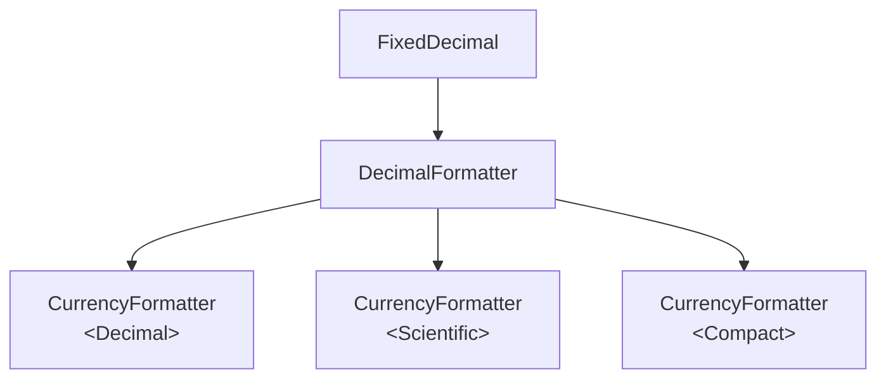
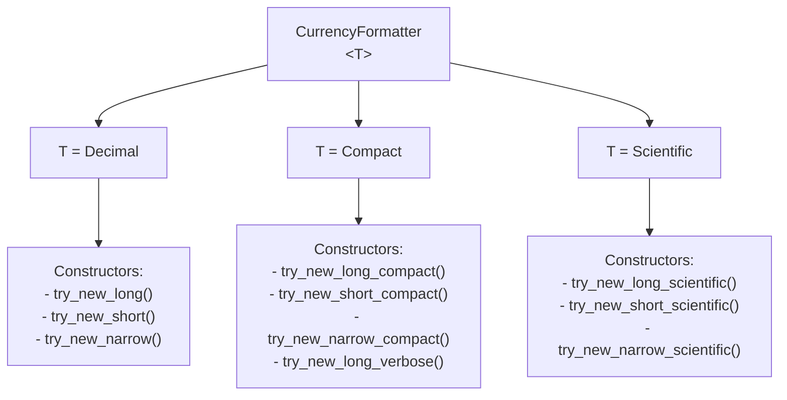
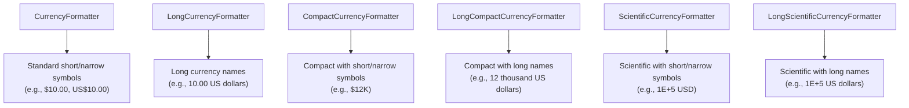

# ICU4X Number Formatter Design

This document describes the design and architecture of number formatting components in ICU4X.

## Overview

ICU4X number formatting is designed to be highly modular, performant, and zero-copy. It covers basic decimal formatting and localized currency formatting.

The formatting pipeline follows a layered architecture where the currency formatter builds upon the decimal formatter, sharing common data structures and formatting traits.



## Currency Format

This section discusses the design options for currency formatting, including the requirements and the proposed designs to address them.

### Requirements

1. **Format length**: There are multiple formatting shapes and lengths. For example:
   - **Long**: `1 US dollar` / `2 US dollars`
   - **Short**: `1 USD`
   - **Narrow**: `$1`
2. **Value representation**: The value can be represented in different notations, such as:
   - **Decimal**: Standard decimal representation (e.g., `100,000.00 USD`).
   - **Scientific**: Scientific notation (e.g., `1E+5 USD`).
   - **Compact**: Compact notation, short or long (e.g., `100K USD`, `100 thousand USD`).
3. **Accounting format**: An option in the configuration to format negative numbers using accounting convention (e.g., `($10.00)` instead of `-$10.00`).

### Designs

#### Option 1: Single struct with generic value representation

In this option, we use a single `CurrencyFormatter<T>` struct where `T` represents the value representation (Decimal, Compact, or Scientific). This provides a unified type while allowing constructors to be partitioned by capability using trait bounds and concrete implementations.



```rust
pub trait ValueRepresentation {}

pub struct Decimal;
impl ValueRepresentation for Decimal {}

pub struct Compact;
impl ValueRepresentation for Compact {}

pub struct Scientific;
impl ValueRepresentation for Scientific {}

pub struct CurrencyFormatter<T: ValueRepresentation> {
    // ...
    _marker: core::marker::PhantomData<T>,
}

impl CurrencyFormatter<Decimal> {
    /// Creates a currency formatter for long formatting.
    pub fn try_new_long(...) -> Result<Self, DataError>;

    /// Creates a currency formatter for short formatting.
    pub fn try_new_short(...) -> Result<Self, DataError>;

    /// Creates a currency formatter for narrow formatting.
    pub fn try_new_narrow(...) -> Result<Self, DataError>;
}

impl CurrencyFormatter<Scientific> {
    /// Creates a currency formatter for long scientific formatting.
    pub fn try_new_long_scientific(...) -> Result<Self, DataError>;

    /// Creates a currency formatter for short scientific formatting.
    pub fn try_new_short_scientific(...) -> Result<Self, DataError>;

    /// Creates a currency formatter for narrow scientific formatting.
    pub fn try_new_narrow_scientific(...) -> Result<Self, DataError>;
}

impl CurrencyFormatter<Compact> {
    /// Creates a currency formatter for long compact formatting.
    pub fn try_new_long_compact(...) -> Result<Self, DataError>;

    /// Creates a currency formatter for short compact formatting.
    pub fn try_new_short_compact(...) -> Result<Self, DataError>;

    /// Creates a currency formatter for narrow compact formatting.
    pub fn try_new_narrow_compact(...) -> Result<Self, DataError>;

    /// Creates a currency formatter for long compact formatting with verbose names (future).
    pub fn try_new_long_verbose(...) -> Result<Self, DataError>;
}
```

#### Option 2: Separate structs for each formatting style

In this option, we define separate structs for each major formatting style. This allows each struct to only load the data it strictly needs, and provides a clearer separation of concerns.

- **`CurrencyFormatter`**: For standard formatting with short or narrow symbols (e.g., `$10.00`, `US$10.00`).
- **`LongCurrencyFormatter`**: For formatting with long currency names (e.g., `10.00 US dollars`).
- **`CompactCurrencyFormatter`**: For compact formatting with short or narrow symbols (e.g., `$12K`).
- **`LongCompactCurrencyFormatter`**: For compact formatting with long currency names (e.g., `12 thousand US dollars`).
- **`ScientificCurrencyFormatter`**: For scientific formatting with short or narrow symbols (e.g., `1E+5 USD`).
- **`LongScientificCurrencyFormatter`**: For scientific formatting with long currency names (e.g., `1E+5 US dollars`).



```rust
// Standard short/narrow formatter
pub struct CurrencyFormatter;

// Long name formatter
pub struct LongCurrencyFormatter;

// Compact short/narrow formatter
pub struct CompactCurrencyFormatter;

// Compact long name formatter
pub struct LongCompactCurrencyFormatter;

// Scientific short/narrow formatter
pub struct ScientificCurrencyFormatter;

// Scientific long name formatter
pub struct LongScientificCurrencyFormatter;
```

<!--stackedit_data:
eyJoaXN0b3J5IjpbNjg2NjQxMTEyLC0xMjU3MjY2MTM0XX0=
-->