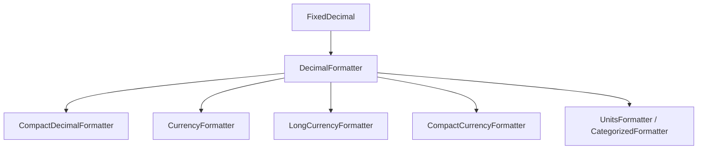

# ICU4X Number Formatter Design

This document describes the design and architecture of number formatting components in ICU4X.

## Overview

ICU4X number formatting is designed to be highly modular, performant, and zero-copy. It ranges from formatting simple decimal numbers to complex dimensions such as currencies and measurement units.

The formatting pipeline follows a layered architecture where complex formatters build upon simpler ones, sharing common data structures and formatting traits.



## Core Principles

- **Zero-Copy**: Data is loaded from the data provider with minimal overhead and no unnecessary copies.
- **Zero-Allocation**: Formatting operations utilize the `Writeable` trait to write directly to a sink (e.g., a string buffer or a stream) without intermediate allocations.
- **Separation of Concerns**: Logic is separated from data. Data is loaded dynamically via `DataProvider`.
- **Type Safety**: Strong types are used to prevent errors (e.g., `CurrencyCode`, `MeasureUnitCategory`).

## Components

### 1. Input: `FixedDecimal`

Instead of formatting floating-point numbers directly (which can introduce rounding errors), ICU4X uses `FixedDecimal` (from the `fixed_decimal` crate) as the primary input for formatting.

- Represents a decimal number with fixed precision.
- Keeps track of sign, integer digits, and fractional digits.
- Supports operations like shifting decimal points without losing precision.

### 2. Decimal Formatting (`icu_decimal`)

The `icu_decimal` crate provides the foundation for all number formatting.

#### `DecimalFormatter`
- Formats `FixedDecimal` into localized representations.
- **Data Dependencies**:
  - `DecimalSymbolsV1`: Contains localized symbols (decimal separator, grouping separator, plus/minus signs).
  - `DecimalDigitsV1`: Contains localized digit characters (e.g., Latin digits, Bangla digits).
- **Features**:
  - Grouping sizes and separators based on locale.
  - Numbering system resolution (e.g., `-u-nu-thai`).

#### `CompactDecimalFormatter`
- Formats numbers in compact notation (e.g., `1.2M` instead of `1,200,000`).
- Uses plural rules to select correct patterns based on the magnitude of the number.

### 3. Currency Formatting (`icu_experimental::dimension::currency`)

Currency formatting is located in the experimental area and supports various widths and styles.

#### `CurrencyFormatter`
- Used for formatting monetary values with short or narrow symbols (e.g., `$10.00`, `US$10.00`).
- **Internal Mechanism**:
  - Resolves the currency symbol and pattern (e.g., `¤{0}` or `{0} ¤`) from `CurrencyEssentialsV1` data.
  - Uses `DecimalFormatter` to format the numeric value.
  - Interpolates the formatted number and currency symbol into the pattern.

#### `LongCurrencyFormatter`
- Used for formatting monetary values with long names (e.g., `10.00 US dollars`).
- **Internal Mechanism**:
  - Requires `PluralRules` to select the correct plural form of the currency name (e.g., "dollar" vs "dollars").
  - Interpolates the formatted number and localized currency name.

#### `CompactCurrencyFormatter`
- Combines compact decimal formatting with currency formatting (e.g., `$12K`).
- **Internal Mechanism**:
  - Obtains the compact decimal pattern and significand.
  - Formats the significand.
  - Interpolates the compact representation into the currency pattern.

### 4. Unit Formatting (`icu_experimental::dimension::units`)

Unit formatting is transitioning to a more type-safe "categorized" approach.

#### `UnitsFormatter` (Legacy)
- A generic formatter for unit values.
- Being deprecated in favor of `CategorizedFormatter`.

#### `CategorizedFormatter`
- A type-safe formatter generic over `MeasureUnitCategory` (e.g., `Area`, `Duration`).
- **Features**:
  - Prevents mixing units of different categories.
  - Uses `UnitsDisplayNamesV1` to load localized unit names.
  - Uses `PluralRules` to select correct patterns based on the value (e.g., "1 meter" vs "2 meters").

## Key Formatting Trait: `Writeable`

All formatters return intermediate structures that implement the `writeable::Writeable` trait.

- Enables formatting directly to a `PartsWrite` sink.
- Supports "parts" annotation, allowing the caller to identify which parts of the output string correspond to the currency symbol, digits, grouping separators, etc. (useful for UI styling).

```rust
pub trait Writeable {
    fn write_to_parts<S: PartsWrite + ?Sized>(&self, sink: &mut S) -> Result<(), Error>;
    // ...
}
```

## Data Loading and Providers

All constructors support both compiled data (`try_new`) and dynamic data loading via `DataProvider` (`try_new_unstable`).

- `try_new_unstable` allows for tree-shaking and dynamic data loading.
- Markers are used to identify the required data (e.g., `DecimalSymbolsV1::MARKER`).
