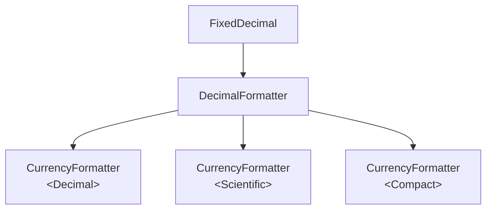
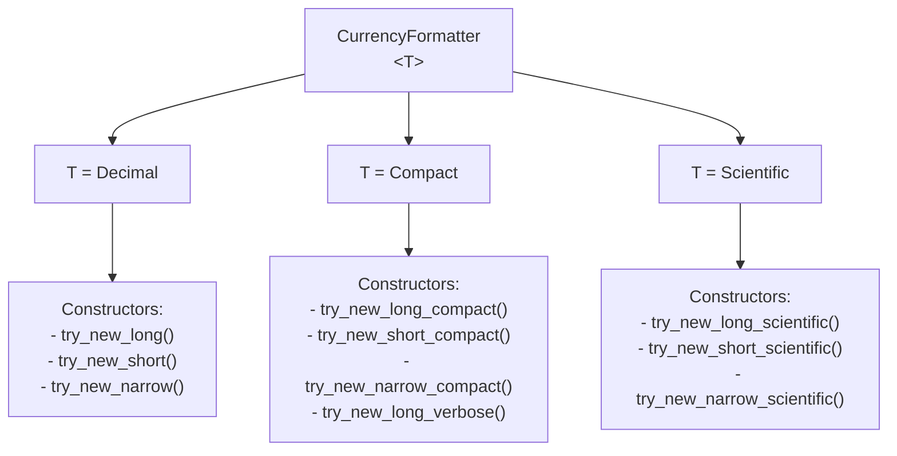
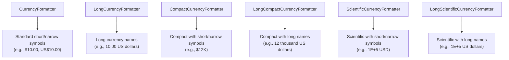

# ICU4X Number Formatter Design

This document describes the design and architecture of number formatting components in ICU4X.

## Overview

ICU4X number formatting is designed to be highly modular, performant, and zero-copy. It covers basic decimal formatting and localized currency formatting.

The formatting pipeline follows a layered architecture where the currency formatter builds upon the decimal formatter, sharing common data structures and formatting traits.



## Currency Format

This section discusses the design options for currency formatting, including the requirements and the proposed designs to address them.

### Requirements

1. **Format length**: There are multiple formatting shapes and lengths. For example:
   - **Long**: `1 US dollar` / `2 US dollars`
   - **Short**: `1 USD`
   - **Narrow**: `$1`
2. **Value representation**: The value can be represented in different notations, such as:
   - **Decimal**: Standard decimal representation (e.g., `100,000.00 USD`).
   - **Scientific**: Scientific notation (e.g., `1E+5 USD`).
   - **Compact**: Compact notation, short or long (e.g., `100K USD`, `100 thousand USD`).
3. **Accounting format**: An option in the configuration to format negative numbers using accounting convention (e.g., `($10.00)` instead of `-$10.00`).

### Designs

#### Option 1: Single struct with generic value representation *(Choosed)* https://github.com/unicode-org/icu4x/pull/8045


In this option, we use a single `CurrencyFormatter<T>` struct where `T` represents the value representation (Decimal, Compact, or Scientific). This provides a unified type while allowing constructors to be partitioned by capability using trait bounds and concrete implementations.



```rust
pub trait ValueRepresentation {}

pub struct Decimal;
impl ValueRepresentation for Decimal {}

pub struct Compact;
impl ValueRepresentation for Compact {}

pub struct Scientific;
impl ValueRepresentation for Scientific {}

pub struct CurrencyFormatter<T: ValueRepresentation> {
    // ...
    _marker: core::marker::PhantomData<T>,
}

impl CurrencyFormatter<Decimal> {
    /// Creates a currency formatter for long formatting.
    pub fn try_new_long(...) -> Result<Self, DataError>;

    /// Creates a currency formatter for short formatting.
    pub fn try_new_short(...) -> Result<Self, DataError>;

    /// Creates a currency formatter for narrow formatting.
    pub fn try_new_narrow(...) -> Result<Self, DataError>;
}

impl CurrencyFormatter<Scientific> {
    /// Creates a currency formatter for long scientific formatting.
    pub fn try_new_long_scientific(...) -> Result<Self, DataError>;

    /// Creates a currency formatter for short scientific formatting.
    pub fn try_new_short_scientific(...) -> Result<Self, DataError>;

    /// Creates a currency formatter for narrow scientific formatting.
    pub fn try_new_narrow_scientific(...) -> Result<Self, DataError>;
}

impl CurrencyFormatter<Compact> {
    /// Creates a currency formatter for long compact formatting.
    pub fn try_new_long_compact(...) -> Result<Self, DataError>;

    /// Creates a currency formatter for short compact formatting.
    pub fn try_new_short_compact(...) -> Result<Self, DataError>;

    /// Creates a currency formatter for narrow compact formatting.
    pub fn try_new_narrow_compact(...) -> Result<Self, DataError>;

    /// Creates a currency formatter for long compact formatting with verbose names (future).
    pub fn try_new_long_verbose(...) -> Result<Self, DataError>;
}
```

##### Underlying Currencies Providers & Markers

To guarantee modular, zero-copy formatting without memory overhead, currency data is decoupled into four highly specialized data provider structs and their corresponding markers:

###### 1. `CurrencyEssentialsV1`
- **Data Marker**: `CurrencyEssentialsV1`
- **Scope & Keying**: Keyed strictly by `Locale`.
- **Payload & Architectural Purpose**:
  - Encapsulates the minimal core data required for standard short and narrow monetary output.
  - **Symbols**: Holds both the short currency symbol string (e.g., `"USD"`, `"EUR"`) and the narrow currency symbol string (e.g., `"$"`, `"€"`).
  - **Layout Patterns**: Contains relative positioning placeholders dictating exactly where the symbol sits relative to the numeric string (e.g., prefix vs. suffix, spaced vs. unspaced).

###### 2. `CurrencyExtendedDataV1`
- **Data Marker**: `CurrencyExtendedDataV1`
- **Scope & Keying**: Keyed by `Locale` and `DataMarkerAttributes` (derived dynamically from the active `CurrencyCode`).
- **Payload & Architectural Purpose**:
  - Designed specifically for long, verbose currency formatting.
  - **Pluralized Names**: Stores the complete dictionary of localized display names for a currency under all cardinal plural rules (e.g., `"US dollar"` for `One`, `"US dollars"` for `Other`).
  - Keying by `DataMarkerAttributes` allows massive currency dictionaries to be sliced into lightweight, per-currency payloads, completely eliminating monolithic downloads.

###### 3. `CurrencyPatternsDataV1`
- **Data Marker**: `CurrencyPatternsDataV1`
- **Scope & Keying**: Keyed by `Locale`.
- **Payload & Architectural Purpose**:
  - Defines the sentence structure necessary when combining formatted numbers with long verbose display names.
  - **Multi-Placeholder Interpolation**: Holds double-placeholder patterns that dictate the exact grammatical arrangement of the numeric significand string and the currency display name string across different plural categories.

###### 4. `ShortCurrencyCompactV1`
- **Data Marker**: `ShortCurrencyCompactV1`
- **Scope & Keying**: Keyed by `Locale`.
- **Payload & Architectural Purpose**:
  - Dedicated entirely to specialized compact monetary formatting.
  - **Compact Patterns**: Encapsulates standard compact notation patterns (`"10K"`, `"12M"`) as well as specialized `"alpha_next_to_number"` patterns.
  - **Adjacency Rules**: Governs precise spacing adjustments required when an alphabetical currency code directly touches a compact significand letter (e.g., ensuring clear visual separation between `"USD"` and `"K"`).

##### Pros and Cons of Option 1

- **Pros**:
  - **Unified Type Ergonomics**: Provides a single, cohesive struct identity (`CurrencyFormatter`) for high-level application code to pass around.
  - **Typestate Enforcement**: Leverages compile-time generic marker types (`Decimal`, `Compact`, `Scientific`) to guarantee invalid formatting operations cannot be constructed.
  - **Logic Consolidation**: Centralizes shared boilerplate, option handling, and common trait implementations (`Debug`, `Writeable`), minimizing code duplication.
- **Cons**:
  - **Internal Multiplexing Complexity**: Requires internal storage enums (`DecimalCurrencyData`, `CompactCurrencyData`) to route execution dynamically between standard and long format payloads.
  - **Constructor Crowding**: Grouping many polymorphic constructors (`try_new_short`, `try_new_long_compact`, etc.) under one generic type produces denser API documentation pages.

#### Option 2: Separate structs for each formatting style

In this option, we define separate structs for each major formatting style. This allows each struct to only load the data it strictly needs, and provides a clearer separation of concerns.

- **`CurrencyFormatter`**: For standard formatting with short or narrow symbols (e.g., `$10.00`, `US$10.00`).
- **`LongCurrencyFormatter`**: For formatting with long currency names (e.g., `10.00 US dollars`).
- **`CompactCurrencyFormatter`**: For compact formatting with short or narrow symbols (e.g., `$12K`).
- **`LongCompactCurrencyFormatter`**: For compact formatting with long currency names (e.g., `12 thousand US dollars`).
- **`ScientificCurrencyFormatter`**: For scientific formatting with short or narrow symbols (e.g., `1E+5 USD`).
- **`LongScientificCurrencyFormatter`**: For scientific formatting with long currency names (e.g., `1E+5 US dollars`).



```rust
// Standard short/narrow formatter
pub struct CurrencyFormatter;

// Long name formatter
pub struct LongCurrencyFormatter;

// Compact short/narrow formatter
pub struct CompactCurrencyFormatter;

// Compact long name formatter
pub struct LongCompactCurrencyFormatter;

// Scientific short/narrow formatter
pub struct ScientificCurrencyFormatter;

// Scientific long name formatter
pub struct LongScientificCurrencyFormatter;
```

##### Pros and Cons of Option 2

- **Pros**:
  - **Pristine Separation of Concerns**: Each struct possesses a direct, single-purpose internal payload struct entirely free of runtime multiplexing enums.
  - **Focused API Documentation**: Each struct's documentation page is exceptionally lean, displaying only the exact constructors relevant to its precise formatting mode.
  - **Granular Dead Code Elimination**: Allows the Rust compiler to effortlessly strip out code for unused formatting styles (e.g., eliminating compact formatters if an app only uses standard decimals).
- **Cons**:
  - **API Surface Fragmentation**: Forces users to memorize and import up to six distinct top-level struct names (`CurrencyFormatter`, `LongCurrencyFormatter`, `CompactCurrencyFormatter`, etc.).
  - **Boilerplate Duplication**: Reimplements identical underlying sign delegation, validation checks, and preference conversions across multiple separate structs.
